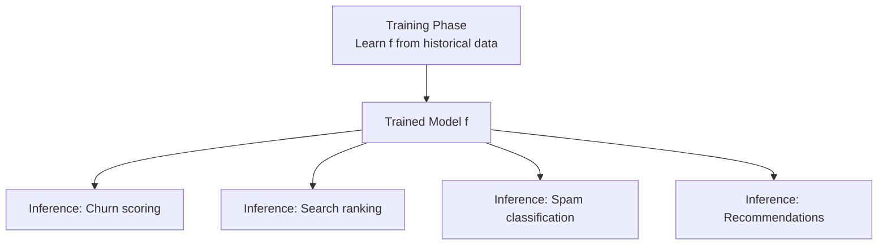
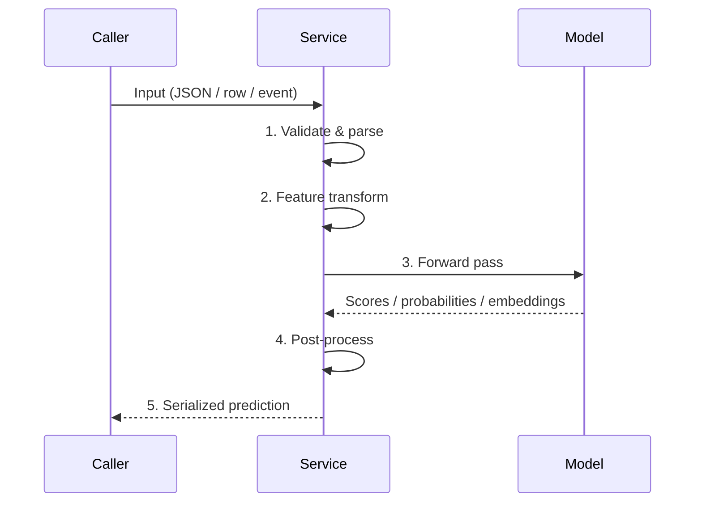

# Definition of Model Inference

## Training vs Inference: Two Phases of the ML Lifecycle

Every ML system has two distinct phases:

| Phase | Purpose | Input | Output |
|-------|---------|-------|--------|
| **Training** | Learn parameters from historical data | Labelled (or unlabelled) training set | Trained model weights |
| **Inference** | Apply the trained model to new, unseen data | Fresh features at serving time | Predictions, scores, embeddings |

**Training builds the function.** Think of it as defining $f$ such that predictions are useful.

**Inference calls the function.** Every time your system scores a customer for churn, ranks search results, classifies an email as spam, or generates recommendations, you are performing inference:

$$\text{prediction} = f(\text{input features})$$

Over a model's entire lifetime, **inference dominates** in both frequency and operational attention. Training happens occasionally; inference happens all the time.

---

## The Single Inference Call: End-to-End Pipeline

Whether you score one HTTP request or a million rows in a batch job, the **core steps are identical**. What changes is how often you run the flow, how many items per call, and how strict the timing requirements are.

### Step-by-Step Journey

| Step | What Happens | Examples |
|------|--------------|----------|
| **1. Receive input** | Accept raw data in the caller's format | JSON over HTTP, Parquet row, Kafka event |
| **2. Validate & parse** | Check required fields, types, value ranges; convert to internal objects/tensors | Reject malformed requests early (400 errors) |
| **3. Transform features** | Apply the **same preprocessing** used during training | Encoding, scaling, embedding lookup |
| **4. Run model** | Forward pass — `model.predict()` or equivalent | Logits, probabilities, class labels, embeddings |
| **5. Post-process** | Shape output for the caller | Apply thresholds, pick top-$k$, map IDs to labels |
| **6. Return prediction** | Serialize (usually JSON) and send response | HTTP 200 with prediction payload |

### Why Training-Serving Skew Is Dangerous

Step 3 is where most production bugs hide. If inference preprocessing differs even slightly from training (wrong scaler, missing category encoding, different null handling), the model receives a **distribution it was never trained on**. Accuracy collapses silently.

---

## Inference Across Calling Patterns

The pipeline above is **pattern-agnostic**:

| Pattern | Items per Call | Timing Constraint | Example |
|---------|---------------|-------------------|---------|
| Batch | Thousands to billions | Finish entire job by deadline | Overnight churn scoring for 10M customers |
| Online | One (or small group) | Per-request latency budget (e.g. < 200 ms) | Fraud check at payment checkout |
| Streaming | One event or mini-batch | End-to-end event-to-action latency | Real-time anomaly detection on transaction stream |

The function $f$ does not change. The **invocation contract** does.

---

## Real-World Cloud Examples

| Company / System | Inference Action | Pattern |
|------------------|-----------------|---------|
| Netflix | Rank content for a user's homepage | Online (user waiting) + batch (precomputed candidates) |
| Stripe | Score payment fraud risk | Online (checkout blocked until decision) |
| Amazon | Weekly seller risk reports | Batch (scheduled job, no user waiting) |
| Datadog | Flag anomalous metric spikes | Streaming (continuous event pipeline) |

---

## Common Pitfalls / Exam Traps

- **Trap**: "Inference = forward pass only." — The forward pass is one step in a six-step pipeline; network, validation, and feature prep often dominate latency.
- **Trap**: "Batch and online inference use different models." — They typically use the **same model**; only the calling pattern and metric priorities differ.
- **Trap**: Assuming preprocessing "just works" in production — training-serving skew is a top cause of silent model degradation.
- **Trap**: "Inference is stateless." — While individual calls are often stateless, the service maintains loaded model weights, caches, and connection pools in memory.

---

## Quick Revision Summary

- **Training** learns $f$ from historical data; **inference** calls $f$ on new data continuously
- Inference dominates the model lifecycle in call volume and operational cost
- Every inference call follows: receive → validate → transform → predict → post-process → return
- The same six-step pipeline applies to batch, online, and streaming — only scale and timing differ
- Feature preprocessing at inference must **exactly match** training to avoid silent accuracy loss
- $\text{prediction} = f(\text{input features})$ is the core mental model for all serving patterns
