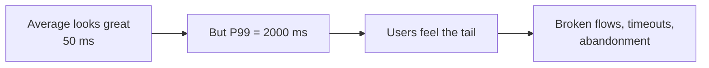
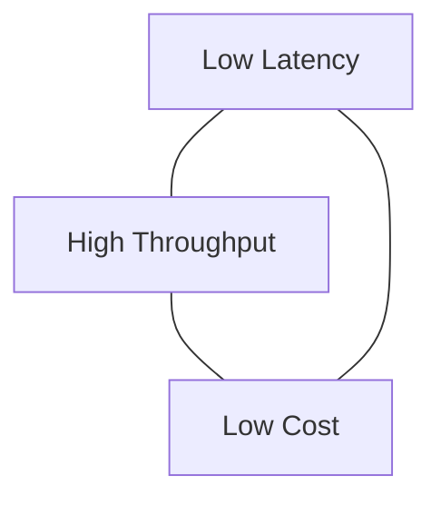

# Latency, Throughput, and Cost: The Inference Metrics Triangle

## Why Inference Metrics Matter

Inference is not a one-off event. It runs continuously — for every page view, transaction, and overnight batch job. The metrics we choose to measure inference directly determine:

- **User experience** — Does the app feel snappy or laggy?
- **Scalability** — Can the system keep up as traffic and data grow?
- **Affordability** — Can we run the model at the required frequency without blowing the cloud budget?

Three metric families govern all inference design decisions: **latency**, **throughput**, and **cost**.

---

## Latency: How Long Until the Prediction Returns?

**Latency** is the elapsed time from when a request arrives until the prediction is ready to return. It includes everything:

- Network overhead
- Validation and feature preparation
- Model forward pass
- Post-processing

### Beyond the Average: Percentile Latency

| Metric | Definition | When It Matters |
|--------|------------|-----------------|
| **Average (mean)** | Mean across many requests | General system health |
| **P50 (median)** | 50% of requests are faster | Typical user experience |
| **P95** | 95% of requests are faster | Product SLA targets |
| **P99** | 99% of requests are faster | Worst-case user experience |

### Why Tail Latency Dominates UX

It is tempting to celebrate a low average latency. But users feel the **tail**, not the mean.

If most requests complete in 50 ms but 1% take 2 seconds, users notice those slow ones. At scale, 1% of requests can mean thousands of painful experiences per hour.

Product requirements are almost always expressed in tail terms:

> "Predictions must return in under 100 ms at P95."

This explicitly targets the slow end of the distribution, not the average.

**Engineering implication**: Model engineers must design the **entire inference path** — model choice, feature processing, infrastructure, batching — to fit within a latency budget at P95/P99, not just on average.

---

## Throughput: How Much Work Per Unit of Time?

**Throughput** answers: how many predictions can the system produce per second, minute, or hour?

| Pattern | Throughput Unit | Example Target |
|---------|----------------|----------------|
| Online API | Requests per second (RPS) | 5,000 RPS at peak |
| Batch job | Rows per second | 50,000 rows/sec overnight |
| Streaming | Events per second (sustained) | 100K events/sec continuously |

### Utilisation: Are We Wasting Capacity?

Real workloads are not flat — they have peaks and valleys (morning traffic, marketing campaigns, product launches). **Utilisation** measures how busy CPUs/GPUs are:

| State | Meaning | Risk |
|-------|---------|------|
| Mostly idle | Wasting paid capacity | Overspending on infra |
| Constantly maxed out | No headroom for spikes | Timeouts and failures during peaks |

Throughput and utilisation together tell you whether your serving setup can handle real-world traffic patterns.

---

## Cost: What Does Each Prediction Cost?

Every prediction consumes resources:

| Resource | What It Uses |
|----------|-------------|
| **Compute** | CPU/GPU cycles for forward pass |
| **Memory** | RAM/VRAM for model weights and feature buffers |
| **Storage** | Model artifacts, feature stores, logs |
| **Network** | Request/response bandwidth across services and data centers |

A single prediction costs fractions of a cent. Multiply by millions or billions of calls and you get a very real cloud bill. Finance and infra teams care deeply about inference design for this reason.

### Cost Optimization Levers

| Strategy | Mechanism | Trade-off |
|----------|-----------|-----------|
| Right-size the model | Smaller architecture if quality is sufficient | May reduce accuracy |
| Batching | Process multiple items together | Adds latency for individual items |
| Caching | Reuse predictions that don't change often | Staleness risk |
| Hybrid routing | Fast cheap model for most traffic; expensive model for hard cases | Routing complexity |

---

## The Latency–Throughput–Cost Triangle

These three dimensions form a **trade-off triangle**:

| Goal | Typical Cost |
|------|-------------|
| Very low latency + very high throughput | Higher cost (more replicas, GPUs, premium infra) |
| Very low cost | Higher latency or lower throughput |
| Balanced | Depends entirely on the business use case |

There is no universal right answer. The correct point on the trade-off curve depends on:

- How fast the user expects a response (200 ms vs 30 minutes)
- How critical the decision is (fraud block vs weekly report)
- How much traffic you must handle at peak

This is exactly why **batch**, **online**, and **streaming** inference patterns exist — they are different ways of navigating this triangle.

| Use Case | Acceptable Latency | Pattern |
|----------|-------------------|---------|
| Overnight churn scoring | 30 minutes is fine | Batch |
| Payment fraud check | 200 ms is too slow | Online |
| Transaction anomaly alert | Sub-second event-to-action | Streaming |

---

## Common Pitfalls / Exam Traps

- **Trap**: Optimizing average latency when the SLA specifies P95/P99 — averages hide tail problems.
- **Trap**: "High throughput automatically means low latency." — Batching improves throughput but can increase per-item latency.
- **Trap**: Ignoring cost at small scale — per-call costs compound dramatically at billions of requests.
- **Trap**: Treating the triangle as "pick two" rigidly — hybrid architectures (batch precompute + online serve) can shift the curve.
- **Trap**: Measuring only model forward-pass time — validation, feature lookup, and network often dominate total latency.

---

## Quick Revision Summary

- Three core inference metrics: **latency**, **throughput**, **cost** — they drive all serving design
- **P95/P99 latency** matters more than average for user-facing systems; users feel the tail
- **Throughput** = predictions per unit of time; measure in RPS (online), rows/sec (batch), events/sec (streaming)
- **Utilisation** reveals whether capacity is wasted (idle) or dangerously saturated (maxed out)
- Every prediction burns compute, memory, storage, and bandwidth — cost scales with call volume
- Latency, throughput, and cost form a **trade-off triangle** with no universal optimum
- Different inference patterns (batch/online/streaming) are different navigations of this triangle
