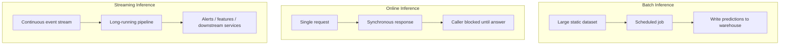
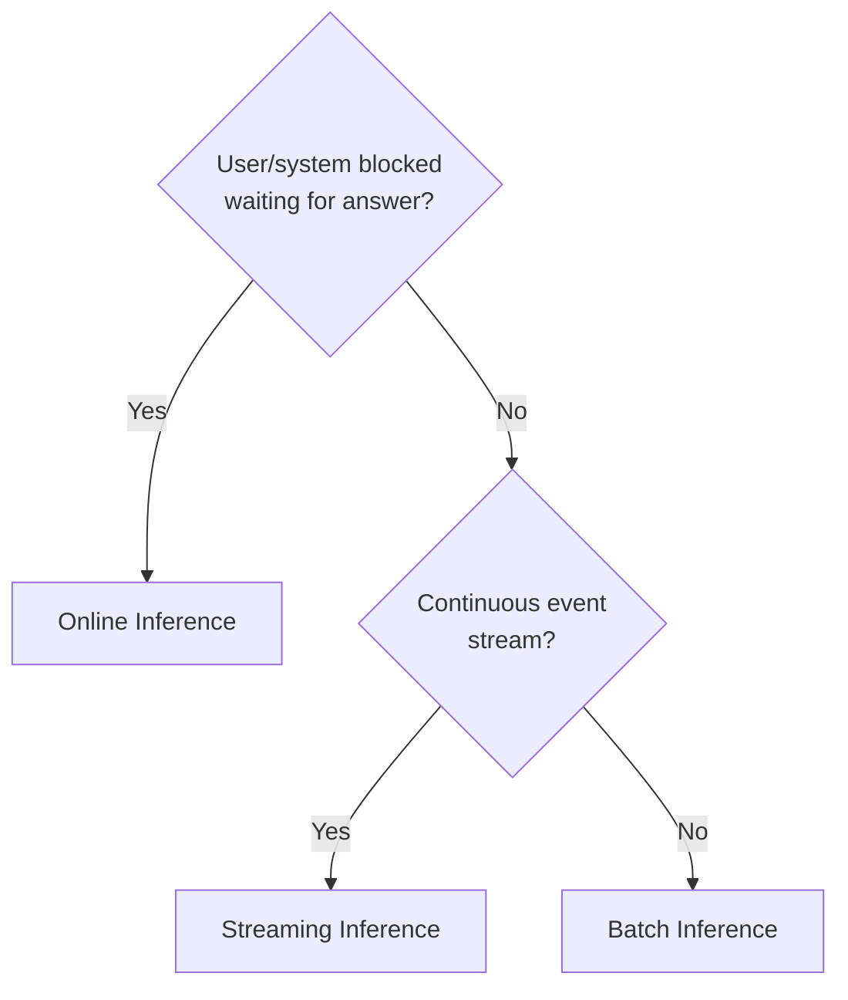

# Inference Patterns: Setup and Mental Model

## The Core Insight: Same Function, Different Calling Patterns

A trained model is fundamentally a function:

$$\text{prediction} = f(\text{input features})$$

The model takes features and returns a prediction. What changes in production is **not** the function itself — it is **how we call it**:

| Dimension | What Varies | Examples |
|-----------|-------------|----------|
| **Frequency** | How often we invoke $f$ | Once a month, once a minute, thousands per second |
| **Batch size** | How many items per call | Single record, 10,000-row chunk, continuous stream |
| **Urgency** | Who is waiting | Nobody (batch), user in UI (online), downstream pipeline (streaming) |

Choosing the right inference pattern is about matching **business and product needs** to the right invocation contract.

---

## Three Inference Patterns at a Glance

| Pattern | Optimized For | Primary Metrics | Caller Behavior |
|---------|--------------|-----------------|-----------------|
| **Batch** | Throughput, total job time | Rows/sec, job completion time | No one waiting per row |
| **Online** | Low per-request latency | P95/P99 latency, error rate | User or system actively waiting |
| **Streaming** | Continuous near-real-time reaction | Event-to-action latency, sustained throughput, lag | No direct request-response; pipeline always running |

---

## Pattern Selection Questions

Before choosing a pattern, answer three questions:

1. **Who is waiting?** — A user clicking a button? A scheduled job with a deadline? A monitoring pipeline?
2. **How fresh must predictions be?** — Real-time context? Hourly? Daily?
3. **How much data, how often?** — Millions of rows once a week? One request at a time? A never-ending event stream?

---

## The Latency–Throughput–Cost Lens Applied

Each pattern occupies a different region of the metrics triangle:

| Pattern | Latency Priority | Throughput Priority | Cost Strategy |
|---------|-----------------|--------------------|--------------|
| Batch | Low (per-row latency irrelevant) | High (chew through dataset fast) | Off-peak scheduling, spot instances |
| Online | Critical (P95/P99 SLOs) | Important (handle traffic spikes) | Right-sized replicas, caching, auto-scaling |
| Streaming | Event-to-action bound | Sustained (keep up with stream) | Efficient 24/7 workers, minimize lag |

---

## Hybrid Architectures in Practice

Real production systems rarely use a single pattern in isolation:

| System | Batch Component | Online Component |
|--------|----------------|-----------------|
| Netflix recommendations | Precompute candidate items overnight | Rank candidates in real time for each user |
| E-commerce fraud | Weekly portfolio risk scoring | Real-time checkout fraud check |
| Search engine | Index building and crawl batch jobs | Query-time ranking and personalization |

The model function $f$ may be the same; the **calling pattern** differs by which part of the user journey needs freshness vs throughput.

---

## What Changes vs What Stays the Same

| Stays the Same | Changes by Pattern |
|----------------|-------------------|
| Model weights and architecture | Invocation frequency |
| Feature preprocessing logic | Items per call |
| Core inference pipeline steps | Latency requirements |
| $\hat{y} = f(x)$ mathematical contract | Infrastructure and monitoring |

---

## Common Pitfalls / Exam Traps

- **Trap**: "We need real-time, so we must use online inference." — Streaming may be better for continuous event reaction without a blocking caller.
- **Trap**: Defaulting to online APIs for everything — batch is simpler, cheaper, and often sufficient when freshness tolerance is hours or days.
- **Trap**: Thinking patterns require different models — the same $f$ is typically reused; only the serving wrapper changes.
- **Trap**: Ignoring hybrid designs — most large-scale ML systems combine batch precomputation with online serving.

---

## Quick Revision Summary

- Model inference is $\text{prediction} = f(\text{input features})$ — the function stays constant
- Three patterns: **batch** (scheduled bulk), **online** (synchronous request-response), **streaming** (continuous pipeline)
- Pattern choice depends on **who is waiting**, **freshness requirements**, and **data volume/frequency**
- Batch optimizes throughput; online optimizes P95/P99 latency; streaming optimizes event-to-action latency and sustained throughput
- Real systems often use **hybrid** architectures combining patterns
- The metrics triangle (latency, throughput, cost) provides a consistent framework for comparing all three patterns
