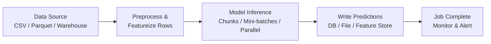
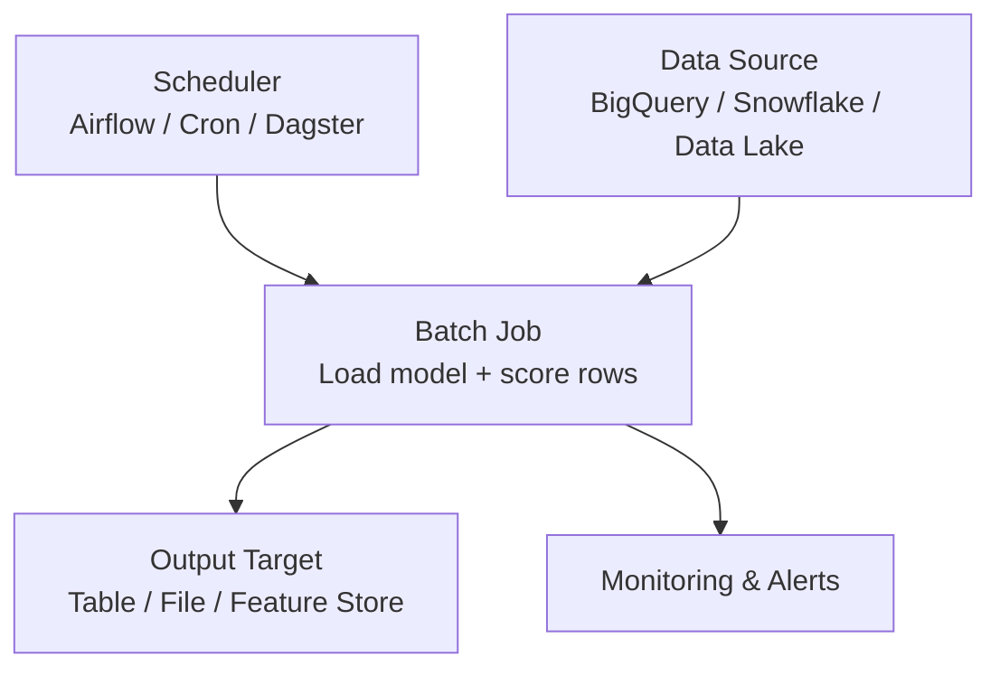

# Batch Inference: Definition and Architecture

## When Real-Time Is Not Required

Batch inference answers the question: **"When do I not need real-time predictions, and how can I take advantage of that?"**

Sometimes you have a large list of items to score and you are happy as long as predictions are ready by a deadline — say, before business hours tomorrow. No human sits waiting on each individual prediction.

---

## Definition

**Batch inference** means:

1. Take a **large set of inputs** (thousands, millions, sometimes billions of rows)
2. Run the model over **all of them in one job**
3. **Write predictions** to a persistent store (database table, data warehouse, file, or feature store)

### Key Properties

| Property | Batch Characteristic |
|----------|---------------------|
| **Schedule** | Periodic — once a day, hourly, every 15 minutes |
| **Caller** | No human waiting per row |
| **Latency concern** | Total job completion time, not per-row latency |
| **Output** | Bulk write to storage for later consumption |

If one row takes 50 ms and another takes 500 ms, nobody cares — as long as the **entire batch completes on schedule**.

---

## End-to-End Batch Job Flow

### Step-by-Step

| Step | Action | Tools / Formats |
|------|--------|-----------------|
| **1. Read input** | Load bulk data snapshot | BigQuery, Snowflake, S3 Parquet, DB export |
| **2. Preprocess** | Apply training-time feature engineering | Encoding, scaling, null handling |
| **3. Run model** | Score all rows — row-by-row, chunked, or parallel | Spark, Airflow task, custom Python script |
| **4. Write output** | Persist predictions for downstream use | `predictions.csv`, warehouse table, feature store |

The job has a clear **start** and **end**. Success means: did it finish before the operational deadline?

---

## Batch vs Other Patterns

| Aspect | Batch | Online | Streaming |
|--------|-------|--------|-----------|
| Data shape | Static snapshot | Single request | Continuous stream |
| Job lifecycle | Start → process → end | Per-request | Always running |
| Latency target | Total job time | Per-request P95/P99 | Event-to-action |
| Who waits | Nobody per row | Caller blocked | Downstream pipeline |

---

## Typical Batch Infrastructure

Unlike online APIs that must be up 24/7, batch jobs are:

- **Scheduled** — run at defined intervals
- **Monitored** — alerts on failure or SLA miss
- **Rerunnable** — fix bugs and rerun to overwrite bad output

---

## Operational Mindset

In batch, you think:

> "I have a million rows to score and I need them done by 7:00 a.m."

Key questions:

- How fast can I chew through this dataset? (throughput)
- Did the job finish successfully?
- What are my rows per second?

This is fundamentally different from online, where you think:

> "A user clicked a button and expects an answer in under 200 ms."

---

## Common Pitfalls / Exam Traps

- **Trap**: Measuring per-row latency in batch — it is irrelevant; only total job time matters.
- **Trap**: Running batch jobs during peak hours — schedule off-peak for cost savings and to avoid competing with online traffic.
- **Trap**: Forgetting to version predictions — without timestamps or run IDs, you cannot trace which model version produced which scores.
- **Trap**: Assuming batch means "slow model only" — batch jobs often use the same model as online; they just invoke it differently.

---

## Quick Revision Summary

- **Batch inference** scores many items at once on a schedule; nobody waits per row
- Inputs: large static datasets; outputs: predictions written to warehouse/file/feature store
- Pipeline: read → preprocess → model inference (parallel/chunked) → write → monitor
- Success metric: **total job time** and **throughput** (rows/sec), not per-row latency
- Infrastructure: scheduler + batch job + output target + monitoring (not 24/7 API)
- Ideal when predictions can be hours or days old and the whole dataset must be ready by a deadline
