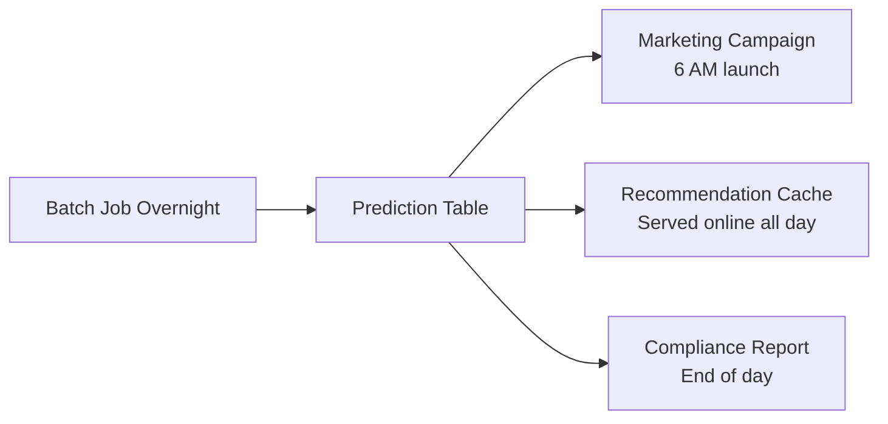
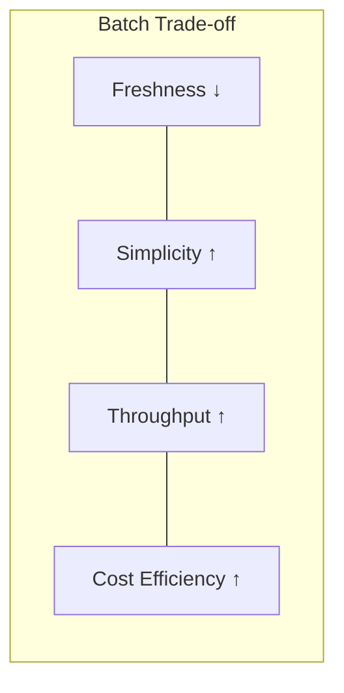

# Batch Inference: Offline Use Cases and Trade-offs

## Where Batch Inference Shows Up in Production

Batch inference is the workhorse of enterprise ML. It appears wherever you have **lots of data** but **no user waiting** for each individual prediction.

---

## Classic Use Cases

| Domain | Use Case | Freshness Tolerance |
|--------|----------|---------------------|
| **Customer analytics** | Monthly/weekly churn predictions for all customers | Days |
| **Credit risk** | Portfolio-wide risk scoring for all accounts | Daily |
| **Recommendations** | Precompute user-item scores and candidate lists overnight | Hours (served online later) |
| **Marketing** | Campaign audience selection — who receives tomorrow's email | Until next morning |
| **Compliance** | Risk and regulatory reports | End of day / end of week |

The common thread: predictions must be ready by a **deadline**, not within 200 ms of a user click.

---

## Decision Rule of Thumb

> If nobody cares whether an individual prediction is 5 seconds old or 5 minutes old — as long as the whole dataset is ready on time — batch inference is a strong candidate.

Batch is what you choose when:

- **Near real-time is not required**
- Predictions being a day old is acceptable
- You trade **freshness** for **simplicity**, **throughput**, and **cost efficiency**

---

## Advantages of Batch Inference

| Advantage | Why It Matters |
|-----------|---------------|
| **High throughput** | Vectorization, batching, and parallelism across cores/machines — score millions of rows in one job |
| **Simpler infrastructure** | No highly available 24/7 API with strict SLAs; a scheduled job on a cluster or beefy machine suffices |
| **Easier rollback** | Discover a bug? Fix it and rerun the job — overwrite bad output with good predictions |
| **Heavier models allowed** | Models too slow or expensive for per-request online serving can run comfortably in batch |

### Cost Efficiency Example

A churn model scoring 50 million customers nightly on AWS:

- **Batch (spot instances, off-peak)**: ~$50/night
- **Online (always-on replicas for equivalent coverage)**: ~$5,000+/month

---

## Disadvantages and Trade-offs

| Trade-off | Impact |
|-----------|--------|
| **Staleness** | Predictions are only as fresh as the last batch run; user behavior changes during the day may not be reflected until the next run |
| **Longer feedback loop** | Experiment cycle becomes: train → run large batch → wait for downstream metrics → adjust → repeat (days, not minutes) |
| **Unsuitable for instant decisions** | Cannot block a suspicious payment at checkout — that requires online or streaming |

---

## Batch + Online Hybrid Pattern

Batch is often the **first stage** in a two-tier architecture:

| Stage | Pattern | What It Does |
|-------|---------|-------------|
| **Offline** | Batch | Precompute heavy features, candidate sets, similarity scores |
| **Online** | Request-response | Light model ranks precomputed candidates in real time |

Example — recommendation system:

1. **Overnight batch**: Score all user-item pairs, build top-500 candidate lists per user
2. **Online serving**: When user opens homepage, rank the 500 candidates using fresh session context in < 100 ms

This hybrid delivers both **freshness where it matters** and **throughput where scale demands it**.

---

## When Batch Is the Wrong Choice

| Scenario | Why Batch Fails | Better Pattern |
|----------|----------------|----------------|
| Blocking a fraudulent payment at checkout | User is waiting; payment provider will timeout | Online |
| Real-time anomaly on server metrics | Events arrive continuously; delay means missed incidents | Streaming |
| Dynamic pricing during a flash sale | Prices must reflect current inventory and demand | Online or streaming |

---

## Common Pitfalls / Exam Traps

- **Trap**: "Batch predictions are always stale and therefore useless." — Many products (weekly campaigns, portfolio reports) explicitly tolerate staleness.
- **Trap**: Running the same heavy model online that works fine in batch — batch allows models that are too slow for per-request serving.
- **Trap**: Forgetting the hybrid pattern — batch precomputation + online ranking is the dominant architecture at scale.
- **Trap**: Assuming batch means "simple = no monitoring" — batch jobs still need SLA monitoring, failure alerts, and data quality checks.

---

## Quick Revision Summary

- Classic batch use cases: churn scoring, credit risk, offline recommendations, marketing lists, compliance reports
- Choose batch when **no one waits per row** and predictions can be hours/days old
- Advantages: high throughput, simpler infra, easy rollback, supports heavier models
- Trade-offs: staleness, slower experimentation feedback loop, unsuitable for instant context-aware decisions
- **Hybrid pattern**: batch precomputes candidates/features; online serves fresh rankings
- Rule of thumb: if deadline matters more than per-row freshness, batch is the right tool
