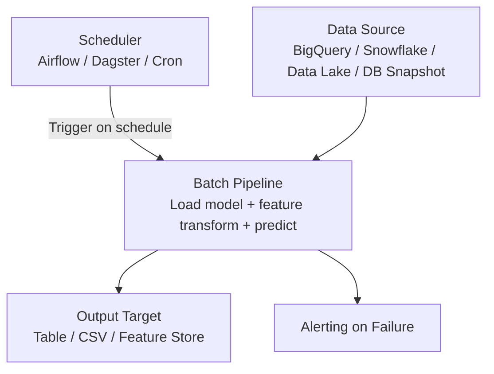
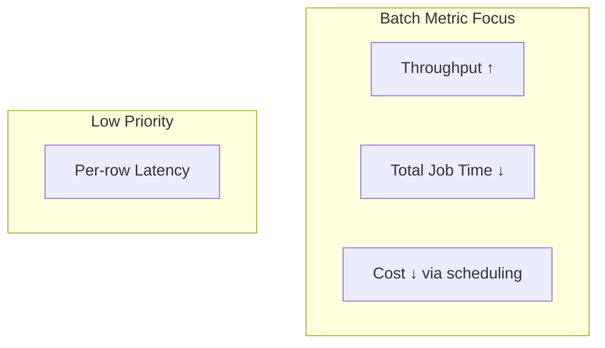

# Batch Inference: Metrics, Pros, Cons, and Architecture

## Batch Metrics Dashboard

In batch inference, the metrics priority order **inverts** compared to online serving:

| Metric | Batch Priority | Online Priority |
|--------|---------------|-----------------|
| **Total job time** | Top priority | N/A |
| **Throughput (rows/sec)** | Top priority | Important but secondary |
| **Per-row latency** | Low priority | Top priority (P95/P99) |
| **Cost** | Optimizable via scheduling | Critical at peak traffic |

### The Batch Mindset

> "I have a million rows to score and I need them done by 7:00 a.m."

Key questions:

- How fast can I chew through this dataset?
- Did the job finish successfully?
- What are my rows per second?

### The Online Mindset (Contrast)

> "A user clicked a button and expects an answer in under 200 ms."

Key questions:

- What is my P95 latency?
- Can I handle traffic spikes in real time?

Same model. Batch does heavy lifting **backstage**; online performs **on stage** in front of the user.

---

## Cost Optimization in Batch

| Strategy | Mechanism | Benefit |
|----------|-----------|---------|
| **Off-peak scheduling** | Run jobs at night when compute is cheaper | Lower cloud bills |
| **Spot/preemptible instances** | Use interruptible VMs for fault-tolerant batch work | Up to 70–90% cost savings |
| **Tolerate longer wall-clock time** | Slower but cheaper compute if deadline allows | Trade time for money |

Batch jobs are uniquely positioned to exploit these strategies because nobody is waiting.

---

## Typical Batch Architecture

### Operational Differences from Online APIs

| Aspect | Batch | Online API |
|--------|-------|-----------|
| Availability | Runs on schedule; downtime between runs is OK | Must be up 24/7 |
| Failure handling | Rerun the job | Graceful degradation, fallbacks, circuit breakers |
| Scaling | Provision for job duration | Auto-scale with live traffic |
| Monitoring | Job success/failure, completion time | Per-request latency, error rate, saturation |

---

## Pros and Cons Summary

| Pros | Cons |
|------|------|
| High throughput via vectorization and parallelism | Predictions are stale between runs |
| Simpler infrastructure (no 24/7 SLA) | Slower experimentation feedback loop |
| Easy rollback (rerun job to fix bad output) | Cannot support instant, context-aware decisions |
| Supports heavier/slower models | Not suitable when user is actively waiting |
| Cost-efficient (off-peak, spot instances) | Lag behind rapidly changing user behavior |

---

## Mapping Batch to the Metrics Triangle

---

## Lab Connection: What You Will Measure

In the hands-on lab, you will:

1. Build a **batch client** against the same model API from Module 1
2. Run it over many rows of input data
3. Measure **total runtime** and **rows per second**

These numbers make the batch mindset concrete — you optimize for how fast the entire job completes, not how fast any single row is processed.

---

## Common Pitfalls / Exam Traps

- **Trap**: Applying online latency SLOs to batch jobs — per-row latency is irrelevant in batch.
- **Trap**: "Batch is always cheaper." — It is cheaper per prediction at scale, but a poorly designed batch job (no parallelism, wrong instance type) can still be expensive.
- **Trap**: Forgetting failure recovery — batch jobs need idempotent writes and rerun capability, not just "run once and hope."
- **Trap**: Conflating batch **inference pattern** with **mini-batch processing** inside a model — batch pattern is about scheduled bulk scoring; mini-batching is an optimization technique usable in any pattern.

---

## Quick Revision Summary

- Batch optimizes **throughput** and **total job time**; per-row latency is low priority
- Cost savings via off-peak scheduling, spot instances, and tolerating longer wall-clock times
- Architecture: data source → scheduler → batch pipeline → output target → alerting
- Pros: high throughput, simple infra, easy rollback, supports heavy models
- Cons: staleness, slow feedback loops, unsuitable for real-time user-facing decisions
- Batch = backstage heavy lifting; online = on-stage performance with strict latency SLOs
