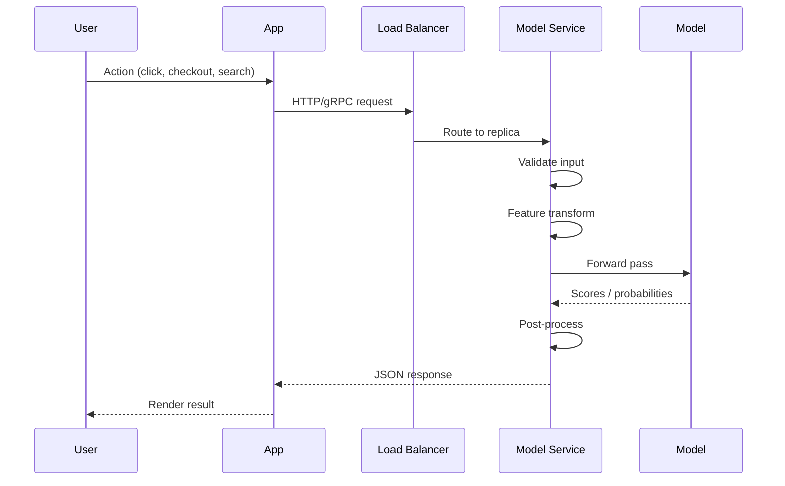
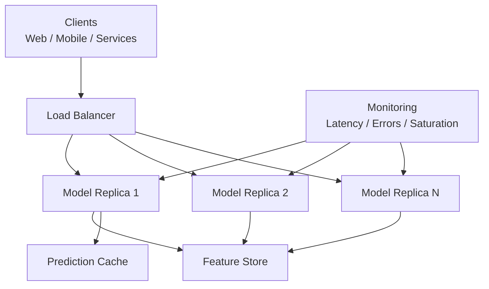

# Online Inference: The Request-Response Pattern

## The Opposite of Batch: Someone Is Waiting

Batch inference processes many items on a schedule with no one waiting per row. **Online inference** flips that entirely:

- One request arrives
- One response must return **immediately**
- The caller is **blocked** until the prediction arrives

The mindset shifts from "finish the whole job by a deadline" to "respond to this single request within milliseconds."

---

## Definition

**Online (synchronous) inference** means:

1. A single request arrives at the service (typically HTTP or gRPC)
2. The service runs the model on that input **right away**
3. A response is returned in the **same interaction**

The caller — front-end app, mobile client, backend service, or another ML system — **cannot proceed** until it receives the prediction. The prediction is part of a **real-time interaction**, not an offline job.

---

## Request-Response Flow

### Per-Request Steps

| Step | Action | Latency Impact |
|------|--------|---------------|
| Receive payload | JSON over HTTP or protobuf over gRPC | Network RTT |
| Validate input | Check fields, types, ranges; reject bad requests early | Microseconds |
| Feature transform | Encoding, normalization, embeddings — same as training | Often significant |
| Forward pass | Compute logits, probabilities, scores | Model-dependent |
| Post-process | Thresholds, top-$k$, label mapping | Microseconds |
| Return response | Serialize and send | Network RTT |

---

## Batch vs Online: Same Steps, Different Constraints

| Aspect | Batch | Online |
|--------|-------|--------|
| Granularity | Thousands to millions of rows per job | One request at a time |
| Timing | Job must finish by deadline | Each request within latency budget |
| Infrastructure | Scheduled job | Always-on API with load balancing |
| Failure mode | Rerun job | Timeout, fallback, circuit breaker |

Conceptually, the inference pipeline is **identical**. The difference is **granularity and timing**.

---

## Transport Protocols

| Protocol | Use Case | Characteristics |
|----------|----------|-----------------|
| **REST/HTTP + JSON** | General-purpose APIs, easy integration | Human-readable, higher overhead |
| **gRPC + protobuf** | High-throughput internal services | Binary, lower latency, schema-enforced |
| **WebSocket** | Streaming responses (e.g., LLM token streaming) | Persistent connection |

---

## Online Serving Architecture

Key components beyond the model itself:

- **Load balancer** — distributes traffic across replicas
- **Feature store** — low-latency feature lookup
- **Cache** — reuse frequent predictions
- **Monitoring** — P95/P99 latency, error rate, replica health

---

## The Latency Budget

Online inference operates within a strict **latency budget** — the maximum time allowed for the entire request path:

$$\text{Total Latency} = t_{\text{network}} + t_{\text{validate}} + t_{\text{features}} + t_{\text{model}} + t_{\text{postprocess}}$$

If the product requires P95 < 200 ms, **every component** must fit within that budget at the tail, not just the model forward pass.

---

## Common Pitfalls / Exam Traps

- **Trap**: "Online inference only means REST APIs." — gRPC, internal service-to-service calls, and even synchronous batch-of-one are all online patterns.
- **Trap**: Optimizing only model inference time — feature store lookups and network hops often dominate total latency.
- **Trap**: Treating online and batch as requiring different preprocessing — they must use identical feature pipelines to avoid training-serving skew.
- **Trap**: "Synchronous = no batching." — Online services often use dynamic batching (grouping concurrent requests) to improve GPU utilization while meeting latency SLOs.

---

## Quick Revision Summary

- **Online inference** = one request in, one response out; caller is blocked until prediction arrives
- Transport: HTTP/JSON or gRPC/protobuf; caller can be UI, mobile app, or backend service
- Same inference pipeline as batch (validate → transform → predict → post-process) but per-request with tight latency budget
- Architecture includes load balancer, replicas, feature store, cache, and monitoring
- Total latency = sum of all pipeline stages; P95/P99 targets apply to the **entire path**, not just the model
- Mindset shift: from "finish job by deadline" to "respond to this request now"
