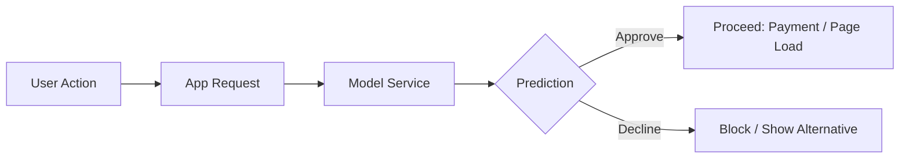
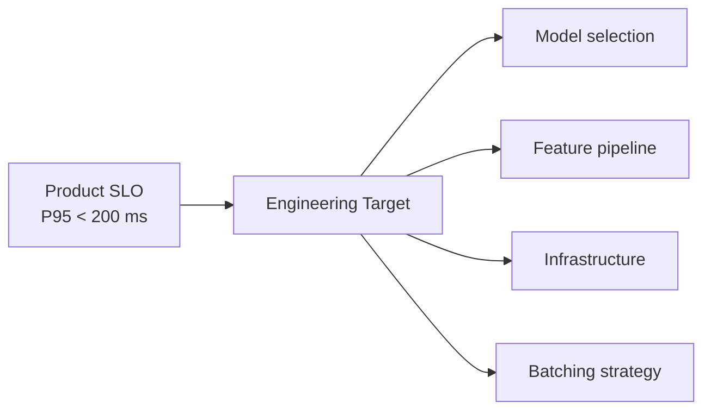

# Online Inference: Interactive Use Cases and Metrics

## When Online Inference Is the Right Tool

Online inference is required when a **live interaction** cannot proceed until the prediction arrives. The common theme: something important is blocked, waiting for the model.

---

## Classic Interactive Use Cases

| Domain | Scenario | Why Online? |
|--------|----------|-------------|
| **Search & ranking** | User types a query; results must be ranked in real time | User staring at search box |
| **Recommendations** | Homepage or product page shows personalized suggestions | Page load blocked on ranking |
| **Fraud / risk** | Payment, login, or password reset checked before proceeding | Transaction blocked until decision |
| **Dynamic UX** | Content layout, pricing, or personalization adapts to current user context | UI rendering depends on prediction |

---

## The User-Is-Waiting Mindset

In online inference, **model latency directly affects**:

| Business Metric | Latency Impact |
|----------------|---------------|
| Page load time | Every ms of inference adds to perceived load |
| App responsiveness | Slow predictions make the app feel "broken" |
| Conversion / abandonment | Users drop out of checkout funnels that feel sluggish |
| Fraud prevention effectiveness | Payment provider timeouts if fraud check is too slow |

### Typical Product Requirements

| Use Case | Latency Target |
|----------|---------------|
| Show recommendations | < 100–200 ms |
| Complete fraud check | Before payment provider timeout (~2–5 s hard limit, but UX breaks well before) |
| Search ranking | < 50–100 ms for snappy feel |

These are **product requirements**, not just engineering preferences.

---

## Online Metrics Dashboard

| Metric | Priority | What It Tells You |
|--------|----------|-------------------|
| **P50 latency** | Medium | Typical user experience |
| **P95 latency** | **Critical** | Worst experience 5% of users feel |
| **P99 latency** | **Critical** | Tail behavior under stress |
| **Error rate** | **Critical** | Timeouts, failures, fallback frequency |
| **Throughput (RPS)** | Important | Can we handle peak traffic? |
| **Cost at peak** | Important | Every extra ms multiplied by thousands of requests |

The headline question for online inference:

> Can we meet latency SLOs at P95/P99, even during traffic spikes?

---

## P95/P99 as Product Requirements

| Statement | Meaning |
|-----------|---------|
| "Average latency is 80 ms" | Misleading if P99 is 2 seconds |
| "P95 latency < 100 ms" | 95% of users get predictions within 100 ms |
| "P99 latency < 500 ms" | Even the slowest 1% must complete within 500 ms |

If P95/P99 targets are missed, the **user experience breaks** — this is not an abstract engineering metric.

---

## Freshness and Personalization Benefits

Online inference enables capabilities batch cannot:

| Benefit | Mechanism |
|---------|-----------|
| **Very fresh predictions** | Use latest session data, recent actions, geolocation, device type |
| **Per-request personalization** | Two users on the same page at the same moment see different content |
| **Tighter feedback loop** | Log each prediction with user interaction; feed back into training faster |

---

## Cost at Peak

Online cost is dominated by **peak traffic**, not average:

- Every extra millisecond of computation at peak is multiplied by thousands of concurrent requests
- Auto-scaling adds replicas during spikes — cost scales with traffic
- Caching and model simplification are primary cost levers

---

## Common Pitfalls / Exam Traps

- **Trap**: Reporting average latency when the SLA specifies P95 — always match the metric to the requirement.
- **Trap**: "100 ms model inference = 100 ms user experience." — Network, feature lookup, and serialization add to total latency.
- **Trap**: Assuming uniform traffic — online systems must be designed for spikes (campaigns, viral events, bot traffic).
- **Trap**: "Online always means the most complex model." — Production online paths often use simplified models or hybrid batch+online architectures.

---

## Quick Revision Summary

- Online inference is required when a **live interaction blocks** on the prediction
- Use cases: search ranking, real-time recommendations, fraud checks, dynamic personalization
- Model latency directly impacts page load, responsiveness, conversion, and abandonment
- Key metrics: **P95/P99 latency** and **error rate** are product-level requirements
- Benefits: fresh context, per-request personalization, faster training feedback loops
- Cost is driven by peak traffic — every ms at peak is multiplied across thousands of requests
