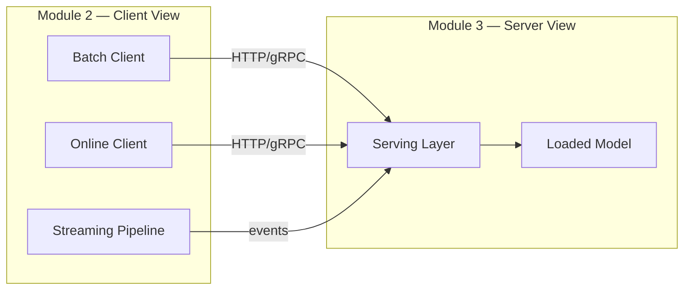

# Model Serving Patterns and Containerization: Module Overview

## Shifting Perspective: From Client to Server

In earlier modules, the focus was on the **client side** of inference — how batch scripts score many rows, how online clients send one request and wait for one response, and how metrics like latency and throughput define success. The mental model was straightforward: send JSON to a `predict` function, receive predictions back.

This module flips the camera around. The central question becomes: **what lives behind the `predict` endpoint?** Where does the trained model actually reside, and how does it handle real traffic in production?

Model serving is the job description for the component that sits behind every prediction call.

---

## 1. What You Already Know (Module 2 Recap)

| Inference Pattern | Client Behaviour | Latency Expectation |
|-------------------|------------------|---------------------|
| **Batch** | Calls `predict` many times (or once with many rows) | Minutes to hours acceptable |
| **Online** | Sends one request, blocks until one response | Typically 50–300 ms |
| **Streaming** | Events flow continuously; model processes as they arrive | Near real-time, event-driven |

Module 2 taught *how clients call models*. Module 3 teaches *how the server side is built, deployed, and operated*.

---

## 2. Module Scope

This module covers four interconnected topics:

1. **Definition and responsibilities** — what model serving actually means beyond "I have a `.pkl` file on disk"
2. **Serving architectures** — monolith, microservice, and serverless patterns
3. **APIs for ML** — REST vs gRPC, synchronous vs asynchronous communication
4. **Deployment and operations** — single-instance deployment, blue-green and canary rollouts, autoscaling, and Docker containerization

The hands-on lab builds a FastAPI model service, packages it in Docker, and tests it locally — the same container can act as a monolith in a small system or as a dedicated model microservice in a larger architecture.

---

## 3. The Serving Layer as a Production Component

A model file on disk is passive. Model serving transforms that artefact into a **reliable, callable production component** that:

- Accepts real traffic from clients (batch scripts, web apps, other services)
- Integrates with monitoring, logging, and alerting infrastructure
- Respects SLOs for latency, throughput, and availability

Think of serving as the bridge between offline training and live product value.

---

## Common Pitfalls / Exam Traps

- **Confusing inference pattern with serving architecture** — batch/online/streaming describes *how* clients call the model; monolith/microservice/serverless describes *where* the model lives in the system. They are orthogonal layers.
- **Assuming serving is just `model.predict()`** — serving orchestrates validation, feature transformation, inference, response formatting, and operational concerns.
- **Treating the model artefact as the service** — a `.pkl` or `.pt` file is not production-ready until wrapped in a long-lived process with an API contract.

## Quick Revision Summary

- Module 3 shifts focus from the **client** (Module 2) to the **serving layer** behind the `predict` endpoint.
- Serving answers: where the model lives, how it handles requests, and how it integrates with production infrastructure.
- Four topics: definition/responsibilities, architectures, APIs, deployment/operations.
- Inference patterns (batch/online/streaming) and serving architectures (monolith/microservice/serverless) are **two layers of the same picture**.
- Labs build a FastAPI + Docker service that embodies these concepts in code.
- The serving layer is what turns a trained model artefact into a measurable production system.
