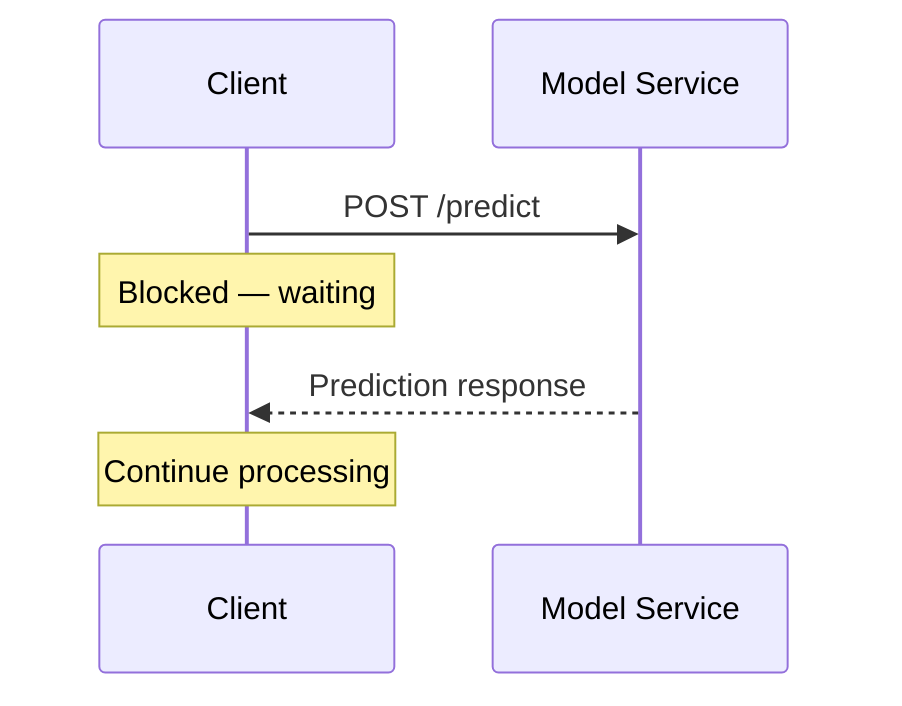
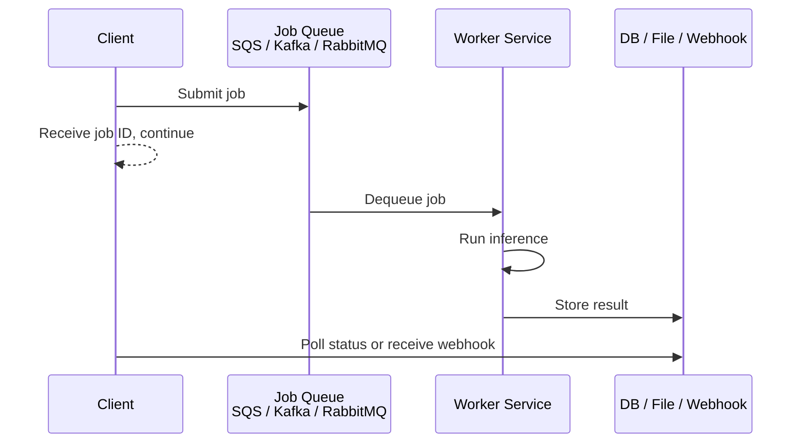
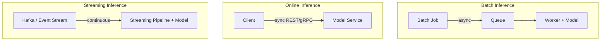

# Synchronous vs Asynchronous API Calls for ML Serving

## Two Dimensions of Communication

API protocol (REST vs gRPC) is one design choice. Another orthogonal dimension is **when the client receives the result** — synchronously (blocking) or asynchronously (non-blocking). Both sync and async can be implemented with REST, gRPC, queues, or any protocol.

---

## 1. Synchronous Calls

In a synchronous call, the client sends a request and **blocks** until the model returns a prediction. Nothing else happens in that workflow until the response arrives or times out.

**Works well when**:

- Inference is fast (typically under 100–300 ms)
- The prediction has **direct impact** on user experience or business decisions
- The caller needs the answer **right now**

| Use Case | Why Sync |
|----------|----------|
| UI fetching real-time recommendations | User is staring at the screen waiting |
| Mobile app getting sentiment score | Screen update depends on the result |
| Payment backend checking fraud before approving | Transaction cannot proceed without the score |

---

## 2. Asynchronous Calls

In an asynchronous workflow, the client **submits a job** and immediately moves on. A worker later picks up the job, runs the model, and stores or delivers the result.

**Works well when**:

- Inference is **slow or heavy** (seconds to minutes)
- The client does **not** need an immediate response
- Systems must handle **traffic spikes** — queues buffer requests without overwhelming the model service

| Use Case | Why Async |
|----------|-----------|
| Scoring millions of rows in a churn model | Hours of processing; no user waiting |
| Video analysis pipeline | Minutes per file |
| Report generation with ML summaries | Results needed eventually, not instantly |
| Peak smoothing during campaign spikes | Queue absorbs burst; workers scale in background |

**Common async pattern**: client submits a job, receives a `job_id`, then polls `GET /jobs/{job_id}/status` or receives a webhook/callback when complete.

---

## 3. Comparison Table

| Dimension | Synchronous | Asynchronous |
|-----------|-------------|--------------|
| **Client behaviour** | Blocks until response | Submits and moves on |
| **Latency tolerance** | Low (ms) | High (seconds to hours) |
| **Traffic spike handling** | Must scale service immediately | Queue buffers; workers scale later |
| **Result delivery** | Inline in response | Poll, webhook, or notification |
| **Complexity** | Simple request-response | Requires queue, worker, status tracking |
| **Protocols** | REST, gRPC | REST + queue, gRPC + queue, pure message queues |

---

## 4. Connecting to Inference Patterns

| Inference Pattern | Typical API Style | Calling Pattern |
|-------------------|-------------------|-----------------|
| **Batch** | Job submission to queue | Async — scheduled, background processing |
| **Online / Real-time** | `POST /predict` (REST or gRPC) | Sync — client waits, low latency required |
| **Streaming** | Event stream (Kafka, Flink) | Event-driven — model processes events as they arrive |

- **Online inference** → typically synchronous REST or gRPC
- **Batch inference** → typically async jobs with queues
- **Streaming inference** → event-driven, no explicit client call

The same model can be served synchronously for online use and asynchronously for batch use — the serving pattern adapts to the consumption pattern.

---

## 5. Course Default: Sync REST

For learning and first production deployments, synchronous `POST /predict` with JSON over HTTP is the standard because:

- Extremely easy to demo, test, and debug (curl, Postman, Bruno)
- Works for both batch and online clients (batch scripts can loop synchronous calls)
- Matches what many teams use for their first production ML model

Later expansion: gRPC for internal service-to-service, async job patterns for long-running workflows.

---

## Common Pitfalls / Exam Traps

- **Sync for long-running inference** — blocking a client for minutes ties up connections and violates UX; use async.
- **Async for real-time fraud detection** — the transaction cannot wait for a queue worker; sync is mandatory.
- **Confusing async API with async inference** — async API means the client does not wait; the model may still run inference synchronously inside the worker.
- **No status endpoint for async jobs** — clients need `job_id` + poll/webhook; submitting to a void is unusable.

## Quick Revision Summary

- Sync = client blocks until prediction arrives; async = client submits job and moves on.
- Sync for: fast inference (< 300 ms), real-time UX, immediate business decisions.
- Async for: heavy/slow inference, peak smoothing, offline/near-real-time use cases.
- Batch → async queues; online → sync REST/gRPC; streaming → event-driven pipelines.
- Same model can be served both ways depending on consumption pattern.
- Course default: sync `POST /predict` with JSON — simple, debuggable, production-viable.
