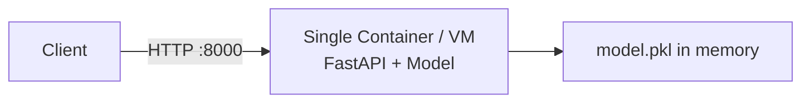
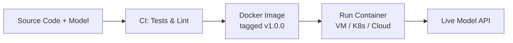

# Single-Instance Deployment of Model Services

## From API Design to Running in Production

Once you have a `POST /predict` endpoint (FastAPI, gRPC, or other), the next questions are operational: **where does this service run**, **how do you update it safely**, and **how do you scale with traffic?** This note covers the simplest deployment pattern — a single instance — and the build-package-run pipeline that gets you there.

---

## 1. Single-Instance Deployment

The simplest production setup: **one VM or one container** running your model API.

- Listens on a port (e.g., 8000), directly or behind a load balancer / reverse proxy
- Configuration via environment variables, config files (JSON/YAML), or secrets managers
- Model path, port, feature flags, and credentials passed at startup

**When this is enough**:

- Small internal tools
- Early prototypes
- Low-traffic services
- Lab environments (Docker container on localhost)

One process, one URL, minimal moving parts — easy to reason about and debug.

---

## 2. The Build-Package-Run Pipeline

Every model deployment follows three steps:

| Step | What Happens | Tools |
|------|--------------|-------|
| **Build** | Commit code → CI runs tests, linters, health checks | GitHub Actions, GitLab CI, Jenkins |
| **Package** | Build Docker image containing code, model artefact, and dependencies; tag with version (e.g., `ml-serving-api:v1.0.0`) | Docker, BuildKit |
| **Run** | Run image as container on VM, Kubernetes, or container platform; pass env vars, configure ports, set secrets | Docker run, kubectl, ECS, Cloud Run |

**Why Docker as the deployment unit**:

- Self-contained: Python version, libraries, model artefact — all bundled
- Reproducible: same image runs identically on laptop, staging, and production
- Portable: deploy to any environment that runs containers

---

## 3. Configuration Management

| Config Type | Examples | How to Pass |
|-------------|----------|-------------|
| **Model path** | `/app/model.pkl` | Environment variable `MODEL_PATH` |
| **Port** | `8000` | Environment variable `PORT` or Dockerfile `EXPOSE` |
| **Feature flags** | Enable/disable experimental endpoints | Environment variable or config file |
| **Secrets** | API keys, database credentials | Secrets manager, Docker secrets, K8s secrets |

Never hardcode secrets or environment-specific paths in application code.

---

## 4. Why Rollout Strategies Matter

In a toy setup, you build a new Docker image, deploy it, and hope for the best. In production, shipping a new model introduces real risk:

| Risk | Example |
|------|---------|
| **Code bugs** | Broken preprocessing pipeline |
| **Model regression** | New model performs worse on live data than offline metrics suggested |
| **Latency regression** | New model is slower or more resource-hungry |
| **Configuration errors** | Wrong model path, missing dependency |

Rollout strategies exist to **reduce blast radius** — test with real traffic in a controlled way before committing fully.

The next notes cover blue-green deployment, canary releases, and autoscaling.

---

## 5. Connecting to the Lab

The lab follows this exact pattern:

1. Build a FastAPI model service
2. Package it in a Docker image
3. Run the container locally on `localhost:8000`

This is single-instance deployment in its purest form. The same Docker image can later be deployed to a VM, Kubernetes cluster, or cloud container platform with more advanced rollout and scaling strategies layered on top.

---

## Common Pitfalls / Exam Traps

- **Skipping CI before packaging** — deploying untested images to production is the most common deployment failure mode.
- **Not tagging images with versions** — `latest` tag makes rollbacks impossible; always use semantic versioning.
- **Hardcoding configuration** — model paths and secrets must be externalised via environment variables.
- **Assuming single-instance is not "real" deployment** — many internal tools run happily on one container for years.

## Quick Revision Summary

- Simplest deployment: one VM or container running the model API on a single port.
- Build-Package-Run pipeline: CI tests → Docker image (tagged) → run container with config.
- Docker image = portable, reproducible deployment unit (code + model + dependencies).
- Configuration via environment variables, config files, and secrets managers.
- Production rollouts need controlled strategies — not "deploy and hope."
- Lab pattern (FastAPI in Docker on localhost) is single-instance deployment in practice.
