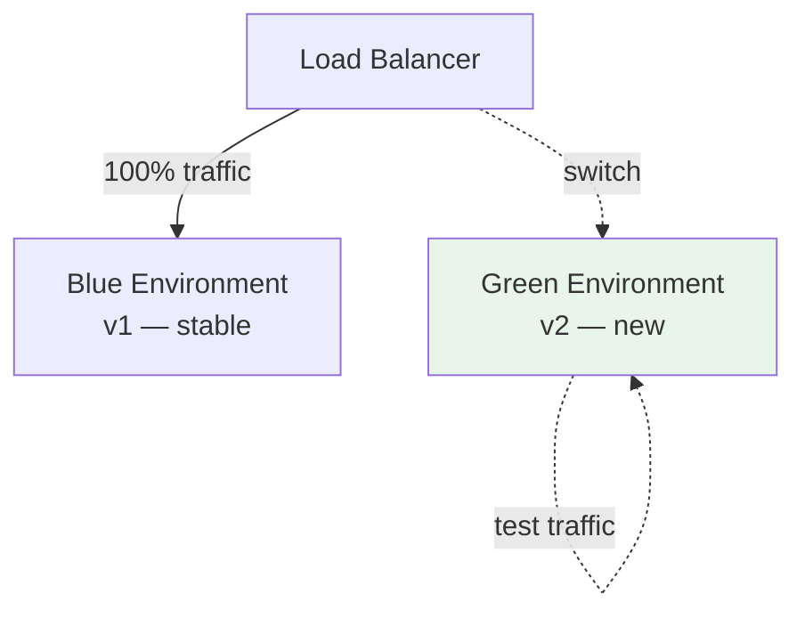
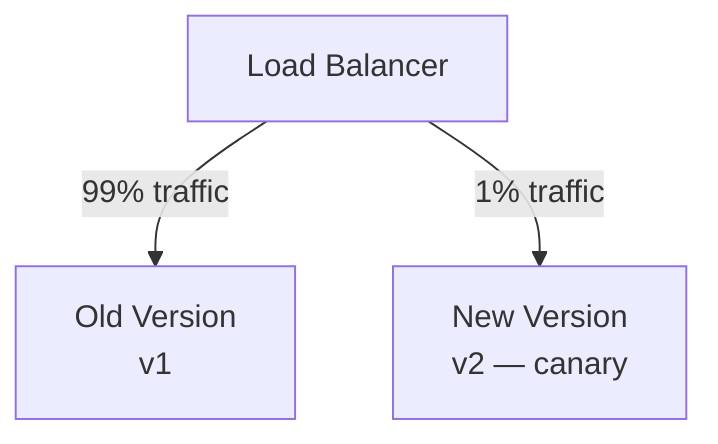
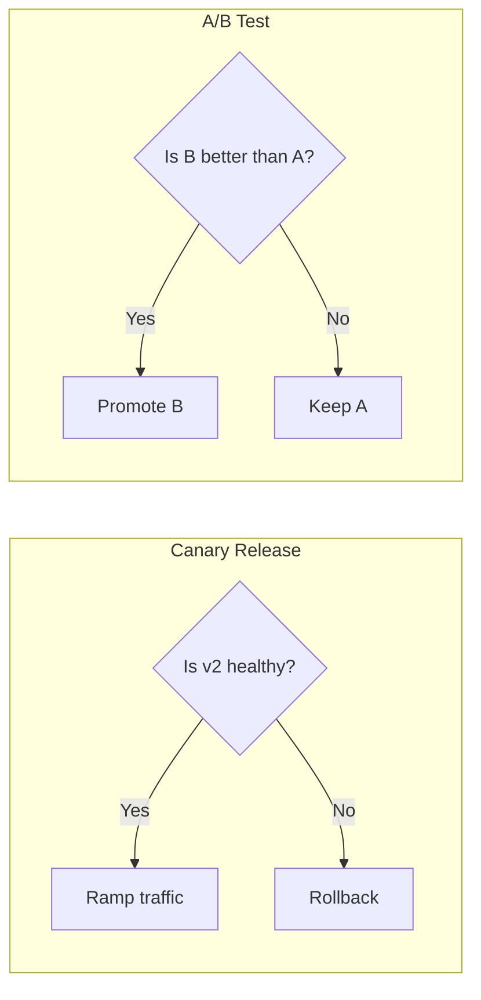

# Blue-Green and Canary Deployment for Model Services

## Why Controlled Rollouts Matter

Deploying a new model version to production is risky — bugs, worse live performance, latency regressions. Rollout strategies let you test with **real traffic in a controlled way** before committing fully, and roll back quickly if something goes wrong.

---

## 1. Blue-Green Deployment

Run **two complete environments side by side**:

- **Blue** = current stable version (serving all production traffic)
- **Green** = new version being prepared for release

**Typical flow**:

1. Deploy new version to green environment
2. Run smoke tests against green (test traffic or internal traffic slice)
3. When confident, **switch the load balancer** so all production traffic goes to green
4. If something goes wrong, **flip traffic back to blue** — rollback is instant

| Advantage | Detail |
|-----------|--------|
| **Fast, simple rollback** | Switch traffic back to blue in seconds |
| **Parallel testing** | New version runs on real infrastructure before full exposure |
| **Clear separation** | Old and new environments are completely isolated |

| Trade-off | Detail |
|-----------|--------|
| **Cost** | Running two full environments temporarily doubles infrastructure cost |
| **When worth it** | Critical services, big changes (new model + major code changes together) |

---

## 2. Canary Release

Instead of switching all traffic at once, route a **small percentage** to the new version while the majority stays on the old version.

**Typical ramp**:

| Stage | Traffic to New Version | Action |
|-------|------------------------|--------|
| Initial | 1% | Monitor closely |
| Healthy | 10% | Expand if metrics look good |
| Healthy | 50% | Continue ramp |
| Healthy | 100% | Full rollout; decommission old version |
| **Problem at any stage** | — | Stop ramp or roll back to old version |

**Metrics to watch during canary**:

| Category | Metrics |
|----------|---------|
| **System health** | Error rates, P95/P99 latency |
| **Model quality** | Click-through rate, conversion rate, fraud catch rate |
| **Business impact** | Revenue, engagement, task-specific quality |

The canary tests the mine first — not the entire user base.

---

## 3. Canary vs A/B Test

Both involve splitting traffic, but they serve **different purposes**:

| Aspect | Canary Release | A/B Test |
|--------|----------------|----------|
| **Primary question** | Is the new version **healthy and safe**? | Does Model B **outperform** Model A on business metrics? |
| **Focus** | Reliability and stability | Product and business impact |
| **Metrics watched** | Error rates, latency, obvious regressions | Engagement, revenue, CTR, quality metrics |
| **Decision** | Safe to serve more traffic? | Which model is better for users? |
| **Traffic split purpose** | Risk mitigation | Experimentation |

In model engineering, canary thinking dominates early — ensure the service is safe and stable before worrying about business uplift.

---

## 4. Choosing Between Blue-Green and Canary

| Factor | Blue-Green | Canary |
|--------|------------|--------|
| **Rollback speed** | Instant (flip switch) | Gradual (reduce canary %) |
| **Risk exposure** | All-or-nothing at switch point | Gradual — problems affect only canary slice |
| **Infrastructure cost** | 2x during transition | Minimal extra (small canary pool) |
| **Best for** | Big bang releases, major changes | Incremental model updates, continuous deployment |
| **Monitoring requirement** | Pre-switch smoke tests | Continuous metric monitoring during ramp |

Many production systems use **both**: blue-green for infrastructure changes, canary for model version updates.

---

## Common Pitfalls / Exam Traps

- **Confusing canary with A/B test** — canary asks "is it safe?"; A/B asks "is it better?"
- **Ramping canary without monitoring** — increasing traffic without watching error rates and latency defeats the purpose.
- **Blue-green without smoke tests** — switching traffic to green without validation is just a delayed big-bang deploy.
- **Forgetting to decommission old version** — leaving blue running indefinitely doubles cost with no rollback benefit.

## Quick Revision Summary

- Blue-green: two environments side by side; switch all traffic at once; instant rollback.
- Canary: route small % to new version; ramp gradually; stop or rollback on problems.
- Canary = safety/reliability question; A/B test = business impact question.
- Watch error rates, P95/P99 latency, and model-specific quality metrics during canary.
- Blue-green costs 2x temporarily; canary costs minimal extra infrastructure.
- Production systems often combine both strategies for different release types.
