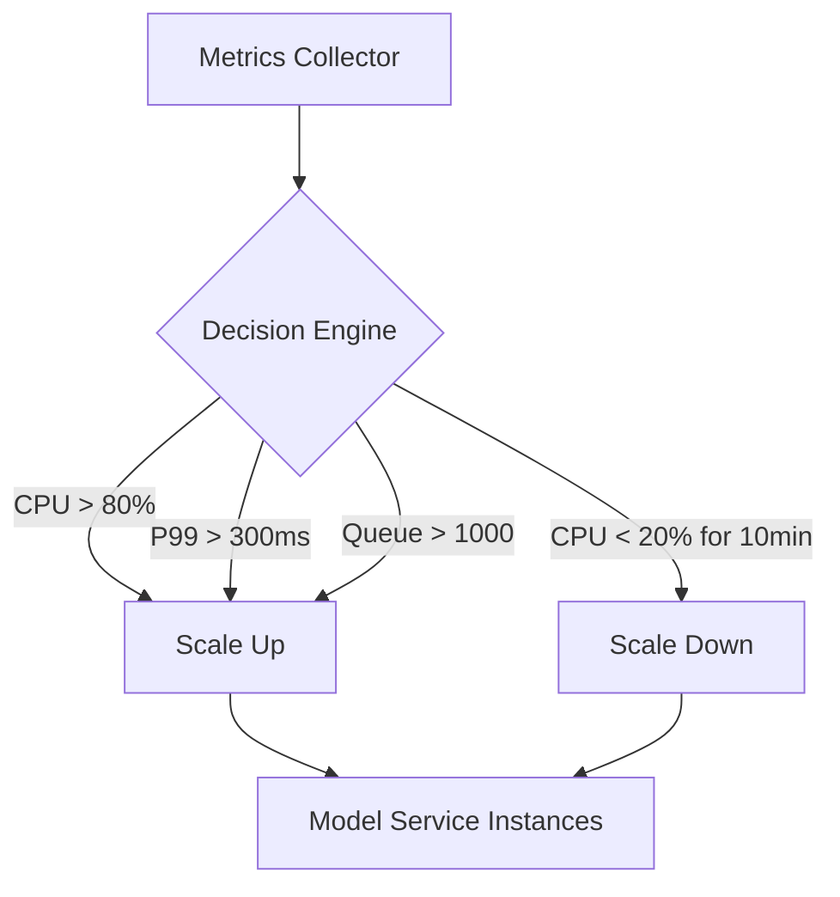
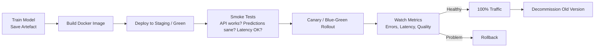

# Autoscaling for Model Services

## Why Traffic Is Never Flat

Real systems see daytime peaks, nighttime lulls, weekend patterns, campaign spikes, and seasonal surges. Fixed capacity creates a dilemma:

- **Too small** → timeouts, errors, unhappy users during spikes
- **Too large** → paying for pods that sit mostly idle

Autoscaling automatically adjusts the number of running instances based on load and performance signals, keeping you within SLOs without burning money.

---

## 1. Common Autoscaling Signals

| Signal | Scale Up When | Scale Down When |
|--------|---------------|-----------------|
| **CPU usage** | Average CPU stays too high across instances | CPU very low for extended period |
| **Request rate (RPS/QPS)** | Requests per second exceed per-instance capacity | Sustained low request rate |
| **Queue length** | Async job queue grows — system falling behind | Queue consistently empty |
| **Latency (P95/P99)** | Latency rises above target SLO | Latency well below target with excess capacity |
| **GPU utilisation** | GPU saturated on ML workloads | GPU idle |
| **Memory usage / OOM events** | Memory pressure or out-of-memory kills | Memory comfortably below limits |

**Goal**: keep P95 latency under target (e.g., < 200 ms) while controlling cost by not running more instances than needed.

---

## 2. ML-Specific Autoscaling Wrinkles

Model services have unique characteristics that generic autoscaling must account for:

### Model Load Time

Large models can take **seconds to minutes** to load into memory. New instances spun up on demand suffer **cold starts** — the first few requests are very slow while the model deserializes.

**Mitigation**: set a **minimum replica count** to keep instances warm.

### Resource Profile

| Workload Type | Scaling Preference |
|---------------|-------------------|
| **CPU-heavy models** (sklearn, XGBoost) | More smaller instances |
| **GPU-heavy models** (deep learning) | Fewer larger GPU instances |
| **Batch serving** | Fewer, larger instances (amortize load time) |
| **Online serving** | More, smaller instances (distribute latency) |

### Recommended Configuration

| Setting | Purpose |
|---------|---------|
| **Min replicas** | Keep warm instances; avoid cold starts |
| **Max replicas** | Prevent runaway cost during misconfigured scaling |
| **Combined signals** | Use traffic + latency + resource usage together, not just CPU |

---

## 3. End-to-End Model Deployment Lifecycle

A typical flow for shipping a new model version:

| Step | Model Engineer Responsibility |
|------|-------------------------------|
| Train and save artefact | Offline metrics, data validation |
| Build Docker image | Package model + code + dependencies |
| Deploy to staging | Smoke tests on real infrastructure |
| Canary / blue-green rollout | Controlled exposure to production traffic |
| Monitor metrics | Errors, latency, business/quality metrics |
| Ramp or rollback | Decision based on live performance |
| Decommission old version | Clean up resources; keep rollback option briefly |

A model engineer's job increasingly involves owning this **entire loop** — not just training the model, but deploying it safely, monitoring it, and scaling it.

---

## 4. Connecting to Module 2 Metrics

Autoscaling directly serves the metrics defined in Module 2:

| Metric | How Autoscaling Helps |
|--------|----------------------|
| **Latency (P95)** | Scale up when P95 exceeds target during traffic peaks |
| **Throughput** | More instances → more concurrent requests handled |
| **Cost** | Scale down during lulls → fewer idle resources billed |

The model artefact is potential; the model service with autoscaling is what turns that potential into a **measurable, scalable production system**.

---

## Common Pitfalls / Exam Traps

- **Scaling on CPU alone for GPU models** — GPU utilisation is the relevant signal, not CPU.
- **Min replicas = 0 for latency-critical services** — every scale-from-zero event triggers a cold start with model load time.
- **No max replica cap** — misconfigured scaling rules can spin up hundreds of expensive GPU instances.
- **Ignoring model load time in scaling calculations** — new instances are not instantly ready; budget warm-up time in SLOs.

## Quick Revision Summary

- Autoscaling adjusts instance count based on load signals to balance SLOs and cost.
- Signals: CPU, RPS, queue length, P95/P99 latency, GPU utilisation, memory.
- ML-specific: model load time (cold starts), GPU vs CPU profiles, batch vs online preferences.
- Set min replicas (warm instances), max replicas (cost cap), combined signals.
- Full lifecycle: train → build image → staging → canary/blue-green → monitor → ramp/rollback.
- Model engineers own the entire deploy-monitor-scale loop, not just training.
