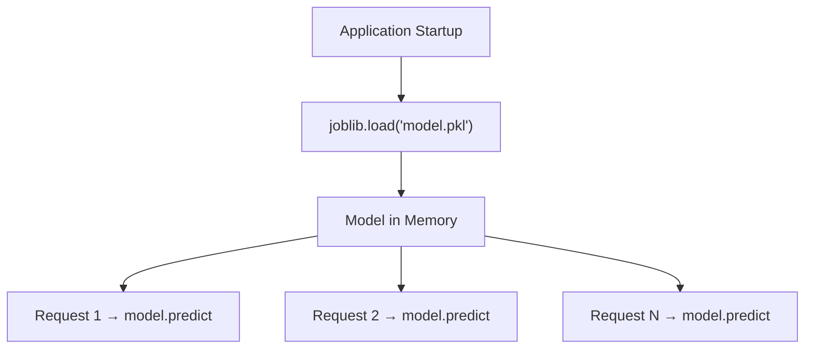
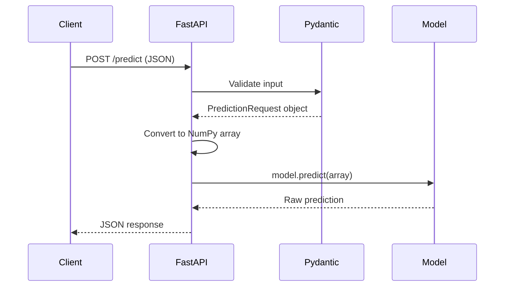

# Building a FastAPI Model Service

## From Training Script to Production API

This note walks through the anatomy of a FastAPI-based model serving service — the same pattern used in hands-on labs and widely adopted in production ML systems. The goal is to understand API structure, model loading strategy, and the request lifecycle inside the `predict` endpoint.

---

## 1. Project Structure

A typical ML serving project layout:

```
lab-3/
├── train_model.py      # Training script (produces model artefact)
├── app.py              # FastAPI serving application
├── model.pkl           # Serialised model artefact
├── requirements.txt    # Python dependencies
└── Dockerfile          # Container build recipe
```

In production, `train_model.py` is often replaced by a model download script (e.g., pulling a pre-trained model from Hugging Face). The serving application loads whatever artefact exists in the `model/` directory.

---

## 2. FastAPI Application Setup

```python
from fastapi import FastAPI

app = FastAPI(
    title="ML Model Service",
    description="Serves predictions from a trained model"
)
```

- `app` is the root object — all endpoints attach to it
- FastAPI auto-generates interactive documentation at `/docs` (Swagger UI)
- This metadata makes the API self-documenting for consumers

---

## 3. Model Loading at Startup (Critical Pattern)

```python
import joblib

MODEL_PATH = "model.pkl"

try:
    model = joblib.load(MODEL_PATH)
except FileNotFoundError:
    model = None
```

**This code runs once at application startup — not on every request.**

| Why | Detail |
|-----|--------|
| **Performance** | Loading a large model takes seconds to minutes; doing it per request destroys latency |
| **Efficiency** | One loaded instance is reused across all incoming requests |
| **Robustness** | Graceful handling if model file is missing (service starts but predict returns error) |



**Anti-pattern**: loading inside the `predict` handler. Never do this in production.

---

## 4. Input Validation with Pydantic

```python
from pydantic import BaseModel

class PredictionRequest(BaseModel):
    feature_1: float
    feature_2: float
```

Pydantic automatically:

- Validates incoming JSON against the schema
- Enforces types (e.g., `feature_1` must be a float)
- Returns HTTP 422 with clear errors for invalid input

This is the serving layer's **schema enforcement** responsibility — protecting the model from garbage input and giving clients actionable error messages.

---

## 5. Endpoints

### Health Check — `GET /`

```python
@app.get("/")
def health_check():
    return {"message": "API is running"}
```

- Used by Kubernetes probes, load balancers, and monitoring systems
- Answers: "Is this process up?"
- Advanced health checks can verify model loaded, database reachable, etc.

### Predict — `POST /predict`

The core serving endpoint. Request lifecycle:



| Step | Code Action |
|------|-------------|
| 1. Receive | FastAPI parses JSON body |
| 2. Validate | Pydantic checks types and required fields |
| 3. Transform | Convert validated object to NumPy array matching model input shape |
| 4. Infer | `model.predict(input_array)` |
| 5. Respond | Return clean JSON with prediction value |

```python
@app.post("/predict")
def predict(request: PredictionRequest):
    if model is None:
        return {"error": "Model not loaded"}
    import numpy as np
    input_array = np.array([[request.feature_1, request.feature_2]])
    prediction = model.predict(input_array)
    return {"prediction": float(prediction[0])}
```

### Model Info — `GET /model-info`

Returns metadata about the model (version, features, type). In the lab this is hardcoded; in production it reads from a model registry or config.

---

## 6. Running the Service

```bash
# Train the model first
python train_model.py

# Start the FastAPI server
uvicorn app:app --reload --host 127.0.0.1 --port 8000
```

- `uvicorn` is the ASGI server that runs FastAPI
- `--reload` enables auto-restart on code changes (development only)
- Service available at `http://127.0.0.1:8000`
- Interactive docs at `http://127.0.0.1:8000/docs`

---

## 7. Testing with an API Client

Test endpoints using Bruno (open-source API client, MIT licence) or curl/Postman:

| Endpoint | Method | Expected Response |
|----------|--------|-------------------|
| `/` | GET | `200 OK` — service running |
| `/model-info` | GET | Model metadata JSON |
| `/predict` | POST | `{"feature_1": 1.5, "feature_2": 2.3}` → prediction JSON |
| `/nonexistent` | GET | `404 Not Found` |

Changing input values and observing different predictions confirms the model is loaded and inference works end-to-end.

---

## Common Pitfalls / Exam Traps

- **Loading model inside predict handler** — the #1 serving anti-pattern; always load at startup.
- **Skipping Pydantic validation** — raw dict access bypasses type checking and schema enforcement.
- **Wrong input shape** — model expects 2D array `[[f1, f2]]`, not 1D `[f1, f2]`; always match training input shape.
- **Using `--reload` in production** — auto-reload is a development feature; production uses a process manager or container orchestrator.

## Quick Revision Summary

- FastAPI app with Pydantic models = schema-enforced ML API with auto-generated docs.
- Model loaded **once at startup** via `joblib.load()`; reused across all requests.
- Three endpoints: health check (`GET /`), predict (`POST /predict`), model info (`GET /model-info`).
- Predict flow: receive → validate (Pydantic) → transform (NumPy) → infer → respond (JSON).
- Run with `uvicorn app:app`; test with Bruno, curl, or `/docs` UI.
- This pattern scales from lab prototype to production microservice with Docker and orchestration.
