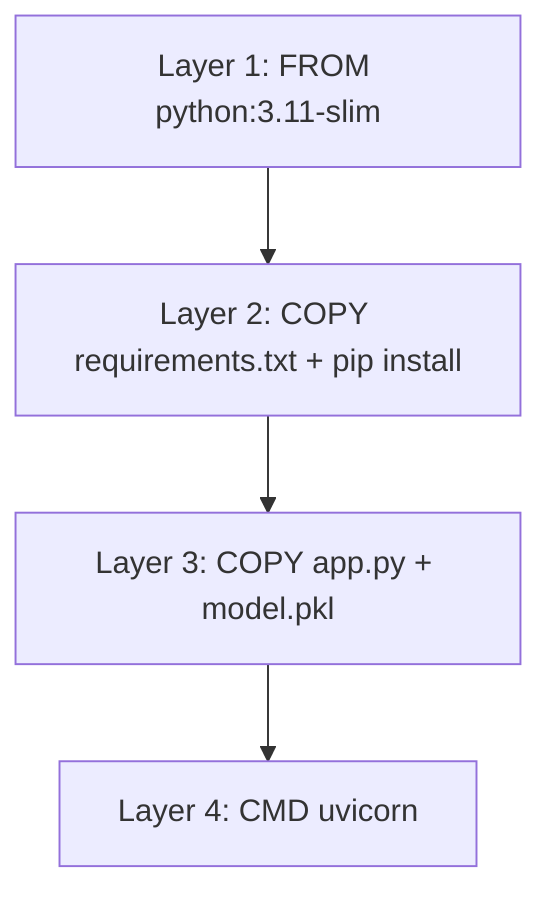
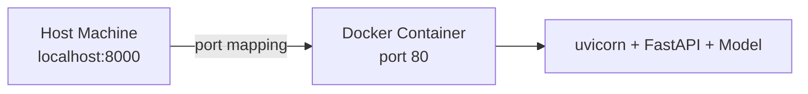

# Containerizing the ML Service with Docker

## Why Containerize?

A Docker image is a **portable, reproducible deployment unit** that bundles your code, model artefact, and all dependencies. The same image runs identically on your laptop, a staging VM, a Kubernetes cluster, or a serverless container platform. Containerization is the bridge between "it works on my machine" and "it works in production."

---

## 1. Anatomy of a Dockerfile

```dockerfile
FROM python:3.11-slim

WORKDIR /app

COPY requirements.txt .
RUN pip install -r requirements.txt

COPY model.pkl app.py ./

EXPOSE 80

CMD ["uvicorn", "app:app", "--host", "0.0.0.0", "--port", "80"]
```

| Instruction | Purpose |
|-------------|---------|
| `FROM python:3.11-slim` | Base image — slim variant keeps size small and attack surface low |
| `WORKDIR /app` | Set working directory inside container |
| `COPY requirements.txt` + `RUN pip install` | Install dependencies **first** (layer caching) |
| `COPY model.pkl app.py` | Copy application code and model artefact |
| `EXPOSE 80` | Document which port the service listens on |
| `CMD uvicorn ...` | Command to start the service when container runs |

---

## 2. Layer Caching Strategy

Docker builds images in **layers**. If a layer's inputs have not changed, Docker reuses the cached layer.



**Best practice**: copy `requirements.txt` and run `pip install` **before** copying application code. If only `app.py` changes, Docker reuses the cached dependency layer — builds are much faster.

---

## 3. Why `--host 0.0.0.0` Matters

Inside a container, `127.0.0.1` (localhost) is only reachable from within the container itself. Binding to `0.0.0.0` makes the service accessible from outside the container — essential for port mapping to work.

| Binding | Reachable From |
|---------|----------------|
| `127.0.0.1` | Only inside the container |
| `0.0.0.0` | Host machine and external network (via port mapping) |

---

## 4. Building the Image

```bash
cd lab-3
docker build -t ml-serving-api:v1 .
```

| Flag | Meaning |
|------|---------|
| `-t ml-serving-api:v1` | Tag image with name and version |
| `.` | Build context — current directory (Dockerfile + files to copy) |

**Tagging best practices**:

- Use semantic versioning: `v1.0.0`, `v1.1.0`
- Include model version in tag when model changes: `ml-serving-api:model-v2`
- Never rely solely on `latest` — it makes rollbacks impossible

Once built, anyone with Docker can run the exact same service — same Python, same libraries, same model — regardless of their host OS.

---

## 5. Running the Container

```bash
docker run -d -p 8000:80 --name ml-service ml-serving-api:v1
```

| Flag | Meaning |
|------|---------|
| `-d` | Detached mode — runs in background |
| `-p 8000:80` | Port mapping: host port 8000 → container port 80 |
| `--name ml-service` | Human-readable container name |



The host machine only needs Docker installed. The container brings its own complete environment — Python runtime, pip packages, model file, and application code.

---

## 6. Production Dockerfile Best Practices

| Practice | Why |
|----------|-----|
| Use slim base images | Smaller image, fewer vulnerabilities |
| Multi-stage builds | Separate build dependencies from runtime |
| Non-root user | Security — container should not run as root |
| `.dockerignore` | Exclude `.git`, `__pycache__`, virtual environments from build context |
| Pin dependency versions | `requirements.txt` with exact versions for reproducibility |
| Health check instruction | `HEALTHCHECK` for orchestrator integration |

---

## 7. Deployment Destinations

The same Docker image deploys to:

| Environment | How |
|-------------|-----|
| Local development | `docker run` on laptop |
| Single VM | `docker run` on cloud VM |
| Kubernetes | `kubectl apply` with deployment manifest |
| AWS ECS / Fargate | Task definition referencing the image |
| GCP Cloud Run | Serverless container platform |
| Azure Container Instances | Managed container runtime |

---

## Common Pitfalls / Exam Traps

- **Wrong build context** — running `docker build` from the wrong directory causes "file not found" errors; always `cd` to the directory containing the Dockerfile.
- **Binding to 127.0.0.1 inside container** — service unreachable from host; must use `0.0.0.0`.
- **Copying code before requirements** — defeats layer caching; always install dependencies first.
- **No image versioning** — deploying `latest` makes it impossible to know which model version is running or to roll back.

## Quick Revision Summary

- Docker image = portable unit bundling code, model, and dependencies.
- Dockerfile: slim base → install deps (cached layer) → copy app + model → expose port → CMD uvicorn.
- Layer caching: copy `requirements.txt` and `pip install` before application code.
- Build: `docker build -t name:version .` from the correct directory.
- Run: `docker run -d -p host:container --name name image:tag`.
- Bind to `0.0.0.0` inside container for external accessibility.
- Same image deploys to laptop, VM, Kubernetes, ECS, Cloud Run, and more.
