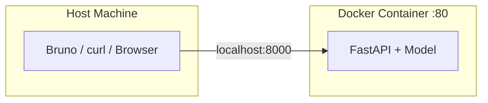
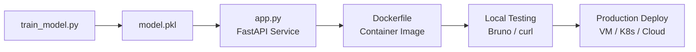

# Testing the Containerized Model Service Locally

## Validating the Full Stack

Building a Docker image is only half the deployment story. Before pushing to any remote environment, you must verify that the containerised service works correctly on your local machine — health checks pass, predictions return sensible values, and the service fails gracefully when stopped.

---

## 1. Test Setup

With the container running (`docker run -d -p 8000:80 --name ml-service ml-serving-api:v1`), the service is accessible at `http://localhost:8000` on the host machine.

**Important**: stop any locally running `uvicorn` process first. Only the container should be serving requests — otherwise port conflicts and ambiguous test results occur.



---

## 2. Endpoint Test Matrix

| Endpoint | Method | Request Body | Expected Result |
|----------|--------|--------------|-----------------|
| `/` | GET | — | `200 OK` — `{"message": "API is running"}` |
| `/model-info` | GET | — | `200 OK` — model metadata JSON |
| `/predict` | POST | `{"feature_1": 1.5, "feature_2": 2.3}` | `200 OK` — `{"prediction": <float>}` |
| `/nonexistent` | GET | — | `404 Not Found` |

### Health Check (`GET /`)

Confirms the container is running and the FastAPI process is healthy. In production, load balancers and Kubernetes liveness probes call this endpoint continuously.

### Model Info (`GET /model-info`)

Returns static model metadata. Verifies routing works and the service can respond to non-predict endpoints.

### Predict (`POST /predict`)

The main validation:

1. Send JSON with `feature_1` and `feature_2` as floats
2. Receive a prediction value
3. Change input values → prediction should change
4. Send invalid input (wrong type, missing field) → expect `422 Unprocessable Entity`

**Example curl test**:

```bash
curl -X POST http://localhost:8000/predict \
  -H "Content-Type: application/json" \
  -d '{"feature_1": 1.5, "feature_2": 2.3}'
```

### Negative Test (`GET /nonexistent`)

Calling an undefined route should return `404`. Confirms the routing layer handles unknown paths correctly.

---

## 3. What Successful Testing Proves

| Validation | What It Confirms |
|------------|------------------|
| Health check returns 200 | Container started, uvicorn running, process healthy |
| Predict returns valid JSON | Model loaded at startup, inference pipeline works end-to-end |
| Different inputs → different outputs | Model is actually running inference, not returning cached/static values |
| Invalid input → 422 | Pydantic validation is active; schema enforcement works |
| 404 on unknown routes | Routing layer is correctly configured |

---

## 4. Cleanup

After testing, stop and remove the container:

```bash
docker stop ml-service
docker rm ml-service
```

Or via Docker Desktop UI. After stopping:

- All endpoints should fail (connection refused or timeout)
- Confirms the service was truly running inside the container, not a leftover local process

---

## 5. The Full MLOps Serving Pipeline

This lab exercise completes the fundamental serving pipeline:



| Stage | Output |
|-------|--------|
| **Train** | Model artefact (`.pkl`) |
| **Wrap** | FastAPI service with validation, health check, predict endpoint |
| **Containerize** | Docker image — self-contained, immutable artefact |
| **Test** | Verify all endpoints locally before remote deployment |
| **Deploy** | Same image runs anywhere Docker is available |

The resulting Docker image is a **self-contained, immutable artefact** that guarantees the model runs exactly the same way on your laptop or in a production data centre. This is the fundamental goal of model serving and containerization in MLOps.

---

## 6. From Local Test to Production

The same test patterns extend to staging and production:

| Local | Production |
|-------|------------|
| `curl localhost:8000/predict` | Load balancer health checks + synthetic monitoring |
| Bruno manual tests | Automated integration test suite in CI |
| `docker stop` cleanup | Blue-green switch or canary rollback |
| Single container | Multiple replicas with autoscaling |

---

## Common Pitfalls / Exam Traps

- **Testing against local uvicorn instead of container** — always stop the dev server before testing the containerised version.
- **Not testing invalid inputs** — only testing happy path misses Pydantic validation verification.
- **Forgetting port mapping** — container exposes port 80; host accesses via mapped port (e.g., 8000).
- **Leaving containers running** — stale containers consume resources and create port conflicts for subsequent tests.

## Quick Revision Summary

- Test containerised service at `localhost:8000` (mapped from container port 80).
- Test matrix: health (`GET /`), model info, predict (`POST /predict`), negative (404).
- Change predict inputs to verify model inference is live, not static.
- Invalid inputs should return 422 (Pydantic validation).
- Stop container after testing; verify endpoints are dead.
- Full pipeline: train → FastAPI wrap → Docker image → local test → production deploy.
- Docker image = immutable artefact guaranteeing identical behaviour everywhere.
