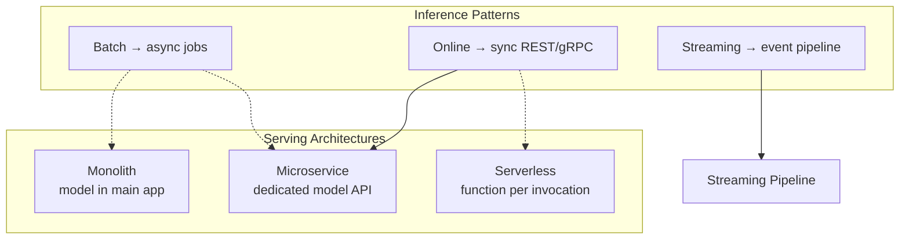

# Module 3 Summary: Model Serving Patterns and Containerization

## The Big Picture

Model serving transforms a passive model artefact into a **reliable, measurable production system**. This module covered the full stack — from definition and responsibilities through architectures, APIs, deployment, and hands-on containerization.

---

## 1. Model Serving Defined

| Concept | Definition |
|---------|------------|
| **Model artefact** | Passive serialised file (`.pkl`, `.pt`) on disk |
| **Model service** | Long-lived running process that loads the model, listens for requests, runs inference, returns responses |
| **Model serving** | The act of bringing the inert artefact to life as a production callable component |

Each request flows through: **receive → validate → transform → infer → post-process → respond**.

---

## 2. Core Serving Responsibilities

| # | Responsibility | Key Point |
|---|----------------|-----------|
| 1 | **Model lifecycle** | Load once at startup; manage versions; fit within resources |
| 2 | **Input validation** | Schema enforcement (Pydantic, protobuf); prevent training-serving skew |
| 3 | **Efficient inference** | Batching, correct transforms, concurrency; respect P95/P99 latency |
| 4 | **Response formatting** | Stable JSON schemas with predictions + metadata |
| 5 | **Operations** | Concurrency, error handling, logging, observability, security |

Most production engineering effort goes into responsibility #5, not the predict call itself.

---

## 3. Serving Architectures

| Architecture | Best For | Key Trade-off |
|--------------|----------|---------------|
| **Monolith** | POCs, internal tools, low traffic | Simple but cannot scale model independently |
| **Microservice** | Critical, high-traffic model APIs | Independent scaling/deploy but more complexity |
| **Serverless** | Spiky, lightweight, event-driven | Auto-scale and pay-per-use but cold starts and limits |

**Two layers of the same picture**: inference patterns (how clients call) and serving architectures (where the model lives).

---

## 4. APIs for ML

| Dimension | REST/JSON | gRPC/Protobuf | Sync | Async |
|-----------|-----------|---------------|------|-------|
| **Default for** | External APIs, prototypes | Internal microservices at scale | Online inference | Batch, heavy workloads |
| **Strength** | Human-readable, universal | Binary, typed, fast | Simple, immediate | Peak smoothing, non-blocking |
| **Weakness** | Verbose, no compile-time types | Not browser-native | Blocks client | Requires queue + worker |

**Course default**: synchronous `POST /predict` with JSON over HTTP — simple, debuggable, production-viable.

**Hybrid pattern**: REST at the edge, gRPC inside the backend.

---

## 5. Deployment and Operations

| Topic | Key Idea |
|-------|----------|
| **Single instance** | One container/VM; build-package-run pipeline with Docker |
| **Blue-green** | Two environments; switch all traffic; instant rollback |
| **Canary** | Small traffic % to new version; ramp gradually; monitor metrics |
| **Canary vs A/B** | Canary = "is it safe?"; A/B = "is it better?" |
| **Autoscaling** | Adjust replicas based on CPU, RPS, latency, GPU; min/max replicas; watch cold starts |

**End-to-end lifecycle**: train → build Docker image → staging → canary/blue-green → monitor → ramp or rollback → decommission old version.

---

## 6. Hands-On Lab Outcomes

| Component | What Was Built |
|-----------|----------------|
| **FastAPI service** | Health check, predict, model-info endpoints with Pydantic validation |
| **Model loading** | Once at startup via `joblib.load()`; reused across requests |
| **Docker image** | Self-contained artefact: code + model + dependencies |
| **Local testing** | Bruno/curl tests confirming all endpoints work in container |

The Docker image is the deployment unit — deployable as a monolith (single instance) or as a model microservice in a larger cluster, with blue-green, canary, and autoscaling layered on top.

---

## 7. Connection to Module 2

| Module 2 (Client Side) | Module 3 (Server Side) |
|------------------------|------------------------|
| Batch / online / streaming clients | Serving architectures hosting the model |
| Latency, throughput, cost metrics | How serving design makes metrics real |
| Inference patterns | API and deployment choices |

The model artefact is potential. The model service is what turns potential into a **real, measurable system** living in your product.

---

## Common Pitfalls / Exam Traps

- **Confusing inference pattern with serving architecture** — they are orthogonal layers.
- **Treating model file as model service** — artefact ≠ service.
- **Per-request model loading** — always load at startup.
- **Canary vs A/B test** — safety vs business impact.
- **Sync for batch, async for online** — reversed; online needs sync, batch needs async.
- **Skipping container testing** — always verify endpoints before remote deployment.

## Quick Revision Summary

- Model serving = long-lived service orchestrating the full predict pipeline under production constraints.
- Five responsibilities: lifecycle, validation, inference, response formatting, operations.
- Three architectures: monolith (simple), microservice (scalable), serverless (bursty).
- APIs: REST default; gRPC for internal scale; sync for online; async for batch.
- Deployment: Docker image → single instance → blue-green/canary rollouts → autoscaling.
- Lab: FastAPI + Pydantic + Docker + local testing = complete serving pipeline.
- Model engineers own train → deploy → monitor → scale, not just training.
- Inference patterns and serving architectures are two layers of one system design.
