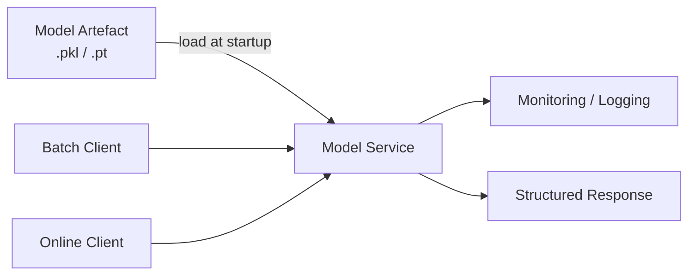
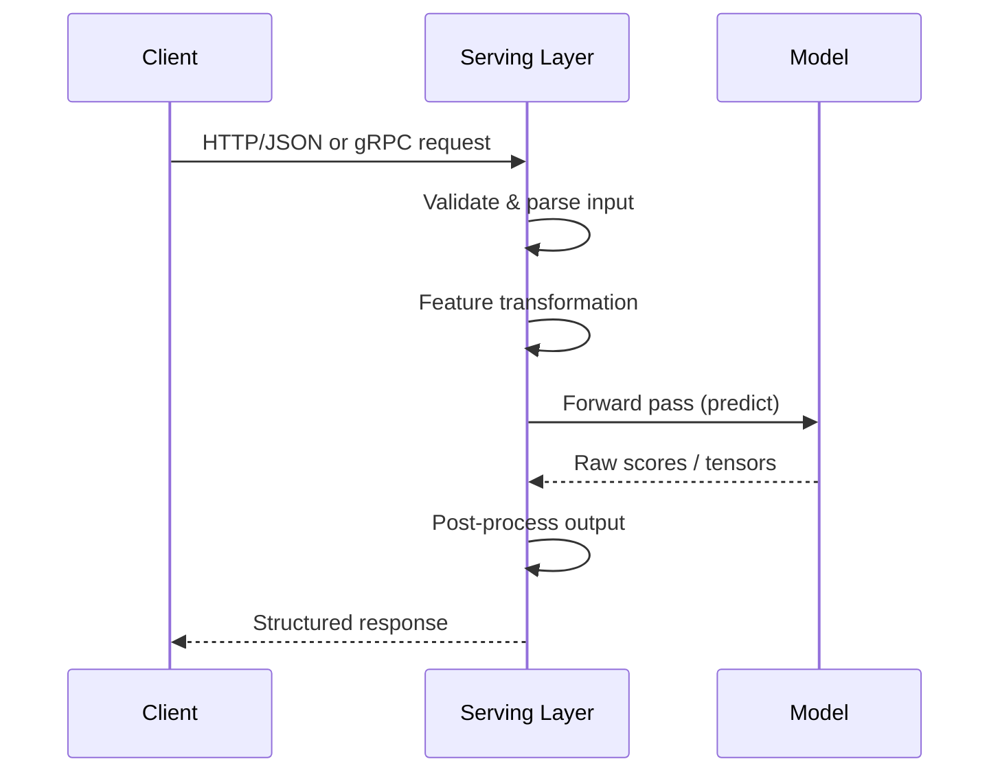

# Defining Model Serving: Artefact vs Service

## Why a Model File Is Not Enough

Training produces a serialised artefact — `model.pkl`, `model.pt`, or similar — that sits passively on disk. Production requires something fundamentally different: a **long-lived service** that loads the model, listens for incoming requests, runs inference on each request, and returns structured responses to callers.

Model serving is not "we have a file." It is "we have a reliable service that takes real traffic, answers prediction calls, and behaves like a proper production component."

---

## 1. Model Artefact vs Model Service

| Aspect | Model Artefact | Model Service |
|--------|----------------|---------------|
| **Form** | Serialised file on disk (`.pkl`, `.pt`, `.onnx`) | Running process or container |
| **State** | Passive — waits to be loaded | Active — listens for requests |
| **Interface** | None | Exposes endpoints (`POST /predict`, `GET /health`) |
| **Integration** | None | Connects to clients, monitoring, logging |
| **Lifecycle** | Versioned in object storage or registry | Loaded at startup, version-managed in memory |

The artefact can be served by many runtime forms: a FastAPI app, a Flask app, a gRPC service, a serverless function, or a specialised inference engine (TensorFlow Serving, Triton). The **core idea is identical** — bring the inert artefact to life as a callable service.

---

## 2. The End-to-End Serving Pipeline (Server View)

For each inference request, the serving layer orchestrates a multi-step pipeline — not a single function call:

| Step | What Happens | Why It Matters |
|------|--------------|----------------|
| **Receive** | Accept HTTP/JSON, gRPC, or similar | Entry point for all traffic |
| **Validate & parse** | Check types, required fields, ranges; convert raw JSON to structured objects | Prevents garbage input and training-serving skew |
| **Transform features** | Apply encoders, normalisers, feature unions matching training | Model sees the same distribution it was trained on |
| **Forward pass** | Call `model.predict()` or equivalent | Core inference step |
| **Post-process** | Apply thresholds, top-K selection, label mapping | Raw scores become actionable output |
| **Return response** | Emit stable JSON or protobuf | Downstream systems depend on predictable schemas |

Model serving is about orchestrating this **entire pipeline** around the model, not calling `predict` in isolation.

---

## 3. Real-World Example: Fraud Detection API

A payment platform deploys a fraud model as a FastAPI service on AWS ECS:

1. Checkout service sends `POST /predict` with transaction features (amount, merchant category, device fingerprint).
2. Serving layer validates the JSON schema via Pydantic — rejects malformed requests with HTTP 400.
3. Feature pipeline applies the same scaler and one-hot encoder used during training.
4. XGBoost model returns a fraud probability score.
5. Service applies a threshold ($p > 0.85$ → block), adds metadata (model version, timestamp), and returns JSON.
6. Latency is logged; P95 is tracked in Datadog.

Without the serving layer, the checkout team would need to load the model, replicate preprocessing, and handle errors themselves — a recipe for inconsistency and outages.

---

## Common Pitfalls / Exam Traps

- **Equating artefact with service** — having `model.pkl` on S3 is not model serving; serving requires a running process with an API.
- **Skipping preprocessing in the serving path** — calling `predict` on raw client JSON without the training-time transformations causes silent accuracy degradation (training-serving skew).
- **Loading the model per request** — anti-pattern; model must be loaded once at startup and reused across requests.

## Quick Revision Summary

- Model serving = long-lived service that loads a model, handles requests, and returns predictions.
- **Artefact** = passive file; **service** = active process with endpoints and operational integration.
- Each request flows through: receive → validate → transform → infer → post-process → respond.
- Serving orchestrates the full pipeline, not just `model.predict()`.
- Runtime can be FastAPI, Flask, gRPC, serverless, or specialised engines — the pattern is the same.
- Production serving integrates with monitoring, logging, and client contracts from day one.
