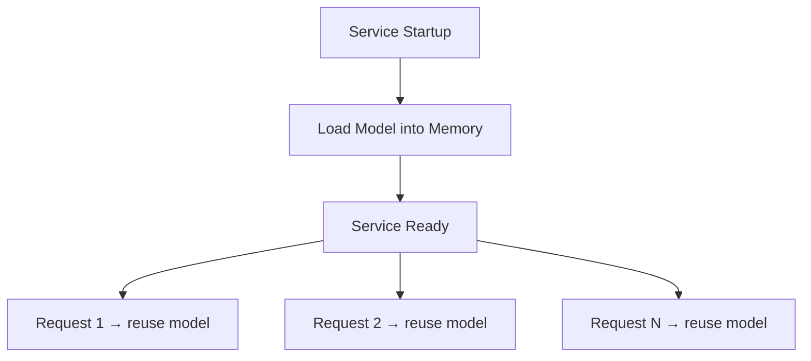
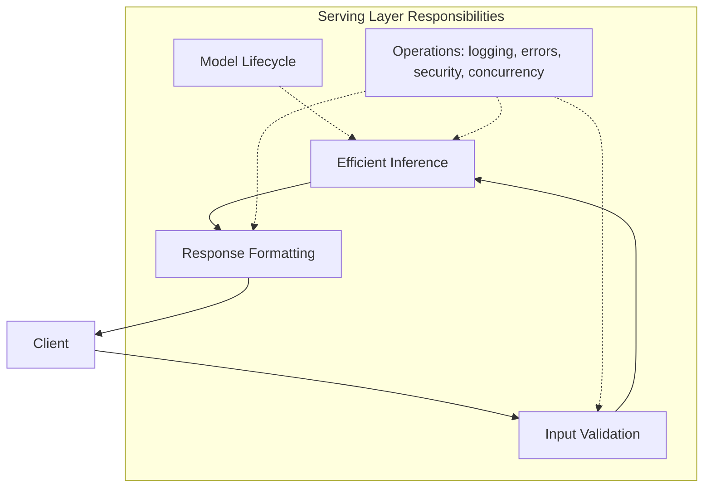

# Core Responsibilities of the Model Serving Layer

## Intuition First

A production model service is not a thin wrapper around `predict`. It is a **production-grade component** with five overlapping responsibility domains: model lifecycle management, input validation, efficient inference, response formatting, and operational concerns. Most real-world engineering effort goes into the operational layer, not the predict call itself.

---

## 1. Model Lifecycle Inside the Server

The serving layer owns the model's life **inside the running process**:

- **Load at startup** (or lazily on first request) — deserialize the artefact into memory
- **Version management** — activate v1, v2, or roll back to a previous version
- **Resource fit** — ensure the model fits within available CPU, GPU, and memory budgets

**Critical anti-pattern**: loading the model inside the request handler on every call. Deserializing a large model can take seconds to minutes — doing this per request destroys latency and wastes CPU.

**Correct pattern**: load once at startup, keep in memory, reuse across all requests.

---

## 2. Input Validation and Schema Enforcement

The serving layer is the **gatekeeper** between untrusted client input and the model.

| Check | Purpose |
|-------|---------|
| Required fields present | Prevent partial inputs from reaching the model |
| Correct types (string, number, enum, array) | Catch client bugs early |
| Value ranges and constraints | Block out-of-distribution garbage |
| Graceful error handling | Return HTTP 400 with clear messages, not stack traces |

**Benefits**:

- Protects the model from inputs that cause crashes or undefined behaviour
- Gives clients actionable error messages when they call the API incorrectly
- Prevents **training-serving skew** — subtle differences between training and production input distributions

**Implementation tools**: Pydantic models (FastAPI), Protocol Buffer messages (gRPC), JSON Schema, OpenAPI specifications. These schemas make the client-server contract explicit and enforceable.

---

## 3. Running Inference Efficiently

Beyond calling `predict`, the serving layer must:

- **Batch requests** when appropriate (grouping multiple inferences for GPU efficiency)
- **Apply correct feature transformations** matching training pipelines
- **Manage threading and concurrency** so parallel requests do not corrupt shared state or overload the model

All of this must respect production metrics:

| Metric | Target | Why |
|--------|--------|-----|
| **Latency** (P95, P99) | Online: typically < 200 ms | User experience and business decisions depend on speed |
| **Throughput** | Requests or rows per second | Capacity planning and cost |
| **Stability** | No crashes, timeouts, or hangs under strange inputs | Availability SLOs |

It is `predict` under **real-world constraints**, not `predict` in a notebook.

---

## 4. Response Formatting

Raw model output (NumPy arrays, tensors, raw logits) is not consumable by downstream systems. The serving layer must:

- Convert raw output to clean, human-readable JSON or structured messages
- Use **stable response schemas** with named fields
- Include useful metadata where appropriate

A well-designed response typically contains:

| Field | Example |
|-------|---------|
| **Prediction** | Class label, scores, ranks, probabilities |
| **Metadata** | Confidence score, model version, timestamp, request ID |

From the client's perspective, a stable, well-designed response schema is often more important than the exact model architecture underneath.

---

## 5. Operational Responsibilities

| Concern | What the Serving Layer Must Do |
|---------|-------------------------------|
| **Concurrency** | Handle multiple simultaneous requests without state corruption or global blocking |
| **Error handling** | Return clear HTTP 400/500 status codes; never leak internals or crash the process |
| **Logging & observability** | Log request IDs, latency, errors; expose metrics for request rates, error rates, performance |
| **Security** | Authentication, authorization, rate limiting, input size caps (context-dependent) |

In production, **most engineering effort** lands here — not in the predict call itself.

---

## Common Pitfalls / Exam Traps

- **Per-request model loading** — the single most common serving anti-pattern; always load once at startup.
- **Ignoring schema enforcement** — without Pydantic/JSON Schema, training-serving skew and silent failures are inevitable.
- **Returning raw tensors** — clients cannot consume unformatted model output; stable JSON schemas are mandatory.
- **Underestimating operational work** — exam questions often focus on `predict`, but production effort is dominated by logging, error handling, and concurrency.

## Quick Revision Summary

- Five responsibility domains: model lifecycle, input validation, efficient inference, response formatting, operations.
- Load model **once at startup**; never per request.
- Schema enforcement (Pydantic, protobuf, JSON Schema) prevents garbage input and training-serving skew.
- Inference must respect latency (P95/P99), throughput, and stability under real traffic.
- Responses need stable schemas with predictions plus optional metadata (version, confidence, request ID).
- Operational concerns (concurrency, errors, logging, security) dominate real production effort.
- The serving layer is `predict` under real-world constraints, not `predict` in isolation.
