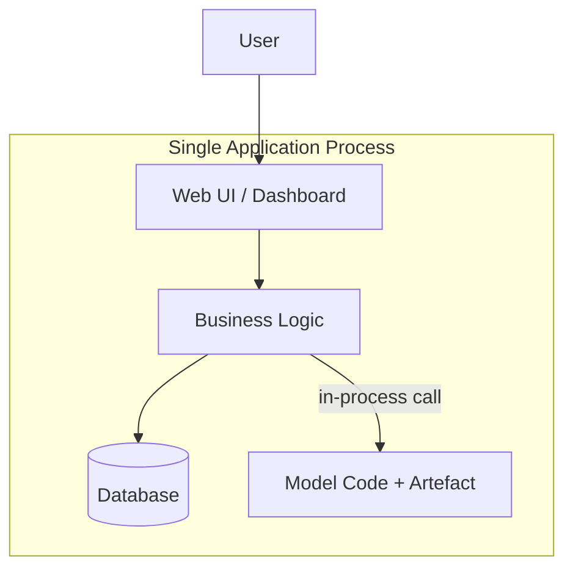

# Monolithic Model Serving Architecture

## The Big-Picture Question

Once you understand what the serving layer does (load model, validate, infer, format, log), the next question is architectural: **how do you organise that serving layer inside a real system?** Three patterns dominate — monolith, microservice, and serverless. This note covers the simplest: the monolith.

---

## 1. What Is a Monolithic Serving Architecture?

In a monolithic setup, **everything lives together** in one application:

- UI / frontend
- Business logic
- Model code and model artefact

All run in the **same process**. There is no separate model service.

**Typical flow**: a user clicks a button in an internal analytics dashboard; a Python function in the same codebase loads the model and calls `predict` directly. No HTTP hop, no separate container.

---

## 2. When Monoliths Are the Right Choice

Monoliths get a bad reputation, but they are often exactly what you want early on.

| Advantage | Explanation |
|-----------|-------------|
| **Simple deployment** | Build one artefact, deploy one artefact |
| **Low infrastructure overhead** | No extra services, configs, or deployment pipelines |
| **Straightforward local development** | Run one process; test end-to-end locally |
| **Fast iteration** | Speed matters more than perfect architecture for small teams |

**Good fit for**:

- Small internal tools and dashboards
- Proof-of-concept ML features
- Low-traffic or low-criticality applications
- Early-stage projects where iteration speed dominates

**Real-world example**: a data science team embeds a churn prediction function inside an internal Flask dashboard. Five users click "Score" per day. A monolith is perfect — no need for a separate microservice.

---

## 3. Limitations for Machine Learning

As models and traffic grow, monoliths hit real walls:

| Pain Point | Consequence |
|------------|-------------|
| **Coupled scaling** | Model needs GPUs → you scale the entire app, including parts that do not need GPUs |
| **Coupled deployment** | Shipping a new model requires shipping a new version of the entire application |
| **Tech stack lock-in** | App is in Java; ML ecosystem is strongest in Python — awkward integration |
| **Blast radius** | A bug in model code can crash the entire application |

**Signals it is time to move beyond a monolith**:

- Model becomes heavy, slow, or GPU-hungry
- Traffic grows and the model becomes the bottleneck
- Multiple teams need to evolve the model and the app independently

---

## 4. Monolith vs Other Patterns (Preview)

| Dimension | Monolith | Microservice | Serverless |
|-----------|----------|--------------|------------|
| Deployment units | 1 | 2+ | Function per invocation |
| Scale model independently | No | Yes | Automatic but limited |
| Operational complexity | Low | Medium–High | Low (managed) |
| Best for | POCs, internal tools | High-traffic critical APIs | Spiky, lightweight workloads |

The monolith is the **starting point** for most teams. Migration to microservices happens when the model becomes central, traffic grows, or independent deployment becomes a requirement.

---

## Common Pitfalls / Exam Traps

- **Dismissing monoliths as always bad** — they are the correct choice for POCs, internal tools, and low-traffic features.
- **Staying monolithic too long** — when the model is GPU-hungry and traffic spikes, coupled scaling becomes a real bottleneck.
- **Confusing monolith with "no serving layer"** — even in a monolith, you still need validation, preprocessing, and error handling around `predict`.

## Quick Revision Summary

- Monolith = model embedded inside the main application, same process, no separate service.
- Pros: simple deployment, low overhead, fast iteration, easy local dev.
- Cons: cannot scale model independently, coupled deployments, tech stack lock-in, large blast radius.
- Good for: internal tools, POCs, low-traffic ML features.
- Move to microservices when: model is heavy/GPU-hungry, traffic grows, teams need independent evolution.
- Even in a monolith, the full serving pipeline (validate → transform → infer → format) still applies.
