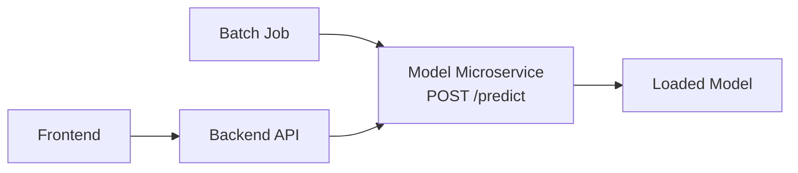
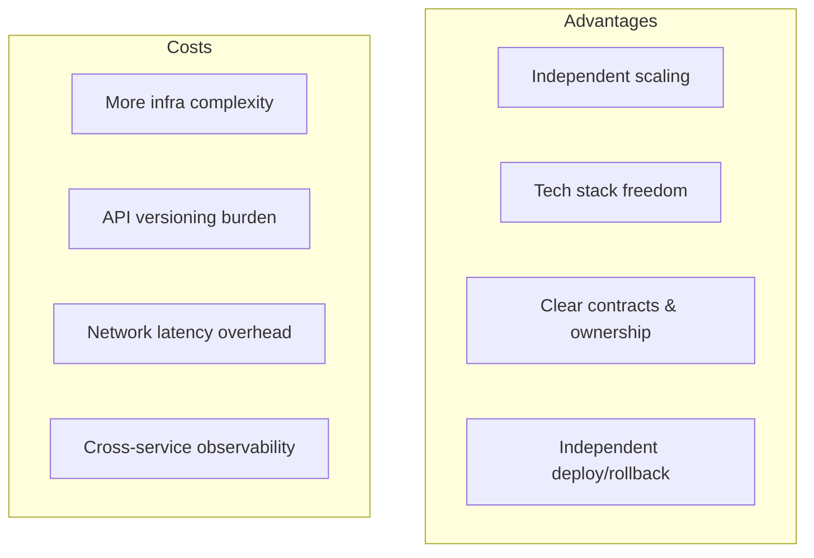

# Microservice Model Serving Architecture

## Why Split the Model Out?

In a microservice architecture, the model lives in its **own separate service** — its own process or container, exposing a dedicated API (typically `POST /predict` over HTTP or gRPC). Other parts of the system (frontend, backend, batch jobs) call this service as a remote dependency.

The model is no longer a function inside a big app. It becomes its **own product-like service** with a clear contract.

---

## 1. Key Benefits

### Independent Scaling

Scale the model service up or down **without touching** the frontend or backend. If the model needs more CPUs, GPUs, or memory, adjust its replica count independently.

*Example*: an e-commerce recommendation engine runs 20 model-service replicas on GPU nodes while the Django backend stays at 4 CPU-only instances.

### Tech Stack Freedom

The model service can run Python with specific ML libraries, use GPUs, and maintain its own dependency tree. The rest of the system can be in Go, Java, or Node.js — they communicate over HTTP/gRPC, not shared memory.

### Clear Ownership and Contracts

A team owns the model API, its request/response schema, and its SLOs (latency, uptime). Other teams only need to know: "call `POST /predict` with this JSON, get this JSON back."

### Independent Deployment and Rollback

Deploy a new model version by updating **only** the model service. If something goes wrong, roll back that service without redeploying the entire application.

---

## 2. Trade-offs

| Trade-off | Detail |
|-----------|--------|
| **Deployment complexity** | More services to deploy, configure, and monitor |
| **API design discipline** | Other teams depend on your predict API; breaking changes are costly |
| **Network overhead** | Calls go over HTTP/gRPC, not in-process — adds latency and failure points |
| **Distributed tracing** | When something fails, you must trace requests across multiple services |

---

## 3. When Microservices Are the Right Choice

Microservice-style serving is usually correct when:

- The model is **critical** to the product (fraud detection, recommendations, search ranking)
- **Traffic is high** and the model is the scaling bottleneck
- You need to **separate scaling** for the model from the rest of the app
- You expect to **iterate on the model frequently** and independently of the application

**Real-world pattern**: Netflix serves recommendation models as dedicated microservices behind an API gateway. The streaming UI, account service, and recommendation service deploy and scale independently.

---

## 4. The Service Contract

A model microservice exposes a formal contract:

| Element | Description |
|---------|-------------|
| **Request schema** | Required fields, types, constraints (e.g., Pydantic model) |
| **Response schema** | Prediction format, metadata fields |
| **SLOs** | Target latency (P95 < 100 ms), uptime (99.9%) |
| **Versioning** | API version in URL path or header (`/v2/predict`) |

This contract is what makes the microservice pattern work — without it, every consumer reimplements validation and error handling differently.

---

## Common Pitfalls / Exam Traps

- **Microservices for everything** — premature splitting adds complexity without benefit for low-traffic POCs.
- **Ignoring network latency** — an in-process call takes microseconds; HTTP adds milliseconds. Budget for this in SLOs.
- **Weak API contracts** — without enforced schemas, microservices become distributed monoliths with hidden coupling.
- **Forgetting distributed tracing** — cross-service debugging requires request IDs propagated through every hop.

## Quick Revision Summary

- Model microservice = separate process/container with its own `POST /predict` API.
- Benefits: independent scaling, tech stack freedom, clear ownership, independent deploy/rollback.
- Costs: more infra, API versioning, network overhead, distributed tracing needs.
- Right when: model is critical, traffic is high, independent iteration is needed.
- The service contract (schema + SLOs) is the foundation that makes microservices work.
- Common in production: model service behind API gateway, called by backend and batch jobs alike.
