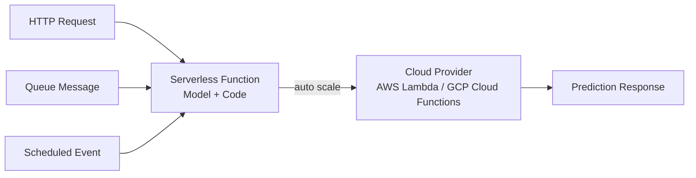
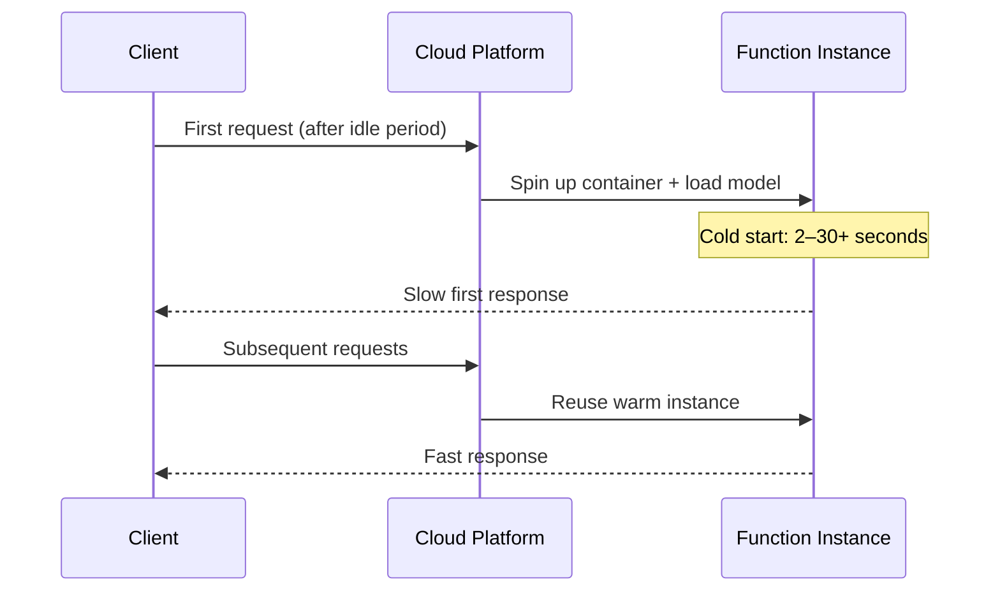

# Serverless Model Serving Architecture

## The Third Pattern

Serverless (Function-as-a-Service, FaaS) packages model code as a **function** that a cloud provider manages. The provider handles underlying servers, scaling, and infrastructure — you only write the inference logic.

The function can be triggered by HTTP requests, queue messages, scheduled events, or other cloud events.

---

## 1. Why Serverless Appeals for ML

Serverless is attractive when:

- Traffic is **spiky or unpredictable** — Black Friday surges, campaign launches
- Volume is **low or medium** — you do not want to pay for idle servers
- Models are **simple or lightweight** — small sklearn models, rule-based scorers
- You want **automatic scale-up and scale-down** with **pay-per-use** pricing

**Real-world example**: a marketing team deploys a lead-scoring function on AWS Lambda. It runs 200 times per day normally, spikes to 50,000 during a webinar. Lambda spins up instances automatically; cost scales with actual invocations, not provisioned capacity.

---

## 2. Advantages

| Advantage | Detail |
|-----------|--------|
| **Built-in autoscaling** | Traffic spikes → more function instances; traffic drops → instances spin down |
| **Pay per use** | Cost-effective for low or bursty traffic; no idle server charges |
| **Zero server management** | Cloud provider handles VMs, patching, and capacity |

---

## 3. Constraints and Limitations

| Constraint | Impact on ML |
|------------|--------------|
| **Cold start** | Function idle for a while → first invocation is noticeably slower (model load + container init) |
| **Time limits** | Per-invocation timeout (e.g., 15 min on Lambda) — heavy or long-running inference may fail |
| **Memory limits** | Package size and RAM caps — large models or many dependencies may not fit |
| **Statelessness** | No persistent in-memory model between invocations (unless using provisioned concurrency) |

**Cold start anatomy**:

---

## 4. When Serverless Fits ML Workloads

| Good Fit | Poor Fit |
|----------|----------|
| Non-latency-critical APIs (extra ms acceptable) | Real-time fraud detection (< 50 ms SLO) |
| Simple, stateless inference logic | Large GPU models (BERT, diffusion) |
| Prototypes and event-driven ML (webhooks, automations) | High-throughput sustained traffic |
| Bursty, unpredictable workloads | Models requiring persistent warm state |

---

## 5. Three-Way Architecture Comparison

| Dimension | Monolith | Microservice | Serverless |
|-----------|----------|--------------|------------|
| **Deployment** | One app | Separate service | Function package |
| **Scaling** | Scale whole app | Scale model independently | Automatic per invocation |
| **Cost model** | Always-on servers | Always-on replicas | Pay per use |
| **Cold start** | None (always warm) | Minimal (if replicas > 0) | Significant if idle |
| **Best for** | POCs, internal tools | Critical high-traffic APIs | Spiky, lightweight workloads |

---

## Common Pitfalls / Exam Traps

- **Serverless for latency-critical models** — cold starts alone can violate P95 SLOs.
- **Ignoring package size limits** — a 2 GB transformer model will not fit in a Lambda deployment package.
- **Assuming "serverless" means "no ops"** — you still manage function code, IAM, monitoring, and cold-start mitigation.
- **Loading model per invocation without provisioned concurrency** — without warm instances, every cold start reloads the model.

## Quick Revision Summary

- Serverless = model packaged as a cloud-managed function (Lambda, Cloud Functions).
- Pros: auto-scaling, pay-per-use, zero server management.
- Cons: cold starts, time/memory limits, packaging constraints, statelessness.
- Best for: spiky traffic, lightweight models, prototypes, event-driven ML.
- Poor for: latency-critical APIs, large GPU models, sustained high throughput.
- Mitigate cold starts with provisioned concurrency and minimum warm instances.
