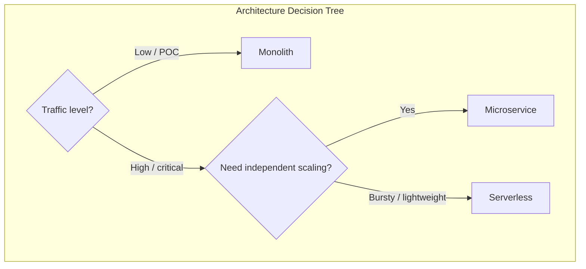
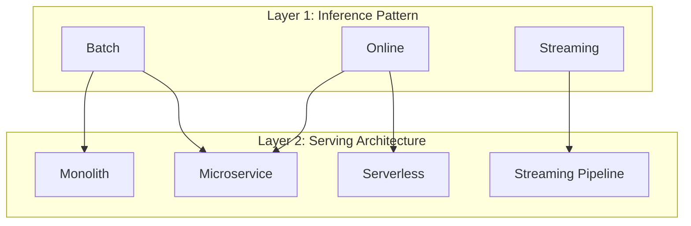

# Design Decisions in Model Serving Systems

## No Single Right Answer

Choosing a serving architecture is an engineering trade-off, not a correctness question. The right choice depends on how critical the model is, what traffic looks like, and how the organisation is structured. This note synthesises the three architectures and connects them to inference patterns from Module 2.

---

## 1. Side-by-Side Architecture Comparison

| Dimension | Monolith | Microservice | Serverless |
|-----------|----------|--------------|------------|
| **Build & deploy** | One app, one artefact | Separate service with own pipeline | Function package to cloud |
| **Scale model independently** | No | Yes | Automatic (with limits) |
| **Coupling** | Model and app tightly coupled | Model is isolated with API contract | Model is ephemeral per invocation |
| **Operational complexity** | Low | Medium–High | Low (provider-managed) |
| **Cost at low traffic** | Fixed (always-on) | Fixed (replicas) | Near zero (pay per use) |
| **Cold start risk** | None | Low (if min replicas set) | High |
| **Best for** | Internal tools, POCs, experiments | High-traffic critical model APIs | Spiky, lightweight, event-driven |

---

## 2. Connecting Serving Architecture to Inference Patterns

Inference patterns (Module 2) and serving architectures (Module 3) are **two layers of the same picture**:

| Inference Pattern | Typical Serving Architecture | Communication Style |
|-------------------|------------------------------|---------------------|
| **Batch** | Scheduled job or container in a cluster; may call a model microservice to score data | Async jobs, queues |
| **Online** | Model microservice behind API gateway; lighter scenarios may use serverless HTTP endpoint | Sync REST or gRPC |
| **Streaming** | Model inside a streaming pipeline (Flink, Spark Streaming, Kafka consumer) | Event-driven, continuous |

- **Inference pattern** tells you *how* the model is called (batch vs online vs streaming).
- **Serving architecture** tells you *where* the model service fits in the overall system.

The same trained model can be served differently depending on how it is used.

---

## 3. Decision Framework

Ask these questions before choosing:

1. **How critical is the model?** — Fraud detection at checkout vs internal dashboard scoring
2. **What does traffic look like?** — Flat, spiky, seasonal, growing?
3. **How large is the team?** — Can you operate multiple services?
4. **What are latency SLOs?** — Sub-100 ms rules out naive serverless
5. **How often does the model change?** — Frequent updates favour microservice independence

**Example decisions**:

| Scenario | Choice | Rationale |
|----------|--------|-----------|
| Internal churn dashboard, 10 users/day | Monolith | Simple, fast iteration |
| Real-time product recommendations, 10K RPS | Microservice | Independent GPU scaling, strict SLOs |
| Webhook-triggered image classifier, sporadic use | Serverless | Pay per use, auto-scale on spikes |
| Real-time anomaly detection on IoT sensors | Streaming pipeline | Continuous event processing |

---

## 4. The Lab Connection

The hands-on lab builds a FastAPI service packaged in Docker. That container is versatile:

- **Small system** → acts as a simple monolith (single container on a VM)
- **Large system** → acts as a model microservice in a Kubernetes cluster
- **Advanced setup** → plugged into blue-green, canary, or autoscaling strategies

The architectural pattern you choose changes *how* you build, deploy, and operate — but the serving responsibilities (load, validate, infer, format, log) stay the same.

---

## Common Pitfalls / Exam Traps

- **Treating architecture choice as permanent** — teams commonly start monolith and migrate to microservice as traffic grows.
- **Confusing inference pattern with architecture** — batch inference can use a microservice or a monolith; they are independent choices.
- **Choosing microservices without operational readiness** — more services means more monitoring, tracing, and deployment pipelines.
- **Using serverless for streaming** — streaming requires long-running consumers, not ephemeral functions.

## Quick Revision Summary

- Three architectures: monolith (simple, coupled), microservice (independent, complex), serverless (auto-scale, constrained).
- No universal right answer — depends on criticality, traffic, team structure, and SLOs.
- Inference patterns (batch/online/streaming) and serving architectures are two orthogonal layers.
- Batch → jobs/queues; online → microservice or serverless; streaming → pipeline consumers.
- Lab Docker container works as monolith or microservice depending on deployment context.
- Serving responsibilities stay constant; architecture changes how you build, deploy, and operate.
