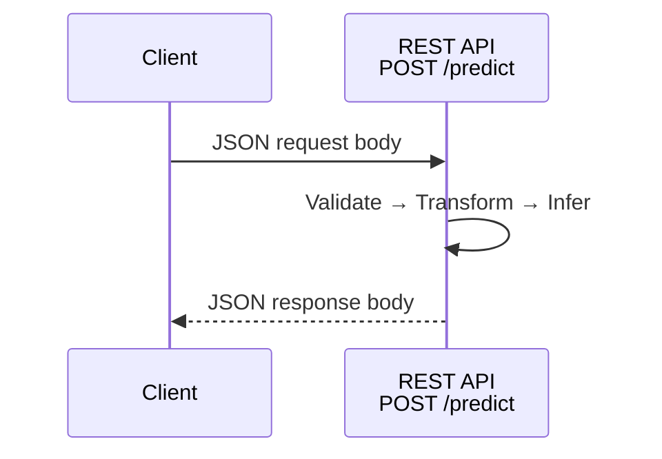

# REST APIs for Machine Learning Serving

## Why API Design Matters

Every served model is exposed through an API. The design of that API directly impacts developer experience, performance, service contract stability, and how easily other teams integrate. A well-designed API is the foundation for connecting your model to the rest of the organisation — not a minor technical detail.

---

## 1. REST over HTTP with JSON

REST (Representational State Transfer) uses standard HTTP verbs (`GET`, `POST`) and sends input/output in the request/response body, typically formatted as JSON.

**The dominant ML serving pattern**:

```
POST /predict
Content-Type: application/json

{"features": {"age": 35, "income": 75000}}
```

**Response**:

```json
{
  "prediction": "approved",
  "confidence": 0.92,
  "model_version": "v1.2.0"
}
```



---

## 2. Why REST Dominates ML Serving

| Reason | Detail |
|--------|--------|
| **Universal language support** | Callable from Python, JavaScript, Java, Go, curl, browsers |
| **Human-readable payloads** | Easy to inspect, log, and debug |
| **Excellent tooling** | curl, Postman, Bruno, Swagger/OpenAPI auto-documentation |
| **Low onboarding friction** | Any developer who knows web APIs can call your model |

**Real-world example**: a fintech startup exposes its credit-risk model via `POST /predict` with JSON. The mobile app (Swift), backend (Go), and nightly batch job (Python) all call the same endpoint with zero custom SDK work.

---

## 3. Concrete Request-Response Flow

| Step | Client Side | Server Side |
|------|-------------|-------------|
| 1 | Build JSON with feature fields | — |
| 2 | `POST /predict` with `Content-Type: application/json` | Receive and parse JSON |
| 3 | Wait for response | Validate → transform → infer → format |
| 4 | Parse JSON response | Return prediction + metadata |

Because everything is JSON, debugging is trivial: open the payload in any text editor, send test requests with curl or Postman, and immediately see what is happening.

---

## 4. Pros and Cons

| Pros | Cons |
|------|------|
| Simple and familiar — most developers already know HTTP/JSON | JSON is verbose — larger payloads than binary protocols |
| Excellent tooling (curl, Postman, Swagger, OpenAPI) | No compile-time type safety across services |
| Human-readable — easy to inspect and debug | Inefficient at very high throughput or very large payloads |
| Production-ready for many use cases | Relies on documentation and conventions for contract enforcement |

---

## 5. When REST Is the Right Default

REST is an excellent **default and starting point** for:

- Demos, prototypes, and first production deployments
- External-facing APIs and partner integrations
- Teams where ease of integration matters more than raw performance
- Low to moderate traffic workloads

Teams typically adopt gRPC when they hit scale limits — very high request rates, large complex payloads, or many internal microservices communicating with each other.

---

## 6. OpenAPI / Swagger Integration

FastAPI automatically generates interactive API documentation from your endpoint definitions and Pydantic models. This means:

- Request/response schemas are self-documenting
- Developers can test endpoints from a browser (`/docs`)
- API contracts are versionable and shareable

---

## Common Pitfalls / Exam Traps

- **Assuming REST means no schema enforcement** — Pydantic + OpenAPI provides strong runtime validation even with REST.
- **Using GET for predictions with sensitive features** — features in URL query strings leak in logs; always use POST with JSON body.
- **Ignoring payload size at scale** — JSON verbosity matters at 10K+ RPS; plan for gRPC migration if needed.
- **No versioning strategy** — changing response fields without versioning breaks downstream consumers.

## Quick Revision Summary

- REST = HTTP verbs + JSON payloads; the default ML serving API style.
- Dominant pattern: `POST /predict` with JSON features in, JSON predictions out.
- Pros: universal, human-readable, excellent tooling, low friction.
- Cons: verbose payloads, no compile-time typing, inefficient at extreme scale.
- Best default for prototypes, external APIs, and moderate-traffic production.
- FastAPI + Pydantic + OpenAPI gives schema enforcement and auto-documentation.
- Graduate to gRPC when throughput, payload size, or internal service mesh demands it.
