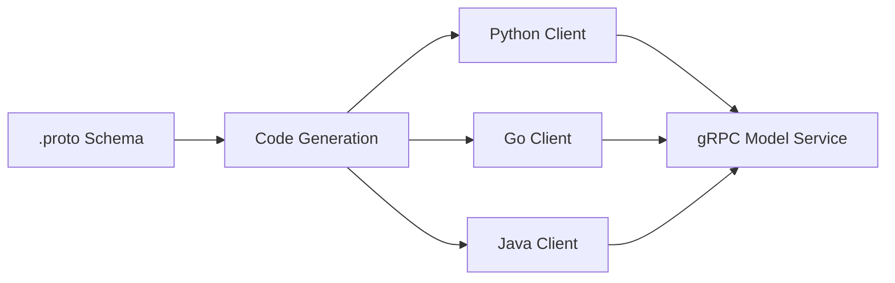
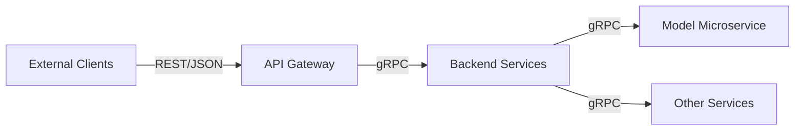

# gRPC for Machine Learning Serving

## When REST Hits Its Limits

REST with JSON is the right default for most ML APIs. But in larger, performance-sensitive systems — many internal microservices, strict latency SLOs, high throughput — teams adopt **gRPC** (Google Remote Procedure Call).

gRPC is a high-performance, contract-first framework that uses **Protocol Buffers** (protobuf) instead of JSON.

---

## 1. How gRPC Works

Instead of free-form JSON, request and response formats are defined in a **`.proto` file** — a strongly typed schema. Client and server both generate code from this single contract.

```protobuf
message PredictRequest {
  float age = 1;
  float income = 2;
}

message PredictResponse {
  string prediction = 1;
  float confidence = 2;
}

service ModelService {
  rpc Predict(PredictRequest) returns (PredictResponse);
}
```

From one `.proto` file, gRPC generates clients for Python, Java, Go, C++, and many other languages — all using the exact same contract.



---

## 2. Key Advantages

| Advantage | Detail |
|-----------|--------|
| **Binary encoding** | Payloads are much smaller; serialization/deserialization is much faster than JSON |
| **Strong typing** | Field changes caught at compile time, not discovered at runtime in production |
| **High throughput** | Efficient for service-to-service communication at scale |
| **Multi-language codegen** | One schema, clients in every language your org uses |

**Performance comparison (illustrative)**:

| Aspect | REST/JSON | gRPC/Protobuf |
|--------|-----------|---------------|
| Payload size | Larger (text) | ~3–10x smaller (binary) |
| Serialization speed | Slower | Faster |
| Type safety | Runtime (Pydantic) | Compile time |
| Browser support | Native | Requires gRPC-Web proxy |
| Human readability | High | Low (binary) |

---

## 3. Where gRPC Fits in ML Systems

gRPC is most commonly used for:

- **Internal microservices** — backend services calling model serving services efficiently
- **Real-time systems** — recommendation engines, ad bidding, low-latency ranking
- **Large distributed architectures** — where performance and strict structure matter

It is less common for:

- External/public APIs (browsers and partners expect REST)
- Prototypes and demos (JSON is easier to debug)
- Mobile apps without gRPC client libraries

---

## 4. REST vs gRPC Decision Guide

| Criterion | REST | gRPC |
|-----------|------|------|
| **Audience** | External clients, partners, browsers | Internal service-to-service |
| **Priority** | Ease of integration | Raw performance and type safety |
| **Payload** | Small to moderate | Large or high-frequency |
| **Debugging** | Easy (human-readable JSON) | Harder (binary) |
| **Contract** | OpenAPI / conventions | `.proto` files with codegen |

**Common hybrid pattern in large systems**:



REST at the **edge** (internet-facing), gRPC **inside** the backend (including model serving microservices).

---

## 5. Practical Considerations for ML

- **Model payloads** — gRPC handles large feature vectors and batch inputs more efficiently than JSON
- **Streaming RPC** — gRPC supports server streaming, useful for streaming inference patterns
- **Load balancing** — gRPC uses HTTP/2 multiplexing; requires L7 load balancers aware of gRPC
- **Migration path** — most teams start with REST, add gRPC for internal hot paths when metrics justify it

---

## Common Pitfalls / Exam Traps

- **gRPC for external/public APIs** — browsers do not natively support gRPC; you need gRPC-Web or a REST gateway.
- **Skipping `.proto` versioning** — breaking proto changes require careful backward-compatible field numbering.
- **Assuming gRPC eliminates all latency** — network hop still exists; gRPC reduces serialization overhead, not propagation delay.
- **Over-engineering early** — REST is sufficient until throughput or internal service count demands gRPC.

## Quick Revision Summary

- gRPC = high-performance, contract-first RPC using Protocol Buffers (binary, not JSON).
- `.proto` schema generates typed clients in multiple languages; changes caught at compile time.
- Advantages: smaller payloads, faster serialization, strong typing, high throughput.
- Best for: internal microservices, real-time systems, large distributed architectures.
- REST at the edge, gRPC inside — the common large-system hybrid pattern.
- Start with REST; adopt gRPC when scale, payload size, or service mesh complexity demands it.
