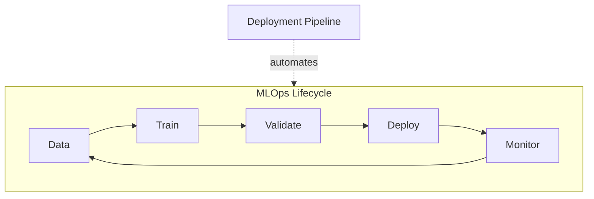

# Deployment Pipelines and MLOps Basics — Module Introduction

## Why "Works in My Notebook" Is Not Enough

A model that trains successfully in a Jupyter notebook is not the same as a model running reliably in production. Notebooks excel at exploration — quick experiments, visualisations, and iterative tuning — but they are poor at **repeatability**, **auditability**, and **team-scale deployment**.

Production ML systems must answer questions that notebooks rarely capture:

- Which exact model version is serving traffic right now?
- What data, code, and hyperparameters produced that model?
- Can another engineer reproduce the result without asking you?

This module shifts focus from **getting a model into a service** (inference patterns, containers) to the **process** that moves a model from experimentation to production in a controlled, automated way.

---

## What Is an ML Deployment Pipeline?

An **ML deployment pipeline** is a sequence of automated steps that transforms raw inputs into a deployed, production-ready model artefact or service.

### Core Stages

| Stage | Purpose | Typical Outputs |
|-------|---------|-----------------|
| **Data preparation** | Load, clean, engineer features, split datasets | Versioned clean dataset |
| **Train** | Fit model using config and training data | Model weights, training metrics |
| **Evaluate** | Measure quality on validation/test data | AUC, accuracy, fairness reports |
| **Package** | Bundle model for deployment | Docker image, ONNX bundle, `.pkl` |
| **Deploy** | Register and serve the model | Running API, registry entry |

Each stage **consumes artefacts** (data, configs, prior outputs) and **produces artefacts** (clean data, models, metrics, containers). Thinking in terms of inputs and outputs is what makes pipelines traceable and partially rerunnable.

---

## Pipelines, Repeatability, and Reliability

| Benefit | What It Means in Practice |
|---------|---------------------------|
| **Repeatability** | Same inputs + same pipeline = same outputs (within acceptable randomness) |
| **Auditability** | Clear record of what ran, when, and with which artefacts |
| **Speed** | Idea-to-production is faster once automation replaces manual stitching |
| **Fewer human errors** | No forgotten config updates or out-of-order manual steps |

**Real-world example**: A fintech fraud-detection team retrains nightly. Without a pipeline, each run depends on whoever is on call remembering to export `model.pkl`, update the serving config, and push to staging. With a pipeline, a scheduled job runs data checks → train → evaluate → promote, and every artefact is versioned.

---

## Connection to MLOps

**MLOps** automates the full ML lifecycle: data → train → validate → deploy → monitor → retrain.

Pipelines are the **automation backbone** of MLOps. They provide:

- A standard path from experimentation to production
- Hooks for data quality checks, model validation, fairness tests
- Integration points for CI/CD and retraining workflows

---

## Mindset Shift: Notebook-First → Pipeline-First

| Old Mindset | Pipeline-First Mindset |
|-------------|------------------------|
| "I have a great notebook; I'll manually push to production" | "I have a pipeline; my notebook is for exploring ideas" |
| Logic lives in the notebook and in one person's head | Logic lives in versioned scripts and configs |
| Deployment is a one-off hero effort | Deployment is a repeatable, team-owned process |

**Practical questions to ask while building**:

- Where does this logic belong in the pipeline?
- How can this step be automated so anyone on the team can rerun it?

---

## Common Pitfalls / Exam Traps

- **Trap**: "A notebook with good metrics is production-ready." — Metrics in a notebook do not imply traceability, reproducibility, or automated deployment.
- **Trap**: Confusing **packaging** (Docker image) with the full **pipeline** (data through deploy). Packaging is one stage, not the whole system.
- **Trap**: Assuming MLOps replaces software engineering practices — it extends them; serving code and infrastructure still need standard CI.
- **Trap**: Treating pipeline stages as independent scripts with no defined artefact contracts — without clear inputs/outputs, you cannot rerun or audit individual steps.

---

## Quick Revision Summary

- Production ML requires more than notebook success — it needs repeatability, auditability, and team-scale processes.
- An ML deployment pipeline automates: data prep → train → evaluate → package → deploy.
- Each stage consumes and produces **artefacts** (data, models, metrics, containers).
- Pipelines deliver repeatability, auditability, speed, and fewer manual errors.
- MLOps automates the full ML lifecycle; pipelines are its execution engine.
- Shift from notebook-first to pipeline-first: notebooks explore; pipelines ship.
- Real systems must answer "which model is in production?" and "how was it built?" — pipelines make that possible.
