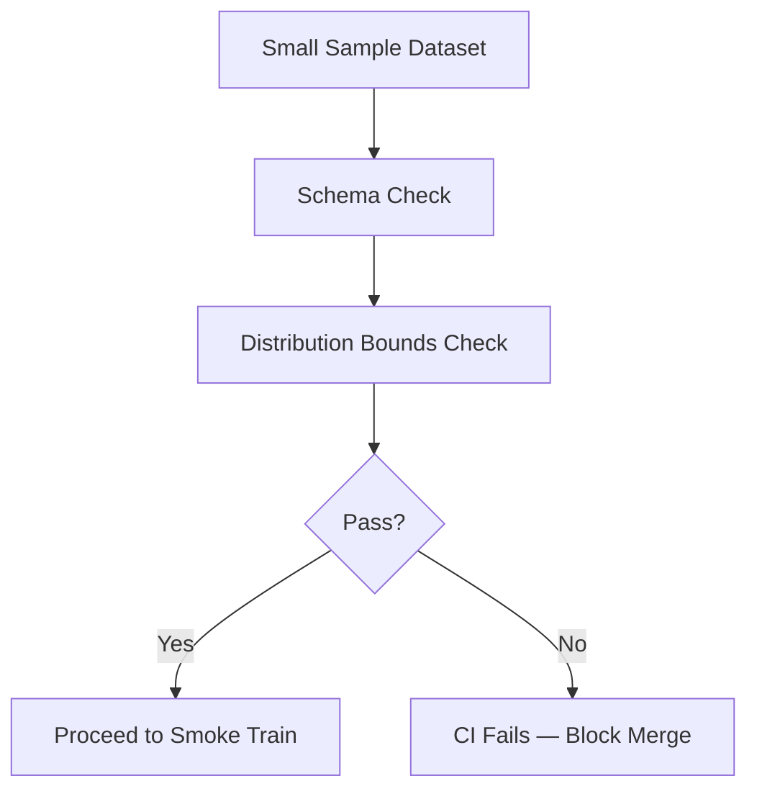
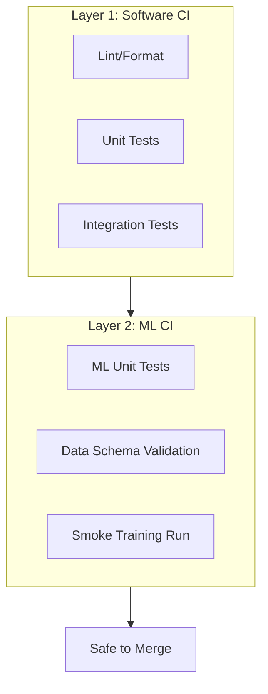

# CI for Machine Learning — What Gets Tested

## The Base Layer: Standard Software CI

ML projects are still software projects. These components need classic CI regardless of model complexity:

- Feature engineering code
- Serving APIs and batch jobs
- Utility modules, config parsers
- Infrastructure glue scripts

### Typical CI Pipeline Steps

| Check | Purpose |
|-------|---------|
| **Linting / formatting** | Code style consistency (flake8, black, ruff) |
| **Unit tests** | Core logic correctness |
| **Integration tests** | Components work together (API starts, health check responds) |

**Fail fast**: If any step fails, the CI job fails and bad code is blocked from merging to main.

The base layer of CI for ML looks **identical** to CI for any other software project.

---

## ML-Specific Unit Tests

Fast, lightweight tests that run on every change:

| Test Type | What It Validates | Example Failure Caught |
|-----------|-------------------|------------------------|
| **Feature functions** | Output shape, dtype, no NaN | Refactor breaks column count |
| **Pre/post-processing** | Raw input → model features → business output | Type mismatch after API change |
| **Model load + predict** | Load artefact, run `predict()` on dummy batch | Serialization break after sklearn upgrade |

These catch *"I changed feature code and broke model input types"* before production.

---

## Data Validation in CI

Even with a **small sample dataset** (checked into repo or pulled from test environment), CI can validate:

| Check | Description |
|-------|-------------|
| **Schema** | Expected columns present; types correct (int, float, string) |
| **Null rates** | Missing values within acceptable bounds |
| **Value ranges** | Features within expected min/max |

**Goal**: Not full data science in CI — catch **obvious** issues cheaply:

- Column renamed or deleted
- Type changed from numeric to string
- Required field disappeared

Finding these in CI is far cheaper than discovering them after deployment.

---

## Smoke Training Run

A widely used CI technique for ML repos:

1. Take a **very small subset** of data
2. Train for **few steps/epochs** only
3. Stop — do not optimise for metrics

### Purpose

Verify the training pipeline runs end-to-end without crashing:

- Training loop executes
- Loss computation matches model output shape
- MLflow (or tracker) logging works
- Data pipeline connections intact

**Not** for model quality — for **integration health**.

| Attribute | Smoke Training | Full Training |
|-----------|----------------|---------------|
| Data size | Tiny sample | Full dataset |
| Duration | Seconds–minutes | Hours |
| Goal | Pipeline doesn't crash | Best model metrics |
| Runs in | CI on every PR | Scheduled / CD pipeline |

**Mental model**: *Can we still successfully run training end-to-end on a tiny dataset?* If smoke training breaks, do not start expensive full retraining on real data.

---

## Complete CI Stack for ML

---

## Real-World Example: GitHub Actions on PR

A data scientist opens a PR changing feature engineering:

1. Flake8 lint passes
2. Unit tests for `transform_features()` pass
3. Schema check on `tests/data/sample.csv` passes
4. Smoke training runs `python scripts/train.py --config configs/train_config.yaml` for 2 epochs
5. All green → PR mergeable

If step 4 fails because a new column broke the model input layer, the PR is blocked before any full retrain is scheduled.

---

## Common Pitfalls / Exam Traps

- **Trap**: Running full training in CI — too slow; use smoke training instead.
- **Trap**: Skipping ML unit tests because "we evaluate in training" — fast shape/load tests catch regressions earlier.
- **Trap**: No data in CI at all — even a tiny fixture enables schema regression detection.
- **Trap**: Smoke training success = model ready for production — it only validates pipeline wiring.
- **Trap**: Only testing training code, not serving code — API integration tests are part of CI too.

---

## Quick Revision Summary

- ML CI starts with standard software CI: lint, unit tests, integration tests.
- ML-specific unit tests: feature shape, preprocessing, model load/predict on dummy data.
- Data validation in CI: schema, null rates, bounds on small sample — catch breaking data changes.
- Smoke training: tiny data, few epochs — verifies end-to-end pipeline health, not model quality.
- CI fails fast to block bad merges before expensive training or production deploy.
- Three layers: software CI → ML unit tests + data validation → smoke training.
