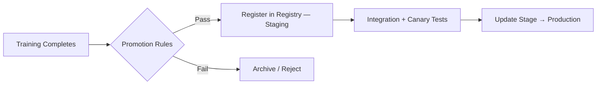
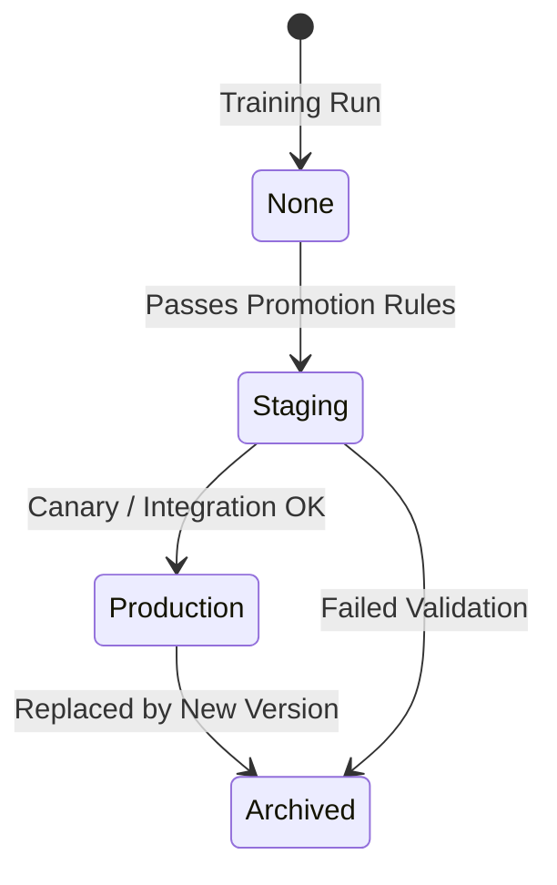

# CD for Machine Learning — What Gets Deployed

## CD in ML: Beyond "Latest Image"

In machine learning, **Continuous Delivery/Deployment** is not simply deploying the newest container image. It is **promoting a specific model version** along with its full context.

### What a Promotion Decision Bundles

| Component | Why It Must Travel Together |
|-----------|------------------------------|
| **Model artefact** | Weights / serialised model file |
| **Metrics** | AUC, accuracy, business KPIs on validation data |
| **Code version** | Training and serving logic that produced the model |
| **Config** | Hyperparameters, thresholds, preprocessing settings |

**CD question**: *Which model + code combination do we trust enough to promote to the next environment?*

---

## Promotion Flow

CD typically moves models: **candidate → staging → production**, often via canary or blue-green deployment strategies.

---

## Promotion Rules (Quality Gates)

A model should **not** be promoted just because training finished. Common gates:

| Rule | Example |
|------|---------|
| **Minimum metric threshold** | AUC $\geq 0.85$, error rate below 2% |
| **Beat current baseline** | New model must improve key KPIs vs production model |
| **Data / fairness checks** | No large performance drop on critical user segments; no bias violations |
| **Integration health** | Serving tests pass in staging environment |

**Mindset shift**: From *"training finished"* to *"training produced a model that deserves deployment."*

---

## Model Registry

A **model registry** manages the promotion lifecycle:

| Feature | Description |
|---------|-------------|
| **Version storage** | Multiple versions per model name |
| **Metrics attachment** | Performance data linked to each version |
| **Lineage** | Training run, data, code references |
| **Stage tracking** | None / Archived / Staging / Production |

### Typical CD Flow with Registry

1. Pipeline finds model passing promotion rules
2. Register model, tag stage as **Staging**
3. Run integration tests and canary deployment in staging
4. On success, update stage to **Production**

**Queryable answers**:

- Which model is in production right now?
- Which is ready in staging?
- Which older versions are archived but reproducible?

---

## What Actually Gets Deployed at Infrastructure Level

The deployed unit is typically a **container image** combining:

| Component | Included In Image |
|-----------|-------------------|
| **Serving code** | FastAPI, Flask, BentoML handler |
| **Model artefact** | Baked into image OR pulled from registry at startup |
| **Config / env** | Runtime settings for the service |

### CD Infrastructure Steps

1. Select winning model version + matching code commit
2. Build container image pairing them
3. Push to container registry (ECR, GCR, ACR)
4. Roll out to VM, Kubernetes cluster, or managed container platform (Cloud Run, App Service)

**Deployed unit** = **container + model**. CI/CD pipelines automate building and rolling out that unit.

---

## Deployment Strategies

| Strategy | Behaviour | ML Use Case |
|----------|-----------|-------------|
| **Blue-green** | Switch traffic between two full environments | Zero-downtime model swap |
| **Canary** | Route small % traffic to new model first | Detect production metric regression early |
| **Rolling** | Gradually replace instances | Standard K8s rollout |

For ML, canary is especially valuable — offline metrics can look good while online business KPIs degrade.

---

## CD vs CI Responsibility Split

| Phase | Responsibility |
|-------|----------------|
| **CI** | Verify code works; smoke training doesn't crash; data schema OK |
| **CD** | Verify model quality; promote specific version; roll out to environments |

---

## Common Pitfalls / Exam Traps

- **Trap**: Promoting every model that finishes training — promotion rules exist for a reason.
- **Trap**: Deploying new model with old serving code (or vice versa) — versions must be paired.
- **Trap**: No staging stage — jumping straight to production skips integration and canary validation.
- **Trap**: Registry shows "latest" but production runs different version — stage field must be authoritative.
- **Trap**: Offline AUC improvement always justifies deploy — check fairness and segment-level KPIs.

---

## Quick Revision Summary

- ML CD promotes a **specific model version + metrics + code + config** — not just latest image.
- Promotion rules: metric thresholds, beat baseline, fairness checks, integration tests.
- Model registry tracks versions, metrics, lineage, and stages (Staging → Production).
- Deployed unit = container (serving code) + model artefact + config.
- CD flow: pass rules → register staging → canary/integration → promote to production.
- Mindset: training success ≠ deployment eligibility.
- Canary/blue-green strategies reduce risk when swapping models in production.
