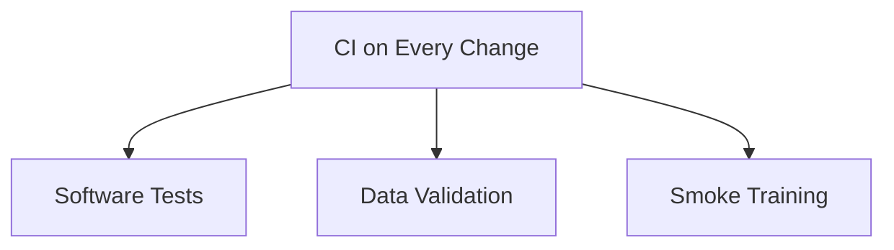
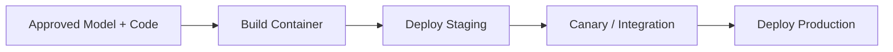
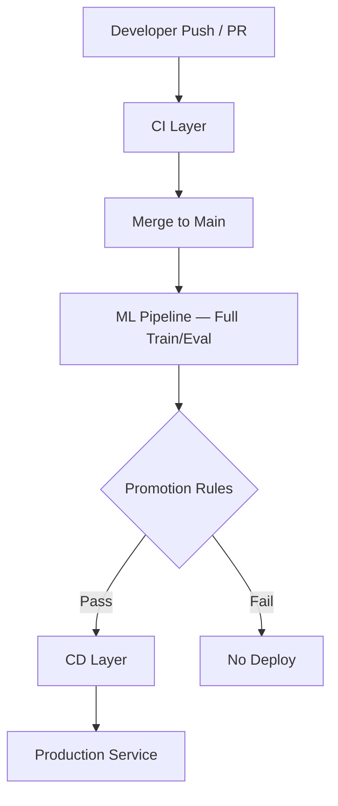

# CI/CD for Machine Learning — Summary

## CI for ML: What We Test

ML CI operates on three layers:

### 1. Standard Software Checks

- Linting and formatting
- Unit tests for core logic
- Integration tests (API starts, health endpoints respond)

### 2. Data Assumptions

- Schema validation on sample data
- Basic distribution checks (null rates, value bounds)

### 3. Training Pipeline Health

- **Smoke training run** — small data, few epochs, verifies end-to-end execution without crash

**CI goal**: Catch catastrophic breakages before merge — not to train production-quality models.

---

## CD for ML: What We Deploy

CD ships a **specific, approved bundle**:

| Element | Description |
|---------|-------------|
| Model version | Known weights with registry ID |
| Metrics | Validation performance that justified promotion |
| Code + config | Exact training/serving logic version |
| Package | Containerised service or batch job |

**CD goal**: Make it explicit **what was checked**, **what was approved**, and **what is running**.

---

## CI vs CD Comparison

| Dimension | CI | CD |
|-----------|----|----|
| **Trigger** | Every push / PR | Model passes promotion gates |
| **Speed** | Fast (minutes) | Slower (full eval, staging, canary) |
| **Tests** | Lint, unit, schema, smoke train | Metric thresholds, baseline comparison, fairness |
| **Output** | Merge approval / block | Promoted model in staging/production |
| **Question answered** | "Is the code/pipeline broken?" | "Is this model good enough to ship?" |

---

## End-to-End ML CI/CD Picture

Good ML CI/CD makes three things unambiguous:

1. **What we checked** (CI evidence)
2. **Which model + code we approved** (registry + commit)
3. **What exactly we deployed** (container + model version in production)

---

## Lab Implementation Preview

A typical Module 4 lab repository contains:

| Component | Role |
|-----------|------|
| Training script | Orchestrates data load, train, evaluate, save |
| MLflow logging | Records params, metrics, model per run |
| CI workflow file | GitHub Actions / GitLab CI YAML |
| Automated checks | Lint, tests, smoke training on each change |

This is a **mini end-to-end** implementation of the CI + ML pipeline concepts — expandable to production systems with more gates, environments, and monitoring.

---

## Scaling to Production

From the lab pattern, production systems add:

- Separate staging and production environments
- Model registry with formal promotion workflow
- Canary deployments with online metric monitoring
- Scheduled retraining pipelines triggered by data freshness
- Alerting when production model drifts from training distribution

---

## Common Pitfalls / Exam Traps

- **Trap**: Summarising ML CI/CD as "just GitHub Actions" — the workflow file is implementation; the concepts are layered verification and gated promotion.
- **Trap**: CI covers everything — full model evaluation and baseline comparison belong to CD / ML pipeline, not PR-time CI.
- **Trap**: Deploying without knowing approved metrics — CD requires documented evidence for promotion.
- **Trap**: Forgetting the hybrid model — CD deploys container (from code CI) **paired with** registry model version.

---

## Quick Revision Summary

- **ML CI tests**: code (lint/unit/integration), data schema on samples, smoke training for pipeline health.
- **ML CD deploys**: specific model version + metrics + code/config as containerised service.
- CI answers "is it broken?"; CD answers "is it good enough to ship?"
- Good ML CI/CD documents what was checked, approved, and deployed.
- Lab repo: training script + MLflow + CI YAML = mini end-to-end pattern.
- Production adds staging, canary, scheduled retrain, and monitoring on top of this foundation.
- Hybrid: code CI builds container; ML pipeline produces model; CD pairs them for deployment.
