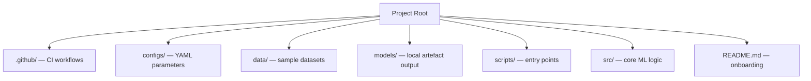
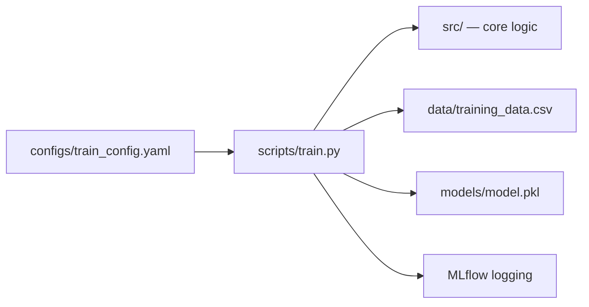

# Repository Structure for MLOps Pipelines

## Why Repository Layout Matters

A well-structured ML repository is not arbitrary organisation — it is a **blueprint** that enables experiment tracking, reproducibility, and CI/CD automation. The layout separates concerns so pipelines know exactly what to call, where artefacts live, and which configs drive each run.

**Mental model**:

- **Repository** = blueprint defining where everything goes
- **Config files** = instructions for each run
- **Scripts** = orchestrators that bring it all together
- **MLflow + CI** = layers that turn a training script into a production-ready system

---

## Standard MLOps Repository Layout



| Directory | Responsibility |
|-----------|----------------|
| **`.github/`** | CI/CD workflow definitions (GitHub Actions `ci.yml`) |
| **`configs/`** | YAML configs: hyperparameters, data paths, model output paths |
| **`data/`** | Small sample data for local dev and CI (not full production datasets) |
| **`models/`** | Local artefact output (e.g., `model.pkl`); placeholder for registry in production |
| **`scripts/`** | Top-level entry points (`train.py`) called by pipelines |
| **`src/`** | Core ML logic: data loading, training, evaluation utilities |
| **`README.md`** | Structure docs, quick-start commands, lab guides |

---

## Directory Deep Dive

### `.github/` — Automation Triggers

Contains `ci.yml` defining jobs that run on push or pull request:

- Checkout code
- Set up Python environment
- Install dependencies
- Run lint, tests, smoke training

This is where **continuous integration** is declared as code.

### `configs/` — Reproducibility Driver

YAML files control experiments without changing Python code:

```yaml
# Example structure (conceptual)
data_path: data/training_data.csv
model_output_path: models/model.pkl
learning_rate: 0.01
epochs: 10
```

Changing learning rate or dataset path = edit config only. This is the **config-driven** pattern — critical for reproducibility because config is a versioned pipeline input.

### `data/` — Local Sample Only

- Lab: `training_data.csv` for local runs and CI smoke tests
- Production: folder may contain **pointers** to data lake/warehouse paths, not multi-GB files in Git
- **Never commit large production datasets** to the repository

### `models/` — Artefact Output

When training runs locally, `model.pkl` appears here. In production MLOps, this is replaced by:

- Remote model registry (MLflow, SageMaker)
- Cloud object storage (S3, GCS, Azure Blob)

Local `models/` is a **development placeholder**.

### `scripts/` vs `src/` — Entry Point vs Logic

| Location | Role | Called By |
|----------|------|-----------|
| **`scripts/train.py`** | Orchestrator: load config → load data → train → log → save | Pipeline, CI smoke test, manual CLI |
| **`src/`** | Reusable functions: `load_data()`, `train_model()`, `evaluate()` | `train.py` and unit tests |

**Pipeline mindset**: `src/` implements step logic; `scripts/` wires steps together for execution.

---

## Config + Script Pairing Pattern

The most common and powerful MLOps pattern:



### `train.py` Typical Flow

1. Load configuration file (paths, hyperparameters)
2. Log parameters to MLflow
3. Load data from config-specified path
4. Train model using `src/` logic
5. Log metrics to MLflow
6. Save model artefact to config-specified output path
7. Log model with MLflow (`log_model`)

**Key principle**: Data paths and model output paths are in **config**, not hardcoded in the script.

---

## How Structure Enables the Deployment Pipeline

A deployment pipeline calls the same entry point CI uses:

```bash
python scripts/train.py --config configs/train_config.yaml
```

Then downstream stages:

1. **Evaluate** metrics from MLflow / saved reports
2. **Package** model into container if quality criteria met
3. **Deploy** to staging/production

The repository structure is what makes this call predictable and automatable.

---

## Pattern Recognition (Not Memorisation)

| Concern | Location |
|---------|----------|
| Source code | `src/` |
| Data | `data/` (sample) or external refs |
| Artefacts | `models/` (local) / registry (prod) |
| Configuration | `configs/` |
| Entry points | `scripts/` |
| CI workflows | `.github/` |

Recognising this pattern transfers across projects — AWS SageMaker repos, Vertex AI templates, and open-source MLOps starters use variants of the same layout.

---

## Common Pitfalls / Exam Traps

- **Trap**: Hardcoding `data/training_data.csv` in Python instead of config — breaks reproducibility and environment portability.
- **Trap**: Putting all logic in `scripts/train.py` with no `src/` separation — untestable, unmaintainable at scale.
- **Trap**: Committing large production datasets to Git — use data lake + versioned snapshots instead.
- **Trap**: Treating local `models/` as the production source of truth — use model registry in real deployments.
- **Trap**: Missing `.github/ci.yml` — structure alone does not automate; CI workflow completes the picture.

---

## Quick Revision Summary

- MLOps repo layout: `.github/`, `configs/`, `data/`, `models/`, `scripts/`, `src/`, `README.md`.
- `configs/` drives reproducibility — hyperparameters and paths externalised from code.
- `scripts/` = entry points; `src/` = reusable ML logic (pipeline step implementations).
- `data/` holds samples locally; production data lives in warehouse/lake.
- `models/` is local artefact placeholder; production uses registry + object storage.
- Config + `train.py` pairing is the standard config-driven training pattern.
- Structure enables CI smoke tests and deployment pipelines to call the same entry point.
