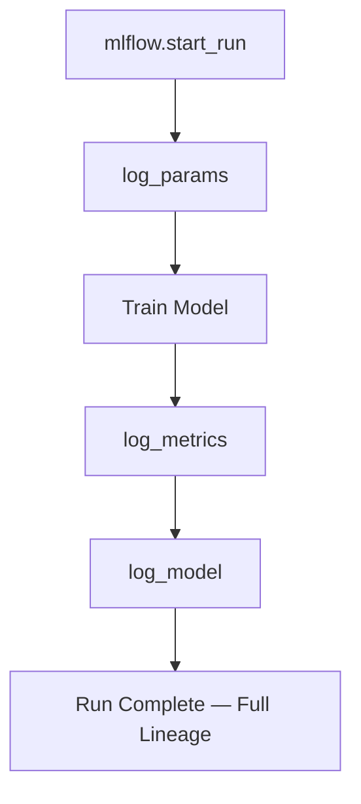
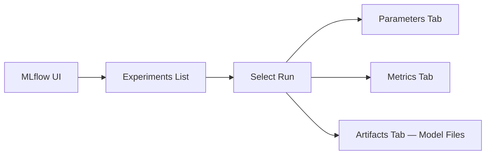

# MLflow Experiment Tracking — Training Script Instrumentation

## From Theory to Tool: Artefacts and Lineage in MLflow

Experiment tracking turns a one-off training script into a **fully tracked experiment** with complete lineage. **MLflow** is the tool used to make artefact and lineage concepts tangible: every run gets a unique ID with linked parameters, metrics, and model files.

---

## The MLflow Logging Pattern

Every instrumented training job follows four steps inside an `mlflow.start_run()` context:



| Step | API | What Gets Captured |
|------|-----|-------------------|
| 1. Start run | `mlflow.start_run()` | Unique run ID; groups all logged data |
| 2. Log parameters | `mlflow.log_params()` | Hyperparameters from config (learning rate, epochs, paths) |
| 3. Log metrics | `mlflow.log_metrics()` | AUC, RMSE, accuracy, etc. (possibly per epoch) |
| 4. Log model | `mlflow.sklearn.log_model()` (framework-specific) | Serialised model linked to this run |

**Core lineage insight**: `log_model` creates a tight link — *this run produced this exact model*.

---

## Code Structure (Conceptual)

```python
import mlflow

with mlflow.start_run():
    # Log hyperparameters from config
    mlflow.log_params({
        "learning_rate": config["learning_rate"],
        "epochs": config["epochs"],
        "data_path": config["data_path"],
    })

    # Train model using src/ logic
    model = train_model(X_train, y_train, config)

    # Log evaluation metrics
    mlflow.log_metrics({
        "mse": mse_score,
        "r2": r2_score,
    })

    # Log model artefact under this run
    mlflow.sklearn.log_model(model, "model")
```

Parameters become **searchable fields** in the MLflow UI — essential for comparing experiments.

---

## Running a Tracked Training Job

```bash
# Install dependencies
pip install -r requirements.txt

# Execute training with config
python scripts/train.py --config configs/train_config.yaml
```

### What Happens Behind the Scenes

- Print statements show progress in terminal
- MLflow captures parameters, metrics, and model silently
- A local `mlruns/` directory is created (default local tracking store)
- Each execution creates a new run with unique ID

**Difference from untracked training**: every run leaves a durable trace — run ID, parameters, metrics, model version.

---

## Inspecting Runs in the MLflow UI

```bash
mlflow ui
# Opens http://localhost:5000 (default)
```

### UI Navigation



| UI Section | Content |
|------------|---------|
| **Experiments** | Groups of related runs (e.g., "fraud-detection-v2") |
| **Run detail** | Run ID, start time, status |
| **Parameters** | All `log_params` values — filterable and comparable |
| **Metrics** | Scalar values; complex runs may show learning curves |
| **Artifacts** | Model files, plots, reports logged under the run |

### Comparing Runs

Select multiple runs → compare parameters and metrics side by side → identify best candidate for registry promotion.

---

## Lineage Questions Answered by MLflow

| Question | Where to Find Answer |
|----------|---------------------|
| Which hyperparameters produced this model? | Run → Parameters |
| What was the validation AUC? | Run → Metrics |
| Where is the model file? | Run → Artifacts → model/ |
| Which run is best? | Experiments → sort/filter by metric |

Connecting to production: once a run is promoted, its run ID links back to exact params, metrics, and artefact — full lineage for audit and debugging.

---

## Local vs Remote Tracking

| Mode | Storage | Use Case |
|------|---------|----------|
| **Local** | `./mlruns/` directory | Development, labs |
| **Remote** | MLflow tracking server + backend store | Team collaboration, production |

Production teams point `MLFLOW_TRACKING_URI` to a shared server so all engineers see the same experiment history.

---

## Integration with CI/CD

The same `train.py` invoked in CI smoke tests also logs to MLflow (or a test tracking URI). This verifies:

- MLflow integration does not break on code changes
- Parameters from config are logged correctly
- Model logging completes without error

---

## Common Pitfalls / Exam Traps

- **Trap**: Logging metrics outside `start_run()` context — data not associated with any run.
- **Trap**: `log_params` with nested dicts or lists — MLflow params must be flat strings; use `log_dict` or flatten.
- **Trap**: Only logging final metrics, not per-epoch — harder to diagnose training instability.
- **Trap**: Saving model to `models/` but not calling `log_model` — file exists locally but no lineage link in tracker.
- **Trap**: Assuming `mlruns/` is production storage — use remote tracking server and model registry for teams.

---

## Quick Revision Summary

- MLflow pattern: `start_run` → `log_params` → train → `log_metrics` → `log_model`.
- `start_run()` groups all logged data under a unique run ID.
- Parameters from config are searchable for experiment comparison.
- `log_model` creates the core lineage link: run → model artefact.
- Run training via `python scripts/train.py --config configs/train_config.yaml`.
- Inspect runs with `mlflow ui` — parameters, metrics, artifacts per run.
- Local `mlruns/` for dev; remote tracking URI for team/production use.
