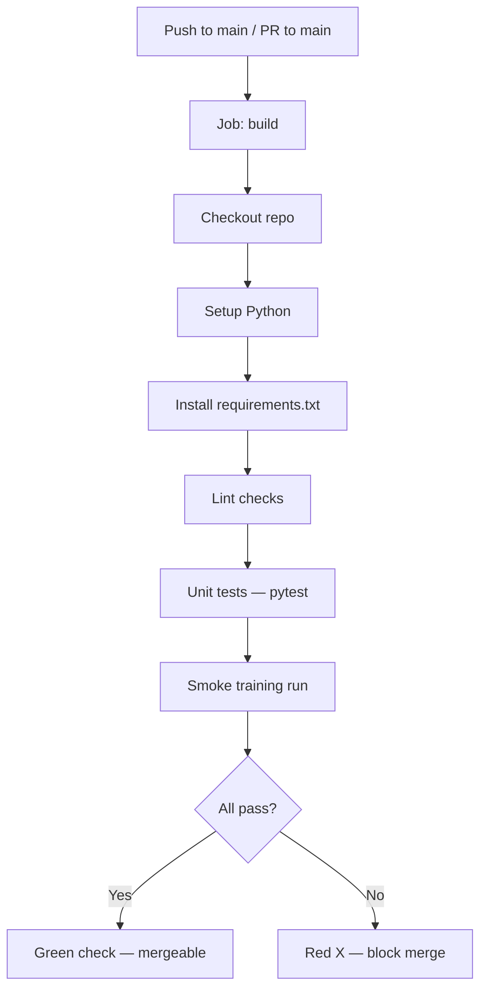
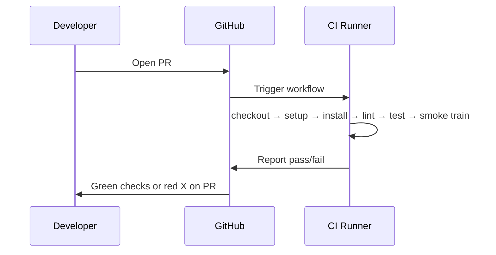
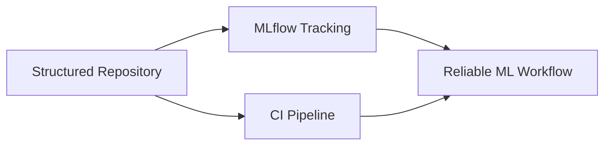

# CI Workflow for ML Repositories — GitHub Actions

## CI as Automated Gatekeeper

A CI workflow defined in YAML (e.g., `.github/workflows/ci.yml`) acts as an **automated gatekeeper** for ML deployment. It ensures code is always in a good state before merging to main — running the same checks a careful reviewer would, but on every push and pull request.

---

## Workflow Anatomy



---

## Trigger Configuration

```yaml
# Conceptual structure
on:
  push:
    branches: [main]
  pull_request:
    branches: [main]
```

| Event | When It Fires |
|-------|---------------|
| **Push to main** | Direct commits to protected branch |
| **Pull request to main** | Every PR targeting main — primary gate for code review |

---

## Job Environment

```yaml
jobs:
  build:
    runs-on: ubuntu-latest
```

- Each job runs in a **fresh, clean cloud VM** (GitHub-hosted runner)
- Environment matches production through `requirements.txt` — same dependency versions locally and in CI

### Standard Steps

| Step | Purpose |
|------|---------|
| `actions/checkout` | Clone repository code |
| `actions/setup-python` | Install specified Python version |
| `pip install -r requirements.txt` | Reproduce dependency environment |
| Lint (flake8, ruff) | Code quality |
| `pytest` | Unit and integration tests |

**If any step fails → entire job fails → bad code blocked from main.**

---

## ML-Specific Step: Smoke Training

Beyond standard software tests, ML repos add a **smoke test** for the training script:

```yaml
# Conceptual step
- name: Smoke training
  run: python scripts/train.py --config configs/train_config.yaml
```

| Property | Smoke Training in CI |
|----------|---------------------|
| **Purpose** | Verify training pipeline runs end-to-end without crashing |
| **Data** | Small sample from `data/` |
| **Duration** | Fast — few epochs or steps |
| **Metrics goal** | None — not evaluating model quality |
| **Catches** | Broken data processing, model input layer mismatch, MLflow logging failures |

**Example failure caught**: A PR changes feature engineering, breaking the model's expected input shape. Smoke training fails in CI before the change merges — preventing a broken nightly retrain on full data.

---

## PR Experience in GitHub UI

When you open a pull request:

1. Workflow starts automatically
2. Each YAML step executes in order with live logs
3. Steps show green checkmarks (pass) or red X (fail)
4. PR with failing CI displays a red cross — signal it is **not ready to merge**



This **automated feedback loop** is the core of Continuous Integration.

---

## CI Workflow vs ML Pipeline

| Aspect | CI Workflow (PR-time) | ML Pipeline (scheduled/triggered) |
|--------|----------------------|----------------------------------|
| **Duration** | Minutes | Hours |
| **Data** | Sample | Full dataset |
| **Training** | Smoke only | Full training + evaluation |
| **Model promotion** | No | Yes, via CD gates |
| **Goal** | Block broken code | Produce deployable model |

Do not conflate the two — CI smoke training is a **health check**, not model selection.

---

## Extending the Workflow

Production ML CI workflows commonly add:

- **Caching** `pip` dependencies for faster runs
- **Matrix builds** across Python versions
- **Data schema validation** step before smoke training
- **Coverage reports** uploaded as artefacts
- **Separate workflows** for CD (deploy on main merge, manual approval)

---

## Foundation for Full MLOps

Together, three elements form the lab's MLOps foundation:



| Element | Contribution |
|---------|--------------|
| **Structured repo** | Predictable entry points and configs |
| **MLflow** | Experiment lineage and artefact tracking |
| **CI pipeline** | Automated test and validation on every change |

This enables developing, testing, and deploying ML models in a **reliable, reproducible, automated** way.

---

## Common Pitfalls / Exam Traps

- **Trap**: CI workflow only on push, not PR — PRs merge without checks.
- **Trap**: No `requirements.txt` pin — CI passes but production fails on different package versions.
- **Trap**: Smoke training uses different config than documented standard — false confidence.
- **Trap**: Lint step as placeholder comment only — must actually run flake8/ruff or checks are meaningless.
- **Trap**: Treating green CI as "deploy to production" — CI gates merge; CD gates deployment.

---

## Quick Revision Summary

- CI YAML in `.github/workflows/` defines automated jobs on push/PR to main.
- Job steps: checkout → setup Python → install deps → lint → test → smoke training.
- Fresh Ubuntu runner; `requirements.txt` ensures environment parity with local dev.
- Any failing step blocks merge — CI is the automated gatekeeper.
- ML-specific addition: smoke training run catches integration errors early.
- PR UI shows per-step pass/fail — core CI feedback loop.
- CI (fast, sample data) ≠ full ML pipeline (slow, full data, model promotion).
