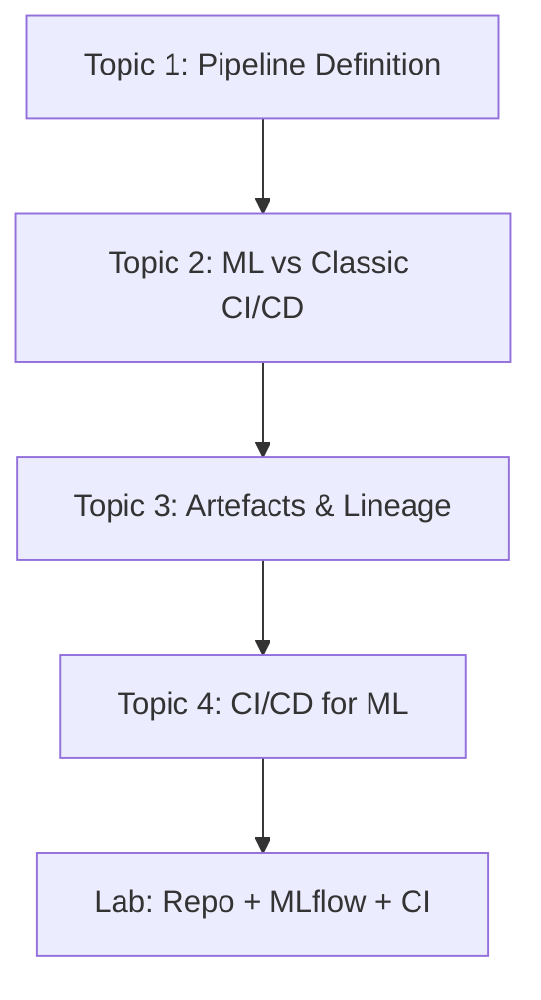
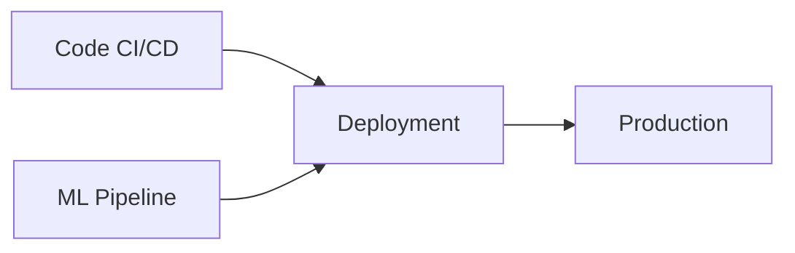
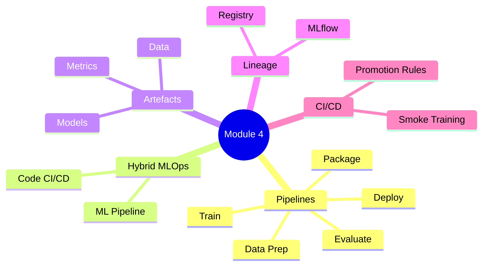

# Module 4 Summary — Deployment Pipelines and MLOps Basics

## Module Arc

This module moves from **one-off notebook heroics** to **systematic, repeatable model shipping**. Every topic plugs into one core concept: the **ML deployment pipeline**.

---

## Topic 1: Why Pipelines, Not Notebooks Alone

### The Problem

Notebook-only workflows are fragile:

- Manual steps live in one person's head
- No clear record of which model runs in production
- Metrics scattered across logs and screenshots
- Non-reproducible models fail audit and debugging needs

### The Solution

An **ML deployment pipeline** is a sequence of automated steps:

$$\text{Data Prep} \rightarrow \text{Train} \rightarrow \text{Evaluate} \rightarrow \text{Package} \rightarrow \text{Deploy}$$

### Pipeline Benefits

| Benefit | Impact |
|---------|--------|
| **Repeatability** | Same inputs → same outputs |
| **Auditability** | Record of what ran, when, with what |
| **Speed** | Faster idea-to-production after initial setup |
| **Fewer errors** | No forgotten config updates or manual copy-paste |

Pipelines are the **automation engine behind MLOps** — the full lifecycle of data, train, validate, deploy, monitor, retrain.

---

## Topic 2: ML Pipelines vs Traditional CI/CD

### Classic CI/CD

- Artefact: code → container
- Gate: "Did tests pass?"
- Works when behaviour is code-determined

### ML Extensions

- Artefacts: code + **data** + **model** + **metrics**
- Gate: "Did tests pass **and** is the model good enough?"
- ML-specific checks: schema, distribution, holdout validation

### Hybrid Architecture

- **Code CI/CD**: lint, test, build containers
- **ML pipeline**: data quality, train, evaluate, register models
- **MLOps**: orchestrate both; deploy only when code **and** model pass gates

---

## Topic 3: Artefacts, Lineage, Reproducibility

### ML Artefacts (Beyond Code)

| Category | Examples |
|----------|----------|
| Code & config | Training scripts, YAML hyperparameters |
| Data | Versioned snapshots, train/val/test splits |
| Models | `.pkl`, `.pt`, `.onnx` |
| Metrics & reports | AUC, fairness plots, evaluation PDFs |

### Lineage

Reconstruct the graph for any model version:

$$\text{commit} + \text{config} + \text{data snapshot} + \text{run ID} \rightarrow \text{metrics} \rightarrow \text{model v}N$$

**Tools**: experiment tracker (MLflow), model registry, metadata store.

### Reproducibility

Same pipeline + same code + same config + same data snapshot → equivalent model.

Requires: encoded pipeline steps + tracked metadata per run.

---

## Topic 4: CI/CD for ML

### CI — What Gets Tested (Every Change)

| Layer | Checks |
|-------|--------|
| Software | Lint, unit tests, integration tests |
| ML code | Feature shape, model load/predict tests |
| Data | Schema validation on sample |
| Pipeline | Smoke training (tiny data, few epochs) |

### CD — What Gets Deployed

- Specific **model version** with known metrics and lineage
- Paired with specific **code version** and **config**
- Packaged as **containerised service**
- Promoted via registry stages: Staging → Production
- Gated by: metric thresholds, baseline comparison, fairness checks

---

## Lab: Putting It Together

| Component | Role |
|-----------|------|
| **Repo structure** | `src/`, `scripts/`, `configs/`, `data/`, `models/`, `.github/` |
| **Config-driven training** | `train_config.yaml` + `scripts/train.py` |
| **MLflow** | `start_run` → `log_params` → `log_metrics` → `log_model` |
| **CI workflow** | Lint, test, smoke training on every PR |

The lab is a **mini end-to-end** implementation expandable to production with more gates, environments, and monitoring.

---

## Mindset Shifts (Exam-Ready)

| Old | New |
|-----|-----|
| Notebook is source of truth | Pipeline is source of truth |
| Manual model push | Automated pipeline stages |
| "Training finished" | "Model meets promotion criteria" |
| Code-only CI | Hybrid code CI + ML pipeline |
| Artefacts in my laptop | Versioned artefacts in tracker/registry |

---

## Module Concept Map

---

## Common Pitfalls / Exam Traps

- **Trap**: Treating any single topic as the whole module — everything connects through the pipeline concept.
- **Trap**: "MLOps = MLflow" — MLflow is one tool; MLOps is the full practice of automated, traceable ML lifecycle.
- **Trap**: Skipping classic CI because you have training pipelines — serving code still needs software CI.
- **Trap**: Notebook exploration equals production readiness — notebooks feed ideas; pipelines ship models.
- **Trap**: Forgetting the three determinants of ML behaviour: code, data, model parameters.

---

## Quick Revision Summary

- Notebook workflows fail at team scale — pipelines automate data → deploy with traceable artefact I/O.
- MLOps pipelines extend (not replace) classic CI/CD; hybrid model coordinates code CI + ML pipeline.
- ML behaviour depends on code, data, and model parameters — all are first-class release artefacts.
- Lineage links commit + config + data + run → model; reproducibility requires pipeline + tracking.
- ML CI: lint, tests, data schema, smoke training on every PR; ML CD: gated promotion of model + code bundle.
- Lab pattern: structured repo + config-driven `train.py` + MLflow + GitHub Actions CI.
- Core mindset: pipeline-first, not notebook-first; training success ≠ deployment eligibility.
