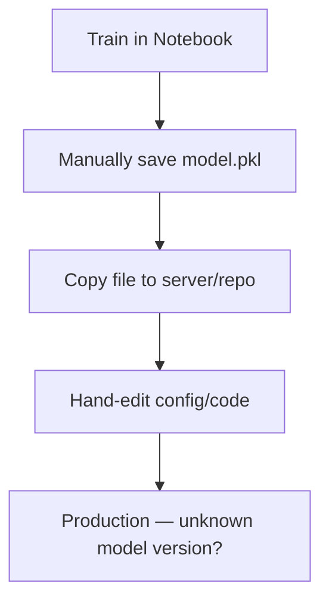

# Manual Workflow Pain, Pipeline Definition, and Benefits

## The Familiar Scenario: Great Notebook, Fragile Deployment

You train a model in a notebook, get solid metrics, and produce nice plots. Behind the scenes, the real process looks like:

1. Run cell 3, then cell 7
2. Export a file manually
3. Copy `model.pkl` to a server or repo
4. Hand-edit config to point at the new model

Critical logic — hardcoded paths, environment variables that exist only on your laptop, preprocessing steps you "just remember" — lives in the notebook and in your head. **Nobody else can reproduce your mental model exactly.**

When production breaks, debugging becomes detective work: Who ran it? Which data? Which notebook? On what day?

---

## Why Manual Notebook Workflows Break Down

### The Typical Ad-Hoc Flow

### Failure Modes

| Problem | Consequence |
|---------|-------------|
| Steps forgotten or done out of order | Wrong model or stale config in production |
| Model saved but config not updated | Serving code loads old weights |
| No central record of runs | Cannot identify which model is live |
| Metrics in screenshots or local logs | Cannot explain performance changes |

**Business risk**: In regulated domains (finance, healthcare), you cannot demonstrate how a model was trained. In fast-moving product teams, you cannot roll back confidently when behaviour shifts.

---

## Lack of Tracking: The Hidden Cost

Without structure, teams typically lack:

- A record of **which data** trained the model
- **Hyperparameters** and **code versions** tied to each run
- **Metrics** stored in a searchable, comparable form

When production performance changes, basic questions go unanswered:

- Why did model behaviour change?
- Which training run produced the currently deployed model?
- What changed between version 3 and version 4?

This produces **non-reproducible models** — unacceptable for serious production systems.

---

## The Alternative: ML Deployment Pipeline

A **deployment pipeline** encodes the full recipe from raw data to deployed service. Humans do not need to remember and rerun each step manually.

### Standard Stages

### Artefact Flow (Input → Output Model)

| Stage | Consumes | Produces |
|-------|----------|----------|
| Data preparation | Raw data, configs | Clean, versioned dataset (train/val/test splits) |
| Train | Dataset, hyperparameter config | Model artefact (`.pkl`, weights), training metrics |
| Evaluate | Model, validation set | Evaluation metrics, reports, plots |
| Package | Model artefact | Docker image or deployable bundle |
| Deploy | Package | Running service, registry entry |

**Key insight**: Pipelines are artefact factories. Tracking what each stage consumes and produces enables partial reruns (e.g., re-evaluate without retraining) and full lineage.

---

## Concrete End-to-End Example

**Step 1 — Data preparation**: Load raw data from warehouse → clean → engineer features → split → output versioned clean dataset.

**Step 2 — Train**: Use dataset + hyperparameter config → output model file and training curves (loss, etc.).

**Step 3 — Evaluate**: Run on validation/test set → output AUC, accuracy, calibration plots.

**Step 4 — Package and deploy**: Bundle model into container → push to registry → deploy as service → register as production model.

The pattern is always the same: **clearly defined steps with clear inputs and outputs, chained together.**

---

## Why Build a Pipeline Instead of Manual Scripts?

| Benefit | Explanation |
|---------|-------------|
| **Repeatability** | Same pipeline + same inputs → same outputs; essential for debugging |
| **Auditability** | Record of what ran, when, with which artefacts — critical for compliance |
| **Speed** | Once automated, idea-to-production skips manual stitching each time |
| **Fewer human errors** | Eliminates "oops, I forgot to update the config" moments |

**Cloud example**: An e-commerce recommendation team runs 20 experiments per week. A pipeline lets any engineer trigger a full train-evaluate-package cycle on AWS SageMaker or Vertex AI without manual file copying.

---

## Pipelines as the MLOps Engine

MLOps automates: data → train → validate → deploy → monitor → (retrain).

Pipelines provide:

- Standard path from experimentation to production
- Plug-in points for data quality, model validation, fairness checks
- CI/CD integration and retraining workflows

**Mental model**: When you hear "MLOps pipeline," think — *this is the engine that runs my ML lifecycle over and over, in a controlled and automated way.*

---

## Pipeline-First Mindset

| Solo Experimentation | Team-Scale Production |
|----------------------|----------------------|
| Artefact lives in my notebook | Logic lives in my pipeline and repo |
| I manually push models | Pipeline handles deployment automatically |
| Notebook is the source of truth | Notebook is for exploration; pipeline is for shipping |

Ask continuously: *Where does this logic belong in the pipeline? How do we automate this step so anyone can rerun it?*

---

## Common Pitfalls / Exam Traps

- **Trap**: "Manual deployment is fine for small teams." — It breaks as soon as multiple people and multiple models are involved.
- **Trap**: Saving `model.pkl` without updating serving config — a classic cause of "wrong model in production."
- **Trap**: Treating exploration notebooks as deployment artefacts — notebooks are not substitutes for versioned scripts and configs.
- **Trap**: Confusing **speed of first deploy** (manual feels faster once) with **speed at scale** (pipelines win over time).
- **Trap**: Forgetting that **auditability** is a legal requirement in regulated industries, not a nice-to-have.

---

## Quick Revision Summary

- Manual notebook workflows hide steps in one person's head and break under team scale.
- Typical manual flow: train → save → copy → hand-edit config — fragile and untraceable.
- Lack of tracking means you cannot explain production behaviour changes or pass audits.
- A deployment pipeline automates data prep → train → evaluate → package → deploy with defined artefact I/O.
- Pipelines deliver repeatability, auditability, speed, and fewer human errors.
- Pipelines are the automation backbone of MLOps (monitor → retrain loops plug in here).
- Mindset shift: notebook explores ideas; pipeline ships models to production.
