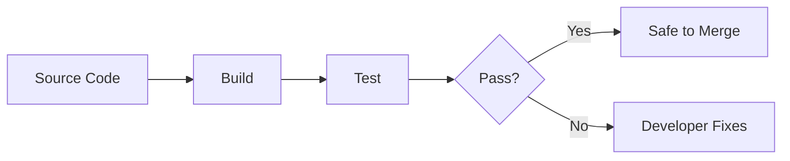

# Classic CI/CD in Software Engineering

## Why Start with Traditional CI/CD?

Before understanding MLOps pipelines, you need a clear picture of **classic CI/CD** from software engineering. ML deployment pipelines extend this foundation — they do not replace it. Copy-pasting a standard software CI/CD pipeline and expecting it to cover all ML risks is a common and costly mistake.

---

## Continuous Integration (CI)

**Continuous Integration** means developers push code frequently, and **automated builds and tests run on every change**.

### Goals

- Catch bugs early, before they reach production
- Keep the main branch in a consistently working state
- Provide fast feedback on every commit or pull request

### Typical CI Flow

---

## Continuous Delivery / Deployment (CD)

**Continuous Delivery** (or **Continuous Deployment**) takes tested changes and **packages and deploys** them to staging or production in small, frequent, low-risk releases.

| Term | Emphasis |
|------|----------|
| **Continuous Delivery** | Changes are always in a deployable state; release is a manual or gated decision |
| **Continuous Deployment** | Every passing change is automatically deployed to production |

Both share the goal: **ship small, ship often, reduce blast radius.**

---

## The Classic Pipeline: Code → Build → Test → Deploy

### What the Pipeline Produces

In traditional CI/CD, the **main artefact is code** — compiled, packaged into a binary or container. System behaviour is largely determined by **which code version** you build.

**Typical sequence**:

1. Check out the repository
2. Build the application / container image
3. Run unit and integration tests
4. Package and deploy a **single artefact** (often a container image) to production

The pipeline's job: ensure this particular code version passed tests, then ship that artefact.

---

## When Classic CI/CD Works Well

Classic CI/CD excels when:

- Behaviour is **fully determined by code**
- The artefact is a **binary or container**
- Tests can verify correctness without external data dependencies
- Releases are frequent and incremental

**Examples**: REST APIs with deterministic logic, microservices, infrastructure-as-code deployments, frontend applications.

---

## The Gap: Why This Picture Is Incomplete for ML

In the next topic, we see that ML system behaviour depends on **code + data + model parameters** — not code alone. Classic CI/CD that only validates and ships code misses two large risk surfaces:

1. **Data issues** (schema changes, drift, labelling errors)
2. **Model issues** (underperformance, fairness violations)

Understanding classic CI/CD is prerequisite to building the **hybrid** picture where software CI/CD and ML pipelines work together.

---

## Comparison: Traditional vs ML (Preview)

| Dimension | Classic CI/CD | ML Pipeline (extends CI/CD) |
|-----------|---------------|----------------------------|
| Primary artefact | Code / container | Code + data + model + metrics |
| Behaviour determined by | Code version | Code + training data + hyperparameters |
| Gate question | "Did tests pass?" | "Did tests pass **and** is the model good enough?" |
| Release unit | Container image | Container **plus** model version with lineage |

---

## Common Pitfalls / Exam Traps

- **Trap**: "CI and CD are the same thing." — CI integrates and tests; CD delivers/deploys. They are related but distinct.
- **Trap**: Assuming ML teams can skip classic CI because they have training pipelines — serving code, APIs, and infra still need linting, unit tests, and container builds.
- **Trap**: "Deploy on every green build" without understanding delivery vs deployment — many teams use manual promotion gates even with continuous delivery.
- **Trap**: Believing a single container artefact fully describes an ML release — the model weights and training data version are separate, critical artefacts.

---

## Quick Revision Summary

- **CI**: frequent commits + automated build/test on every change; catch problems early.
- **CD**: promote tested artefacts to staging/production in small, low-risk releases.
- Classic pipeline: checkout → build → test → package → deploy.
- Traditional CI/CD produces one main artefact (binary/container) from code.
- System behaviour in classic software is determined by code version.
- Classic CI/CD is essential but **insufficient alone** for ML — data and models are additional first-class artefacts.
- ML MLOps builds a hybrid: classic CI/CD for software + ML pipeline for data and models.
