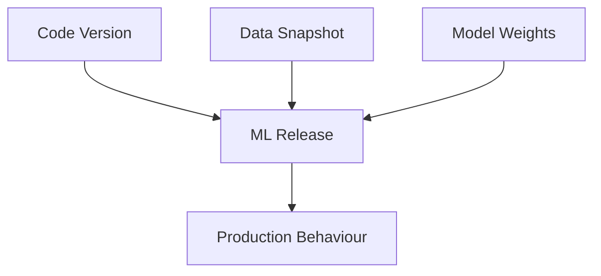
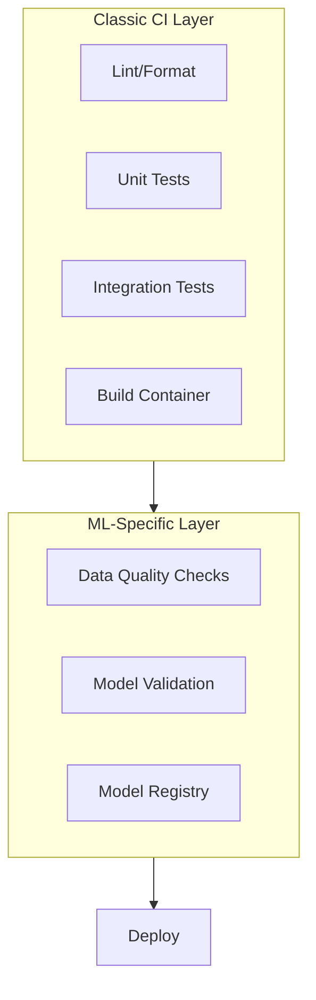

# ML-Specific Differences from Classic CI/CD

## Why the Classical Picture Is Incomplete

A traditional software system's behaviour is determined largely by **which code version** you deploy. A machine learning system's behaviour depends on **at least three factors**:

1. **Code** — feature logic, model architecture, serving API, preprocessing
2. **Data and labels** — training dataset version, label definitions, data distribution at training time
3. **Model parameters and config** — hyperparameters, thresholds, preprocessing choices

If CI/CD only examines code, you miss two huge risk surfaces: **data issues** and **model issues**. ML pipelines must treat **data** and **models** as first-class citizens.

---

## Data as a First-Class Artefact

When you ship a new model, you implicitly ship:

- A particular **training dataset version**
- A particular **label definition** and labelling process
- A **snapshot of the data distribution** at training time

If data changes — a feature disappears, distribution shifts ($P(X)$ drifts), labels are redefined — model behaviour changes **even when code is identical**.

### What ML Pipelines Must Do for Data

- Version data and schema as part of every release
- Run **data quality checks**: required fields present, ranges sane
- Detect **unexpected drift** compared to previous runs

**Release unit in ML**: not just new code — **code + data**.

**Real-world example**: A credit-scoring model trained before a pandemic may degrade when income patterns shift. Identical serving code produces worse decisions because the **data distribution** changed, not because of a code bug.

---

## Models as First-Class Artefacts

An ML pipeline does not only produce a container — it produces:

| Artefact Type | Examples |
|---------------|----------|
| **Model files** | `.pkl`, `.pt`, `.onnx`, SavedModel |
| **Evaluation metrics** | AUC, accuracy, F1, business KPIs |
| **Analysis artefacts** | Fairness metrics, calibration plots, confusion matrices |

These must be **stored, versioned, and linked to metrics** so you can decide whether a model is eligible for deployment.

### Gate Question Shift

| Traditional CI | ML Pipeline |
|----------------|-------------|
| "Did the tests pass?" | "Did tests pass **and** does this model meet performance criteria vs baseline?" |

ML pipelines feel like **scientific experiments encoded as code**, not just code compilation.

---

## ML-Specific Validation Checks

Traditional pipelines ask: *Do functions work? Do services integrate?*

ML pipelines add:

| Check Category | What It Validates |
|----------------|-------------------|
| **Data schema** | Required fields present; types and ranges valid |
| **Data distribution** | Is data similar to training data? Drift or leakage? |
| **Model validation** | On holdout set, does model beat baseline on key metrics? |

**Core promotion question**: *Is this model good enough on this data to advance to the next stage?*

---

## ML Does Not Replace Normal CI

Your ML system still contains substantial regular software:

- Feature engineering code
- Serving APIs and batch jobs
- Infrastructure-as-code
- Configuration and glue scripts

For all of this, you still need classic CI:

- Linting and formatting
- Unit and integration tests
- Building and publishing container images

**MLOps pipeline** = classic software CI/CD **plus** an ML-specific layer on top.

---

## Comparison Table: Software CI/CD vs ML Pipeline

| Aspect | Software CI/CD | ML Pipeline |
|--------|----------------|-------------|
| Primary risk | Logic bugs, integration failures | Logic bugs + data drift + model underperformance |
| Artefacts shipped | Code/container | Code + data version + model + metrics |
| Test focus | Correctness of functions | Correctness + "is model good enough?" |
| Promotion criteria | Tests green | Tests green + metric thresholds + fairness checks |
| Reproducibility driver | Code commit hash | Code + data snapshot + config + seed |

---

## Common Pitfalls / Exam Traps

- **Trap**: "Green CI means safe to deploy the model." — Code tests passing does not mean the model beats baseline or passes fairness checks.
- **Trap**: Versioning only code, not training data — identical code + different data = different model behaviour.
- **Trap**: Treating ML pipeline as a replacement for software CI — you need both layers.
- **Trap**: Promoting a model because "training finished successfully" — completion ≠ quality.
- **Trap**: Ignoring label definition changes as "non-code" changes — relabelling is as impactful as retraining.

---

## Quick Revision Summary

- ML behaviour depends on code, data/labels, and model parameters — not code alone.
- Data must be versioned, schema-checked, and drift-monitored as part of every release.
- Models are artefacts: weights, metrics, and reports must be stored and versioned.
- ML gate question: "Is this model good enough?" not just "Did tests pass?"
- ML-specific checks: schema, distribution, holdout validation vs baseline.
- Classic CI (lint, unit tests, container build) still required for all software components.
- MLOps = classic CI/CD + ML-specific layer for data and model governance.
