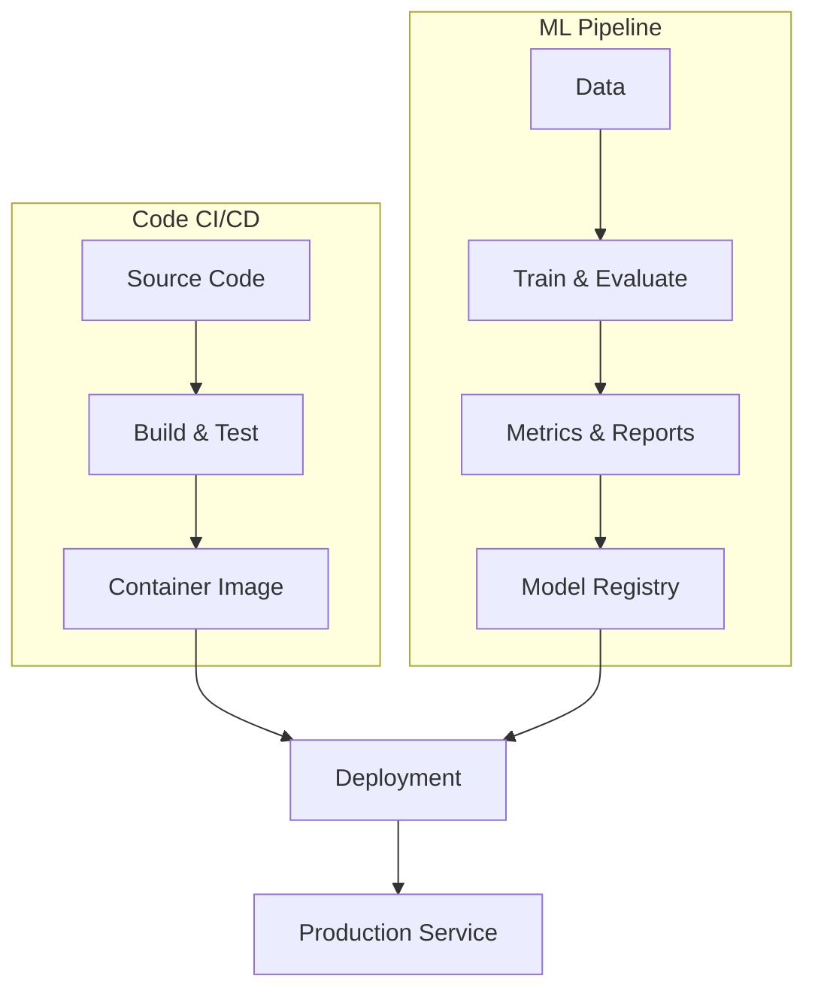
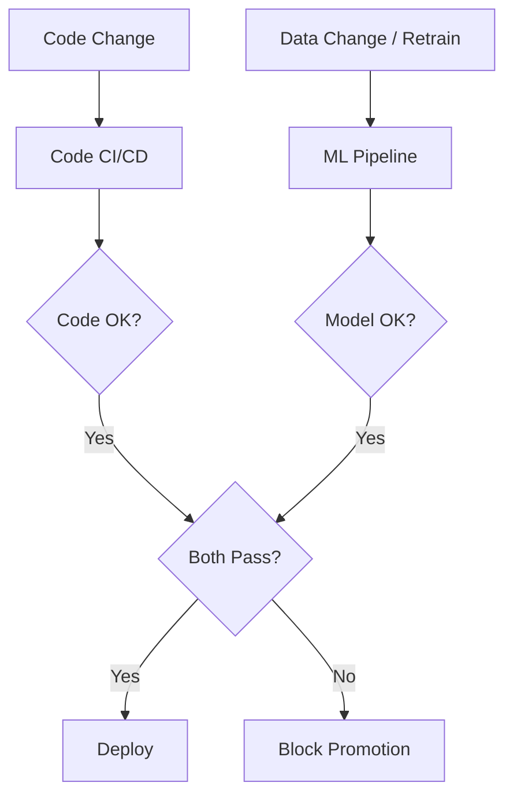

# The Hybrid Picture: Code CI/CD + ML Pipeline

## Two Pipelines, One System

In practice, production MLOps runs **two coordinated flows**:

1. **Code CI/CD** — source code through build and test → containers and infrastructure
2. **ML pipeline** — data through training and evaluation → candidate models and metrics → model registry

At deployment time, you **combine** infrastructure/code from CI/CD with the **chosen model** from the ML pipeline.

**MLOps** orchestrates both flows so code, data, and model advance in a controlled, automated way.

---

## What Happens When Something Changes

### Developer Changes Code

The **code CI pipeline** runs:

- Lint, unit tests, integration tests
- Build container image
- Optional: fast **smoke training** on sample data to catch obvious breakages

### New Data Snapshot or Scheduled Retrain

The **ML pipeline** runs:

- Data quality checks
- Full training and evaluation
- Comparison against current production baseline

If the new model beats baseline and passes checks → registered as **candidate for deployment**.

### Deployment Gate

A good MLOps setup deploys only when **both** pass:

- Code changes passed software tests
- Model changes passed quality and promotion rules

This prevents rolling out **broken code** or a **worse model** just because training finished.

---

## Side-by-Side Responsibilities

| Flow | Trigger | Primary Outputs | Validates |
|------|---------|-----------------|-----------|
| **Code CI/CD** | Git push, PR | Container, infra config | Code correctness, integration |
| **ML Pipeline** | Schedule, new data, manual trigger | Model version, metrics | Data quality, model performance |

---

## Real-World Example: Fraud Detection at Scale

A payments company maintains:

- **Code CI/CD**: FastAPI serving layer, feature preprocessing library, Kubernetes manifests — tested on every PR
- **ML pipeline**: Nightly retrain on transaction data with schema validation, AUC comparison vs production model

A developer refactors the API (code CI runs). Separately, Friday's data snapshot triggers retrain (ML pipeline runs). Production deploy happens only when the new API image **and** the promoted fraud model both pass gates.

---

## Key Takeaways

### 1. Traditional CI/CD Is Still Essential

You absolutely need it for code, tests, and infrastructure. It is not optional in ML systems.

### 2. ML Pipeline Adds New Elements

- **Data and model artefacts** — versioned, tracked, linked
- **Quality gates** — data checks and model validation before promotion

### 3. The Right Mental Model Is Hybrid

| Component | Role |
|-----------|------|
| Code CI/CD | Ships correct **software** |
| ML pipeline | Produces correct **model** trained on correct **data** |
| MLOps orchestration | Ensures the right combination reaches production |

---

## Connection to Artefact Lineage

The hybrid picture creates many linked artefacts: code commits, data snapshots, training runs, metrics, model versions, container images. **Lineage and reproducibility** (next topic) explain how to track and reconstruct these relationships — essential for debugging, audit, and rollback.

---

## Common Pitfalls / Exam Traps

- **Trap**: Running only code CI and assuming ML is covered — model quality and data drift require the ML pipeline.
- **Trap**: Running only ML retraining without code CI — serving bugs and API regressions still reach production.
- **Trap**: Deploying a new model against an old serving image (or vice versa) — deployment must pair **matched** code + model versions.
- **Trap**: Treating smoke training in CI as full model validation — it catches crashes, not performance regressions.
- **Trap**: "Training succeeded" as sufficient for deploy — baseline comparison and promotion rules are mandatory.

---

## Quick Revision Summary

- Production MLOps uses a **hybrid**: code CI/CD + ML pipeline, orchestrated together.
- Code CI/CD: build, test, containerise software components.
- ML pipeline: data quality → train → evaluate → register candidate models.
- Deployment combines container/infrastructure from CI/CD with chosen model from registry.
- Code changes trigger CI; data/retrain triggers ML pipeline — different triggers, coordinated gates.
- Deploy only when **both** code and model pass their respective checks.
- Traditional CI/CD remains essential; ML pipeline adds data/model versioning and quality gates.
