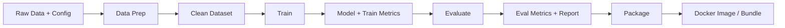

# ML Artefacts: What Pipelines Move and Track

## Beyond Code: The Full Artefact Landscape

In ML pipelines, an **artefact** is anything a stage **consumes** or **produces**. Tracking artefacts — knowing what they are, where they live, and how they relate — is the heart of MLOps.

Without artefact discipline, you cannot debug production issues, pass audits, or reproduce experiments.

---

## Categories of ML Artefacts

### 1. Code and Config

| Item | Examples |
|------|----------|
| Training scripts | `train.py`, feature engineering modules |
| Serving code | FastAPI handlers, batch inference jobs |
| Config files | YAML/JSON hyperparameters, data paths, model output paths |

Configs are critical pipeline inputs — changing learning rate or data path without versioning breaks reproducibility.

### 2. Data Snapshots

| Item | Examples |
|------|----------|
| Raw extracts | Warehouse dumps, streaming batch exports |
| Processed datasets | Cleaned, feature-engineered data |
| Splits | Train, validation, test partitions |

In production, data usually lives in a data lake or warehouse; the pipeline references **versioned snapshots**, not ad-hoc local files.

### 3. Models

Serialised model files containing learned parameters:

- `.pkl` (scikit-learn)
- `.pt` / `.pth` (PyTorch)
- `.onnx` (cross-framework)
- TensorFlow SavedModel

### 4. Metrics and Reports

| Type | Examples |
|------|----------|
| Scalar metrics | AUC, accuracy, RMSE, F1 |
| Curves | Loss curves, ROC plots |
| Reports | Confusion matrices, calibration plots, fairness PDFs |

---

## Pipeline Stages as Artefact Factories

| Stage | Inputs | Outputs |
|-------|--------|---------|
| Data prep | Raw data, config | Versioned clean dataset |
| Train | Dataset, config | Model file, training metrics |
| Evaluate | Model, validation set | Evaluation metrics, report |
| Package | Model | Deployable bundle / container |

Once you view pipelines this way, **managing artefact relationships** becomes the central engineering task — not just "running a script."

---

## Why Artefact Tracking Matters

Every production incident eventually asks:

- What inputs produced this model?
- Where is the evaluation report that justified deployment?
- Can we retrieve the exact config used?

**Artefact tracking** answers these without archaeology through email, Slack, and local laptops.

---

## Artefact Storage Patterns

| Environment | Typical Storage |
|-------------|-----------------|
| Local development | `models/`, `mlruns/`, `data/` directories |
| Team / staging | Object storage (S3, GCS), experiment tracker |
| Production | Model registry, artifact store, container registry |

**Cloud example**: Azure ML stores run artefacts in blob storage; MLflow tracks metadata and provides a UI to browse parameters, metrics, and logged models per run.

---

## Artefacts vs Source Code

| Source Code | Artefacts |
|-------------|-----------|
| Versioned in Git | Versioned in artifact stores / registries |
| Defines *how* to compute | Records *what was computed* |
| Same across runs | Unique per run (model v7 ≠ model v8) |

Both must be linked — a model artefact without its producing code commit is incomplete lineage.

---

## Common Pitfalls / Exam Traps

- **Trap**: Only versioning code, not model files — you cannot reproduce or roll back.
- **Trap**: Hardcoding paths in scripts instead of config-driven paths — breaks portability and reproducibility.
- **Trap**: Storing metrics only in stdout or notebooks — they must be logged to a durable store.
- **Trap**: Treating `models/model.pkl` in a repo as production storage — real systems use registries and object storage.
- **Trap**: Confusing **artefacts** (outputs) with **dependencies** (inputs) — both need versioning, but serve different roles.

---

## Quick Revision Summary

- ML artefacts include code, configs, data snapshots, models, metrics, and reports — not just code.
- Each pipeline stage consumes artefacts and produces new artefacts (artefact factory pattern).
- Categories: code/config, data, models (`.pkl`, `.pt`, `.onnx`), metrics/reports.
- Tracking artefacts = knowing what, where, and how they relate — core of MLOps.
- Artefacts are versioned outside Git (registries, object storage); must link back to code commits.
- Managing artefact relationships is the heart of pipeline engineering and lineage.
