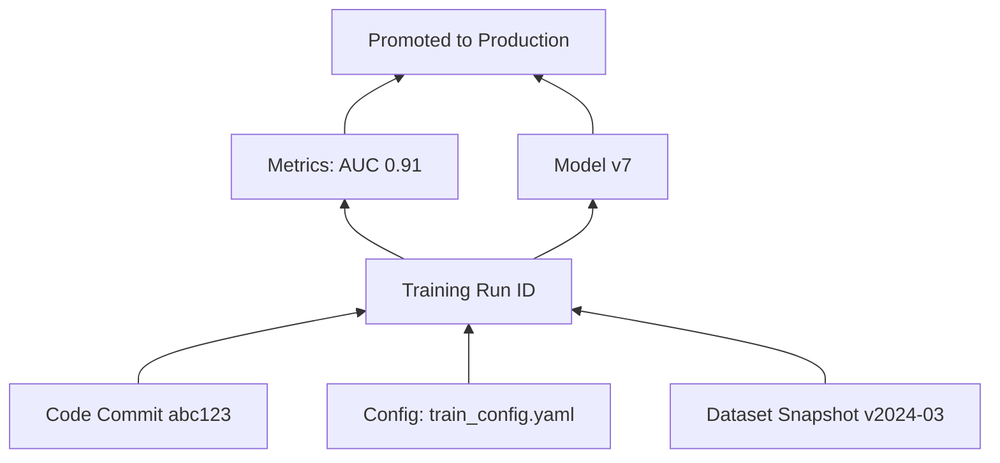
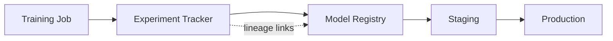

# Lineage and Traceability in ML Systems

## Why Lineage Matters

In production ML, you constantly need answers to questions like:

- Which **data**, **config**, and **code** produced this particular model?
- Which **model version** is currently running in production?
- What changed between model v3 and v4 that caused a performance shift?
- Which **experiments** led to choosing this model?

**Without lineage, you are guessing.** With lineage, you can inspect, compare, and roll back with confidence.

---

## Lineage as a Graph

Visualise lineage as a directed graph where each node is an artefact and edges show provenance.

For **model v7** (running in production), you should reconstruct:

- Code commit used
- Config / hyperparameters
- Data snapshot version
- Training run ID (e.g., in MLflow)
- Metrics and evaluation artefacts that justified promotion

**Lineage** means being able to reconstruct this graph for any model version — especially production.

---

## Questions Lineage Must Answer

| Question | Why It Matters |
|----------|----------------|
| Which data + code produced this model? | Debugging, audit, reproducibility |
| Which model is in production right now? | Incident response, rollback |
| What changed between v3 and v4? | Root-cause analysis for behaviour shifts |
| Which experiments were considered? | Understanding decision history |

---

## Tools That Enable Lineage

You do not need to master every tool immediately — understand the **concepts** first.

| Tool Category | Role | Example |
|---------------|------|---------|
| **Experiment tracker** | Logs runs, parameters, metrics, artefacts | MLflow |
| **Model registry** | Manages model versions and stages (Staging, Production) | MLflow Model Registry, SageMaker Model Registry |
| **Metadata store** | Tracks pipelines, datasets, relationships | MLflow, Kubeflow Metadata, custom DB |

### What Good Tooling Captures

- Every **run** recorded with unique ID
- **Parameters** and **metrics** searchable and comparable
- **Models** versioned with attached context
- Ability to **construct lineage** on demand

---

## Lineage in Regulated Industries

Finance and healthcare regulators may ask:

- How was this model trained?
- On what data?
- With what parameters?

If you cannot answer with evidence (not memory), the organisation faces compliance risk. Lineage is not optional in these domains.

---

## Lineage vs Logging

| Logging | Lineage |
|---------|---------|
| Records events as they happen | Records **relationships** between artefacts |
| "Training started at 10:00" | "Run X used data v3 + commit abc → model v7" |
| Useful for ops monitoring | Essential for audit and reproducibility |

Lineage builds on logging but adds **structured provenance links**.

---

## Practical Lineage Workflow

1. **Train** with experiment tracking (log params, metrics, model)
2. **Evaluate** and attach reports to the same run
3. **Register** model in registry with stage (None → Staging → Production)
4. **Deploy** container that references specific model version + code commit
5. **Query** registry/UI when incidents occur

**Example**: Production AUC drops 5%. Lineage shows v4 used a new data snapshot with a relabelled "fraud" class — root cause is data, not serving code.

---

## Common Pitfalls / Exam Traps

- **Trap**: Logging metrics but not linking them to model files — incomplete lineage.
- **Trap**: Promoting models without recording which evaluation report justified it.
- **Trap**: Assuming Git commit hash alone is sufficient lineage — you also need data version and hyperparameters.
- **Trap**: Multiple "latest" models in different places (local disk, registry, production) — registry stage field should be source of truth.
- **Trap**: Confusing experiment tracking with model registry — tracker logs runs; registry governs lifecycle stages.

---

## Quick Revision Summary

- Lineage answers: which data/code/config produced which model, and what is in production.
- Model lineage as a graph: commit + config + data + run ID → metrics → model version → stage.
- Without lineage: guessing; with lineage: inspect, compare, rollback confidently.
- Tools: experiment tracker (MLflow), model registry, metadata store.
- Runs, parameters, metrics, and models must be recorded and linkable.
- Critical for regulated industries (audit) and production debugging (root cause).
- Lineage = structured provenance relationships, not just event logs.
