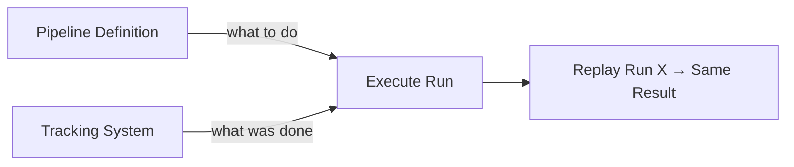

# Reproducibility in Machine Learning Systems

## What Reproducibility Means

**Reproducibility** means: if you run the same pipeline with the same **code**, **config**, and **data snapshot**, you get the same model — or one effectively equivalent within acceptable randomness (e.g., stochastic training with fixed seed).

This is fundamentally different from "it worked once in my notebook."

---

## Why Reproducibility Matters

| Use Case | Why Reproducibility Is Essential |
|----------|----------------------------------|
| **Debugging** | Replay exact training when production performance drops |
| **Compliance / audit** | Prove how a model was created in regulated industries |
| **Collaboration** | New teammate reruns your pipeline and extends your work confidently |
| **Scientific rigour** | Results should be repeatable, not one-off accidents |

All of these rely on **tracked artefacts** and **available lineage**.

---

## Concrete Scenarios

### Debugging Production Regression

Production accuracy drops. You need to replay the training that produced the **current** production model and compare against the previous version. Without reproducibility, you cannot isolate whether the cause is data, code, hyperparameters, or random seed.

### Compliance in Finance or Healthcare

Regulators ask: *How was this model trained? On what data? With what parameters?* Incomplete records create legal and operational risk.

### Team Onboarding

A new engineer clones the repo, runs the pipeline with documented config, and gets the same metrics you reported. They can trust the codebase and build on it.

---

## How to Achieve Reproducibility

### 1. Encode Steps in a Pipeline

The pipeline defines:

- **Order** of steps (prep → train → evaluate → package)
- **Config and parameters** at each stage
- **Dependencies** between stages

### 2. Record Metadata with Tracking Tools

For each run, capture:

| Metadata | Purpose |
|----------|---------|
| Code commit hash | Which logic ran |
| Data version / snapshot ID | Which data trained the model |
| Config file contents | Hyperparameters, paths |
| Environment spec | Python version, package versions |
| Outputs | Model artefact, metrics |

### 3. Combine Pipeline + Tracking

- **Pipeline** knows *what to do* and in what order
- **Tracking system** knows *what was done* and with what inputs
- Together: "Rerun training for run X" → expect equivalent output

---

## Reproducibility Checklist

- [ ] Config externalised (YAML/JSON), not hardcoded in scripts
- [ ] Data referenced by versioned snapshot, not mutable "latest" path
- [ ] Random seeds set and logged where stochasticity applies
- [ ] Environment pinned (`requirements.txt`, Docker image, conda lock)
- [ ] All outputs logged to durable storage with run ID
- [ ] Code commit hash recorded per run

---

## Acceptable Non-Determinism

Perfect bitwise-identical models are not always achievable:

- GPU floating-point non-determinism
- Distributed training ordering effects
- Large-scale data shuffling

**Practical standard**: metrics within a small tolerance (e.g., AUC ± 0.001) when rerunning with same inputs and seed.

---

## MLflow in Practice (Lab Context)

A typical instrumented training run:

1. `mlflow.start_run()` — open tracked context
2. `mlflow.log_params()` — hyperparameters from config
3. `mlflow.log_metrics()` — evaluation results
4. `mlflow.sklearn.log_model()` — register model under the run

Each run gets a **unique run ID** with linked parameters, metrics, and model artefact — reproducibility and lineage in one workflow.

---

## Common Pitfalls / Exam Traps

- **Trap**: "Reproducibility = same notebook cell order" — notebooks are not reproducible deployment units.
- **Trap**: Using mutable paths like `data/latest.csv` — always version data snapshots.
- **Trap**: Logging metrics but not environment/packages — same code + different library version = different model.
- **Trap**: Ignoring random seeds in neural network training — "almost reproducible" fails audit standards.
- **Trap**: Storing only the final model without run metadata — you cannot replay how it was created.

---

## Quick Revision Summary

- Reproducibility: same code + config + data snapshot → equivalent model (within tolerance).
- Critical for debugging, compliance, collaboration, and scientific validity.
- Achieved via pipeline (encoded steps) + tracking (recorded metadata per run).
- Capture: commit hash, data version, config, environment, outputs.
- Pipeline defines *what to do*; tracker records *what was done* — together enables replay.
- Accept minor metric tolerance for GPU/stochastic non-determinism.
- MLflow pattern: start_run → log_params → log_metrics → log_model.
