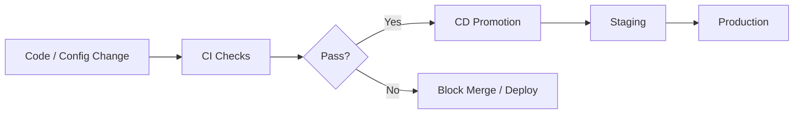

# CI/CD for Machine Learning — Introduction

## From Pipelines to Concrete CI/CD

Previous topics established:

1. **Deployment pipelines** — automated data → train → evaluate → package → deploy
2. **ML vs classic CI/CD** — data and models as first-class artefacts; hybrid architecture
3. **Artefacts, lineage, reproducibility** — what pipelines move and how to track it

This topic zooms into **what actually happens in CI/CD for ML systems**: what gets tested automatically, what gets deployed, and how promotion decisions are made.

---

## CI and CD Defined for ML Context

### Continuous Integration (CI)

Run **checks on every change** — typically on git push or pull request.

**Goal**: Catch problems early, before they reach production.

### Continuous Delivery / Deployment (CD)

**Promote artefacts** that pass checks into staging or production in a safe, controlled way.

**Goal**: Ship validated model + code combinations reliably.

---

## What CI Checks in ML (Overview)

| Layer | Examples |
|-------|----------|
| **Standard software** | Lint, format, unit tests, integration tests |
| **ML-specific code** | Feature function shape tests, model load/predict smoke tests |
| **Data assumptions** | Schema validation on sample data |
| **Pipeline health** | Smoke training run (tiny data, few epochs) |

CI in ML is **not** full data science — it catches catastrophic breakages fast.

---

## What CD Deploys in ML (Overview)

CD does not simply deploy "the latest image." It promotes a **specific bundle**:

- Model artefact (weights)
- Associated metrics (AUC, business KPIs)
- Code version and config that produced the model

**CD question**: *Which model + code combination do we trust enough for the next environment?*

---

## Mental Checklist

When designing ML CI/CD, ask:

1. **On every PR**: What code, data, and pipeline checks run automatically?
2. **Before staging**: Does the model meet metric thresholds and beat baseline?
3. **Before production**: Are canary/blue-green checks in place?
4. **After deploy**: Can we query which model version is live?

---

## Connection to Lab Workflow

A typical ML engineering repo implements this concretely:

- Training script with **MLflow** logging
- **GitHub Actions** (or GitLab CI) workflow file
- Automated lint, test, and smoke training on each change

The abstract CI/CD concepts become a **concrete mental checklist** of what to verify and what to ship.

---

## Common Pitfalls / Exam Traps

- **Trap**: Equating CI with "running full training" — CI uses fast smoke runs; full training is CD/scheduled pipeline territory.
- **Trap**: CD as "deploy latest Docker image" without specifying model version — must promote model + code together.
- **Trap**: Skipping data validation in CI because "we only have sample data" — sample schema checks still catch breaking changes.
- **Trap**: Assuming CD is fully automatic in all organisations — many use manual approval gates even with continuous delivery.

---

## Quick Revision Summary

- CI/CD for ML turns abstract pipeline concepts into concrete verification and promotion workflows.
- **CI**: automated checks on every change (push/PR) — catch issues early.
- **CD**: promote validated artefacts to staging/production safely.
- ML CI checks: code quality, ML unit tests, data schema, smoke training.
- ML CD promotes: specific model version + metrics + code/config — not just latest image.
- Design question: what is verified on every change vs what is required for promotion?
- Lab repos demonstrate this with MLflow + CI workflow files.
