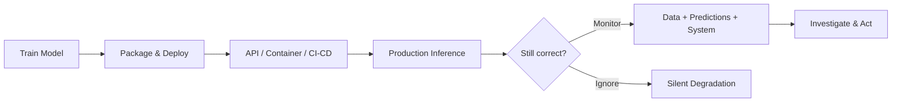

# ML Model Monitoring: Module Introduction

## From Deployment to Operational Excellence

Deploying a machine learning model is not the finish line — it is the starting point of a new operational phase. Earlier work in model engineering focused on getting models into production: exposing them as REST APIs, packaging them in containers, wiring them into CI/CD pipelines, and promoting versions safely. That work answers **how to ship** a model.

Monitoring answers a different question: **once a model is live, how do we know it is still doing the right thing?**

---

## Why Deployment Alone Is Insufficient

A production ML system can satisfy every infrastructure check while failing its business purpose:

| Question | What deployment guarantees | What monitoring must answer |
|----------|--------------------------|----------------------------|
| Are inputs still valid? | API accepts requests | Schema, quality, drift checks |
| Are predictions still accurate? | Service returns 200 OK | Accuracy, AUC, RMSE over time |
| Is the business benefiting? | Container is running | Revenue, fraud catch rate, churn |
| Are all user groups treated fairly? | Latency is low | Segment-level performance gaps |

**Intuition**: Deployment proves the model *can run*. Monitoring proves the model *should still be running*.

---

## The Three Questions Every Live Model Must Answer

1. **Input integrity** — Are we still receiving the right inputs in the expected format and distribution?
2. **Prediction quality** — Are outputs still accurate, calibrated, and fair across segments?
3. **Business impact** — Is the model helping or silently hurting KPIs?

These questions span three monitoring layers (system health, data health, prediction/business health) developed throughout this module.

---

## Real-World Motivation

Consider a fraud detection model deployed on AWS ECS behind an API Gateway:

- **Week 1**: P99 latency 80 ms, error rate 0.1%, accuracy 94%. Dashboards are green.
- **Week 6**: Same latency and error rate — but fraudsters adapted, feature distributions shifted, and precision dropped to 61%. No HTTP errors fired.

Users received fast, error-free responses that were increasingly wrong. This is the defining failure mode of unmonitored ML systems: **silent degradation**.

---

## Module Scope

This module builds a complete monitoring and observability practice:

1. Why ML monitoring differs from traditional application monitoring
2. What to measure at each layer (system, data, predictions)
3. Drift detection and alerting fundamentals
4. Workflow design: dashboards, SLOs, runbooks, ownership
5. Hands-on instrumentation with structured logging, PSI, and automated alerts

The goal is to transform a one-off deployment into a **reliable, long-running ML system** that detects problems before users and stakeholders notice.

---

## Common Pitfalls / Exam Traps

- **"Deployed = done"** — Deployment is the beginning of operational risk, not the end of engineering work.
- **Conflating uptime with model health** — A service returning HTTP 200 does not imply correct predictions.
- **Monitoring only after incidents** — Reactive debugging costs more than proactive observability built at launch.
- **Skipping business KPIs** — Technical metrics without business linkage cannot justify model existence.
- **Treating monitoring as a one-time setup** — Thresholds, segments, and features evolve; monitoring must evolve with them.

---

## Quick Revision Summary

- Deployment (APIs, containers, CI/CD) gets models **into** production; monitoring keeps them **correct** in production.
- The core shift: from "is the service up?" to "are inputs sane, predictions accurate, and business KPIs healthy?"
- Silent degradation is the primary ML-specific risk — fast, error-free wrong answers.
- Monitoring spans three layers: system health, data health, prediction/business health.
- Real production systems need observability from day one, not after the first major incident.
- This module progresses from concepts through drift/alerting to hands-on instrumentation and dashboards.
