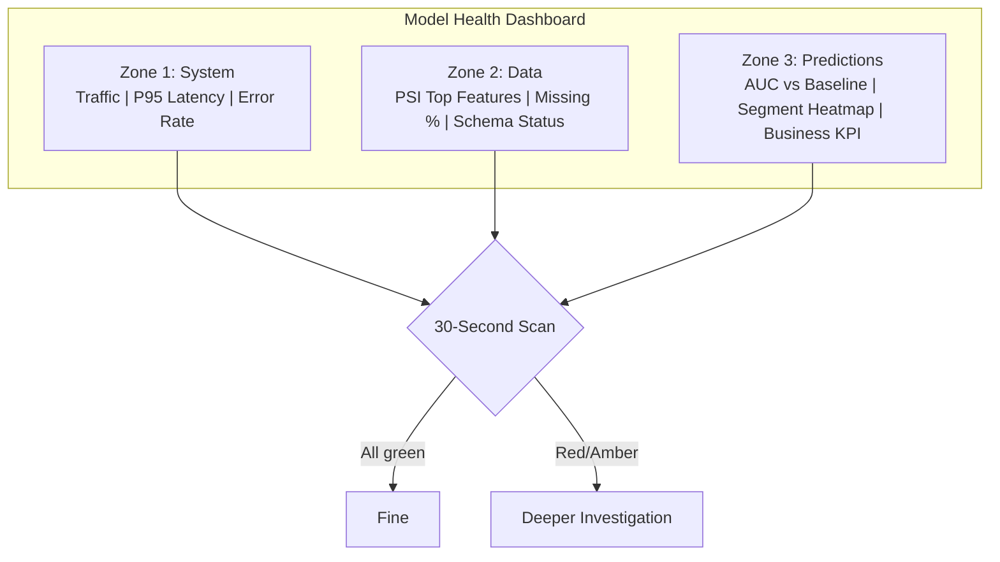
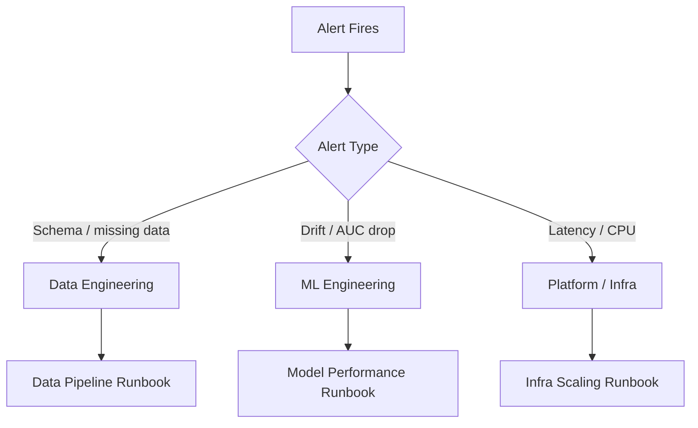
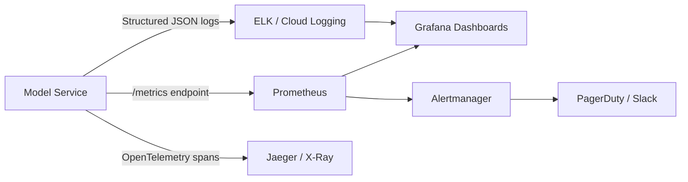

# Dashboards, Alerts, and the Typical ML Monitoring Stack

## Operationalising Observability

Knowing what to monitor is step one. Step two is building the **infrastructure** — dashboards people actually use, alerts that fire at the right time, and a technology stack that scales from a single model service to an enterprise ML platform.

---

## Dashboard Architecture

### One primary dashboard per model

A well-designed model dashboard has three zones:



### Design rules

| Rule | Rationale |
|------|-----------|
| Highlight exceptions (red/amber) | Operators spot problems without reading every number |
| Compare to baseline | Absolute values lack context; deltas reveal drift |
| Show segment breakdowns | Global metrics hide local failures |
| 30-second scan test | If triage takes longer, simplify the dashboard |

Dashboards = **pull monitoring** (humans look when needed).

Alerts = **push monitoring** (system notifies proactively).

---

## Alert Configuration

### Conditions tied to SLOs

| Metric | Condition | Duration | Severity |
|--------|-----------|----------|----------|
| P95 latency | > 200 ms | > 15 min sustained | Warning |
| Error rate | > 1% | > 5 min sustained | Critical |
| PSI (critical feature) | > 0.2 | > 4 hours sustained | Critical |
| AUC | > 10% below baseline | On 7-day labelled window | Warning |

### Anti-fatigue practices

- **Sustained breach** — Not a single spike.
- **Hysteresis** — Metric must return inside band before alert resolves.
- **Grouped incidents** — One alert for correlated drift, not 12 separate pages.
- **Severity-appropriate routing** — Email for warnings; pager only for critical.

### Alert message contents

Every alert should include:

1. What breached (metric name, current value, threshold)
2. Duration of breach
3. Link to relevant dashboard panel
4. Link to runbook
5. Primary owner / on-call contact

---

## Ownership Model



| Alert Category | Primary Owner | Escalation |
|----------------|---------------|------------|
| Schema change, null spike | Data engineering | ML engineering |
| PSI breach, AUC drop | ML engineering | Product / business |
| P99 latency, OOM, restarts | Platform / SRE | ML engineering (if model-specific) |

---

## Runbook Template

```
Alert: feature_1_psi_critical
Severity: Critical
Owner: ML Engineering (primary), Data Engineering (secondary)

Business meaning:
  Input feature distribution has fundamentally shifted from training.
  Model may be operating on data it was never trained for.

Common causes:
  - New market / user segment
  - Upstream ETL change
  - Seasonal business shift

Checks:
  1. Open Model Dashboard → Data Health panel
  2. Compare feature histograms (training vs. production)
  3. Check recent deployments and pipeline changes
  4. Query production logs for sample feature values

Next actions:
  - If pipeline bug → escalate to Data Engineering
  - If genuine population shift → open retrain ticket
  - If seasonality → document and update baseline
  - If severe → consider rollback to previous model version
```

---

## Typical Technology Stack

| Layer | Open Source | Cloud Managed |
|-------|-------------|---------------|
| Metrics collection | Prometheus | CloudWatch, Azure Monitor, Datadog |
| Dashboards | Grafana | CloudWatch Dashboards, Datadog |
| Log aggregation | ELK Stack (Elasticsearch, Logstash, Kibana) | CloudWatch Logs, GCP Cloud Logging |
| Distributed tracing | Jaeger, Zipkin, OpenTelemetry | AWS X-Ray, GCP Cloud Trace |
| Alerting | Alertmanager (Prometheus) | PagerDuty, Opsgenie |
| ML-specific monitoring | Evidently AI, WhyLabs, Arize | SageMaker Model Monitor, Vertex AI Model Monitoring |

### Reference architecture



### Separation of configuration from code

Store alert thresholds in YAML/JSON config files, not hardcoded in application logic:

- Operations teams adjust thresholds without code deploys.
- Version-control threshold changes alongside infrastructure.
- Different environments (staging vs. production) use different configs.

---

## Pull vs. Push Monitoring

| Aspect | Dashboards (Pull) | Alerts (Push) |
|--------|-------------------|---------------|
| Trigger | Human opens dashboard | System detects breach |
| Use case | Exploration, weekly review, triage | Immediate notification |
| Noise risk | Low (human filters) | High (needs careful tuning) |
| Best practice | 30-second health scan | Sustained SLO breaches only |

---

## Real-World Example: Multi-Model Platform on Kubernetes

A company runs 8 ML models on Kubernetes:

- **Prometheus** scrapes `/metrics` from each model pod (latency histograms, error counters, custom PSI gauges).
- **Grafana** hosts one dashboard per model plus a fleet overview.
- **Fluentd** ships structured prediction logs to Elasticsearch.
- **Alertmanager** routes critical alerts to PagerDuty; warnings to `#ml-alerts` Slack channel.
- Thresholds live in a GitOps-managed `alerts.yaml` repo.

Weekly ML ops review uses dashboards (pull). Incidents are handled via alerts + runbooks (push).

---

## Common Pitfalls / Exam Traps

- **Wall-of-numbers dashboards** — No exception highlighting; fails the 30-second scan test.
- **Pager for every warning** — Reserve pagers for critical; use Slack for warnings.
- **Hardcoded thresholds in Python** — Ops cannot tune without code deploy.
- **No runbook links in alerts** — On-call wastes time on triage.
- **Single fleet dashboard for all models** — One model's failure buried in aggregate view.

---

## Quick Revision Summary

- One primary dashboard per model: system + data + prediction zones; 30-second scan.
- Alerts tied to SLOs: sustained breach, severity tiers, grouped incidents.
- Ownership: data eng (pipelines), ML eng (drift/performance), platform (infra).
- Runbooks: business meaning, causes, checks, next actions.
- Typical stack: Prometheus + Grafana + ELK + Alertmanager (+ OpenTelemetry).
- Separate alert config from code (YAML); GitOps for threshold management.
- Dashboards = pull; alerts = push — both required.
