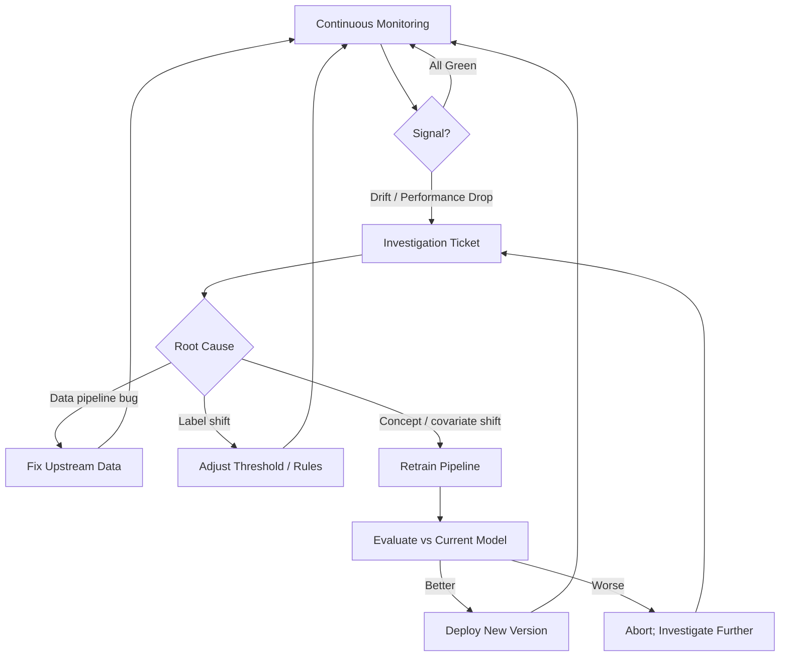
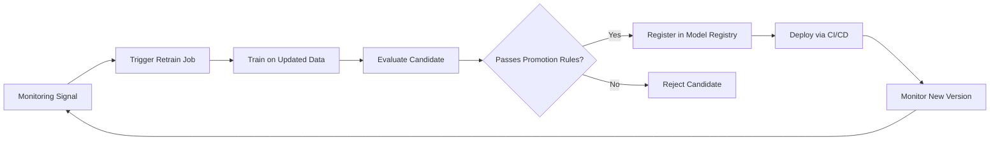

# Closing the Loop: From Monitoring to Model Updates

## Monitoring Is Not the End State

A monitoring system that only produces dashboards is incomplete. The ultimate purpose is to **close the loop** — converting detected signals into model updates, threshold adjustments, or data fixes that restore production quality.



---

## When Monitoring Triggers Action

### Signals that should create investigation tickets

| Signal | Likely Cause | Urgency |
|--------|--------------|---------|
| Repeated drift on top features (PSI > 0.2 sustained) | Population shift or pipeline change | High |
| Persistent AUC/recall drop on fresh labelled data | Concept drift | High |
| Segment performance gap widening | Fairness or localised drift | Medium–High |
| Sudden missing value spike | Pipeline failure | Critical (immediate) |
| Business KPI divergence | Model no longer aligned with goals | Medium |

### Investigation outcomes

After triage, one of three paths typically emerges:

1. **Data issue** — Fix upstream ETL, schema, or feature engineering. No model change needed.
2. **Threshold / business logic adjustment** — Label drift changed the optimal operating point. Recalibrate without retraining.
3. **Retrain and redeploy** — Genuine distribution or concept shift requires a new model on fresher data.

---

## The Retraining Pipeline Integration

When investigation confirms retraining is needed:



### Promotion rules (preview)

Before deploying a retrained model, compare against the current production model:

- AUC / recall not worse than current by more than X%
- Fairness gaps not wider than current
- Latency within serving SLO
- Shadow/canary evaluation on live traffic

Monitoring signals become **automatic triggers** for this pipeline — not ad-hoc requests filed weeks after degradation begins.

---

## Decision Framework

| Observation | First Action | If Unresolved |
|-------------|--------------|---------------|
| PSI high, performance stable | Investigate population change | Monitor; consider retrain if sustained |
| PSI high, performance dropping | Open retrain ticket | Expedited retrain pipeline |
| Label rate shift, AUC stable | Adjust decision threshold | Retrain with class weight update |
| Segment AUC collapse | Check segment-specific drift | Segment-aware retrain or rule override |
| Missing data spike | Page data engineering | Hold predictions if critical features null |

---

## Real-World Example: Churn Model Lifecycle

**Month 1**: Model deployed. Monitoring shows AUC 0.88, PSI < 0.05 on all features. Green.

**Month 4**: `tenure_months` PSI rises to 0.25 (pricing change attracted newer customers). Global AUC drops to 0.79.

**Investigation**: Confirmed covariate drift from pricing strategy change, not pipeline bug.

**Action**: Retrain on last 6 months of data including new customer cohort. Candidate AUC 0.86. Canary deploy for 1 week. Full rollout. Monitoring baselines updated.

**Month 5**: New version monitored with same SLOs. Loop continues.

---

## Prerequisites for a Closed Loop

| Capability | Why Needed |
|------------|------------|
| Structured prediction logs | Compute drift and performance retrospectively |
| Stored training baselines | PSI and stat comparison require reference |
| Automated alert → ticket integration | Signals do not die in Slack |
| Retraining pipeline (CI/CD for models) | Respond to drift without manual weeks-long process |
| Model registry | Track versions, metadata, evaluation results |
| Promotion rules | Prevent worse models from replacing current |

---

## Connection to Broader MLOps

Monitoring sits in the middle of the MLOps lifecycle:

```
Train → Evaluate → Register → Deploy → Monitor → (Retrain) → Deploy → ...
```

Without the monitor → retrain connection, the lifecycle is open-ended — models degrade until manual intervention. With it, the system is **self-correcting** (with human oversight on promotion decisions).

---

## Common Pitfalls / Exam Traps

- **Monitoring without a retraining path** — Detection without remediation accumulates technical debt.
- **Retraining without evaluation gates** — New model may be worse; always compare to current.
- **Fixing data but not closing the ticket loop** — Update baselines after pipeline fixes.
- **Manual-only retrain triggers** — Automated drift → ticket integration prevents weeks of silent degradation.
- **Deploying retrained model without updating monitoring baselines** — New model needs new reference distributions.

---

## Quick Revision Summary

- Monitoring must close the loop: detect → investigate → fix, adjust, or retrain.
- Repeated drift or persistent performance drops should create investigation tickets.
- Three outcomes: data fix, threshold adjustment, or retrain-and-deploy.
- Retraining pipeline: updated data → evaluate → register → deploy → monitor again.
- Promotion rules prevent worse candidates from reaching production.
- Monitoring signals should automatically feed retraining triggers.
- Model registry and CI/CD are prerequisites for a closed MLOps loop.
