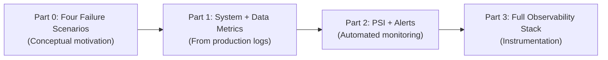
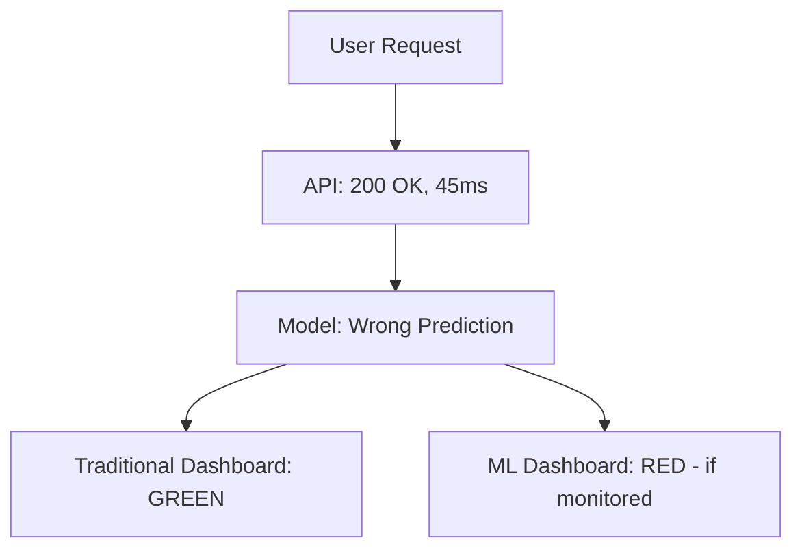
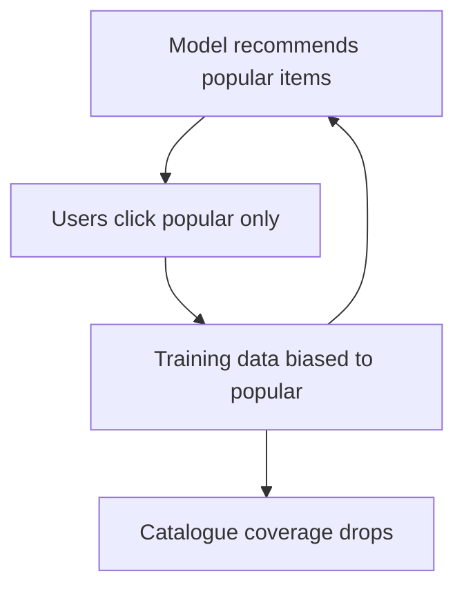

# ML Monitoring Lab: Four Production Failure Scenarios

## Why Simulated Scenarios Matter

Hands-on monitoring labs use simulated data and scenarios for two reasons: **portability** (every student gets identical, reproducible conditions) and **controlled demonstration** (specific failure modes can be injected without waiting for real production drift).

The patterns and code built in the lab scale directly to production by connecting the same techniques to real ML service logs, metric systems, and distributed tracing infrastructure (Prometheus, Datadog, ELK, OpenTelemetry).

---

## Lab Structure Overview

| Part | Focus | Data Source |
|------|-------|-------------|
| Part 0 | Why traditional monitoring fails | Synthetic scenario tables |
| Part 1 | System metrics + data metrics from logs | Sample `logs.csv` + `training_stats.json` |
| Part 2 | PSI, model performance, automated alerting | Same logs + alert config YAML |
| Part 3 | Full inference instrumentation | Simulated ML inference requests |

---

## Scenario 1: Silent Model Degradation

**Failure mode**: Traditional monitoring shows everything healthy; model accuracy collapses.

| Week | System Metrics | ML Metrics |
|------|----------------|------------|
| Week 1 | Latency stable, error rate ~0%, pipeline stable | Accuracy 92% |
| Week 4 | Latency stable, error rate ~0%, pipeline stable | Accuracy 67% |

**Key insight**: Users receive fast, error-free responses that are increasingly **wrong**. No HTTP errors fire. This is the defining ML monitoring gap.

**What catches it**: Rolling accuracy/AUC on delayed labels, not latency or error rate.

---

## Scenario 2: Covariate Drift (Population Shift)

**Failure mode**: Input feature distributions shift; model trained on one population, deployed on another.

| Feature | Training / Week 1 Production | Later Production |
|---------|------------------------------|------------------|
| Mean age | 35 | 24 |
| Mean income | 64 (normalised) | 34 (normalised) |

- Model code unchanged.
- System healthy (no errors, stable latency).
- Model was never trained for the new population (Region B vs. Region A).

**What catches it**: Feature distribution tracking compared to training baseline (mean/std, PSI, histograms).

**Real-world parallel**: A credit model trained on urban customers deployed nationally without monitoring segment-level feature distributions.

---

## Scenario 3: Feedback Loop Degradation

**Failure mode**: Model outputs influence future inputs — unique to ML systems.

**Example**: Recommendation system vicious cycle:

1. Model initially recommends diverse content → users engage with variety.
2. Over time, model favours popular items → users only see popular content.
3. Niche content gets no clicks → training data becomes biased toward popular items.
4. Model reinforces the bias further.

| Metric | Initial | After Feedback Loop |
|--------|---------|---------------------|
| Catalogue coverage | 85% | 40% |

**What catches it**: Diversity metrics, fairness metrics, distribution shift over time — not CPU or error rate.

---

## Scenario 4: Label Drift (Target Shift)

**Failure mode**: Target variable distribution changes; model calibration breaks.

| Metric | Training | Production |
|--------|----------|------------|
| Fraud rate | 1% | 5% |
| Precision at fixed threshold | Acceptable | Tanks |

The model may still rank instances reasonably (AUC stable) but precision collapses because it was calibrated for a 1% base rate.

**What catches it**: Label rate monitoring, precision/recall at operating threshold, not just AUC.

---

## Comparison: Traditional vs. ML Monitoring Coverage

| Failure Mode | Traditional Monitoring | ML-Specific Monitoring |
|--------------|------------------------|------------------------|
| System crash / high latency | Catches | Also catches |
| API errors (5xx) | Catches | Also catches |
| Silent accuracy degradation | **Misses** | Model performance metrics |
| Covariate / population drift | **Misses** | Feature distribution tracking |
| Feedback loop bias | **Misses** | Diversity / fairness metrics |
| Label distribution shift | **Misses** | Label rate + threshold metrics |

**Conclusion**: Specialised ML monitoring is not optional — it is the only way to catch the failure modes that matter most for model quality.

---

## Transition to Hands-On Implementation

Parts 1–3 build the monitoring stack that catches these scenarios:

- **Part 1**: Structured logging, system metrics (P95/P99 latency), data metrics (mean/std comparison, missing value checks).
- **Part 2**: PSI calculation, model performance on ground truth, automated alerting via config-driven thresholds.
- **Part 3**: Instrument model service with Prometheus-compatible metrics endpoints and dashboard integration.

In production, connect the same patterns to real log aggregation (ELK), metric collection (Prometheus), and tracing (OpenTelemetry/Datadog).

---

## Common Pitfalls / Exam Traps

- **"Lab uses synthetic data so patterns don't apply"** — Patterns scale directly; only the data source changes.
- **Monitoring only Scenario 1 (accuracy drop)** — Covariate drift, feedback loops, and label shift require different signals.
- **Ignoring feedback loops in exam answers** — Unique to ML; traditional monitoring has no equivalent.
- **Assuming drift requires code changes** — Data and population change; model code and weights stay the same.
- **Using only system metrics because they are easier** — Easier metrics miss the most damaging failure modes.

---

## Quick Revision Summary

- Lab uses simulated scenarios for reproducibility; patterns scale to production.
- Scenario 1: silent degradation — green infra, collapsing accuracy.
- Scenario 2: covariate drift — population shift, feature means change dramatically.
- Scenario 3: feedback loop — model output biases future training data (catalogue coverage drops).
- Scenario 4: label drift — fraud rate 1% → 5%, precision tanks at fixed threshold.
- Traditional monitoring catches infra issues only; misses all four ML failure modes.
- Parts 1–3 build logging, PSI, alerts, and instrumentation to catch these scenarios.
