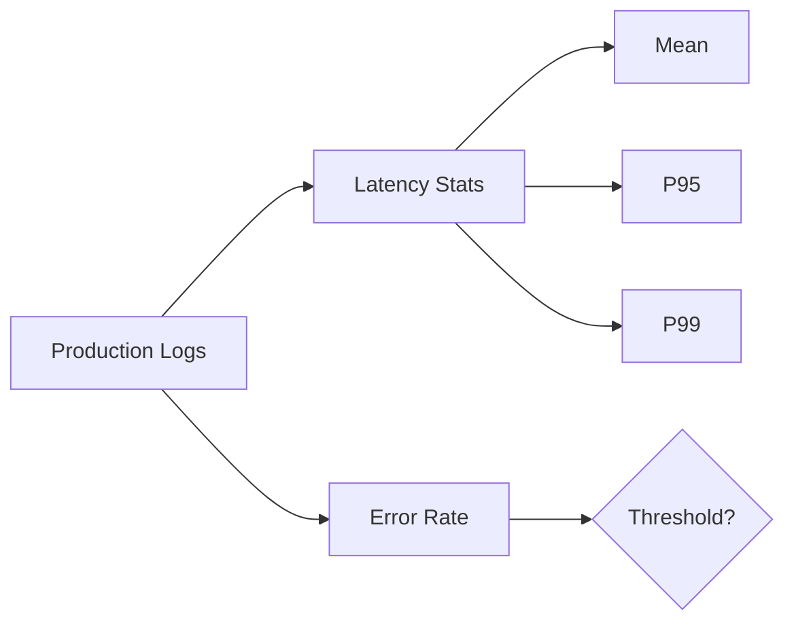
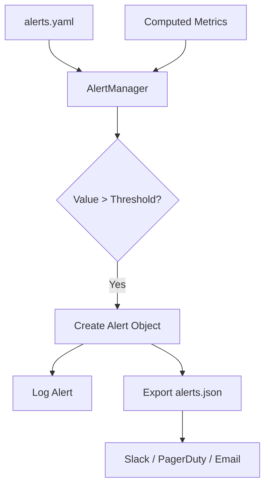
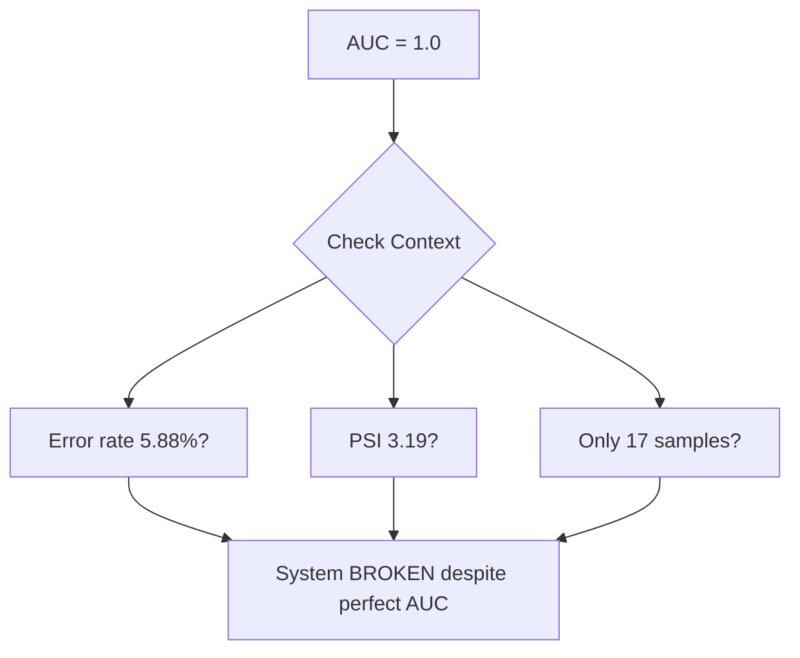

# Instrumenting Model Services: Metrics, PSI, and Automated Alerting

## From Concepts to Code

This note covers the hands-on implementation of ML monitoring: structured logging, system and data metric computation from production logs, PSI-based drift scoring, model performance evaluation, and config-driven automated alerting.

---

## Data Foundation

### Production logs (`logs.csv`)

Each row represents one inference request:

| Column | Purpose |
|--------|---------|
| `timestamp` | Time-window filtering |
| `latency_ms` | System metric computation |
| `status_code` | Error rate calculation |
| Input features | Drift detection |
| `prediction` | Model output tracking |
| `ground_truth` | Delayed performance metrics |

In production: thousands to millions of rows per day streaming into log aggregation (ELK, CloudWatch, Kinesis).

### Training baseline (`training_stats.json`)

Stores reference statistics from training data:

- Numeric features: mean, standard deviation
- Categorical features: frequency distributions

This is the **reference distribution** for all drift comparisons. In production, save actual training distributions at model registration time.

---

## Structured Logging

Replace `print()` with Python's `logging` module:

```python
import logging

logging.basicConfig(
    level=logging.INFO,
    handlers=[
        logging.FileHandler("monitoring.log"),
        logging.StreamHandler()
    ]
)
logger = logging.getLogger(__name__)
```

### Why structured logging matters

| Property | `print()` | Structured logging |
|----------|-----------|-------------------|
| Timestamps | Manual | Automatic |
| Severity levels | None | INFO, WARNING, ERROR |
| Searchable | No | Yes (ELK, CloudWatch) |
| Machine-readable | No | Yes (JSON formatting) |
| File + console output | Manual | Built-in handlers |

In production, logs must be **timestamped, categorised by severity, and searchable** — requirements that print statements cannot satisfy.

---

## Part 1: System and Data Metrics

### Time-window filtering

Filter logs to a recent window (e.g., last 7 days) to focus on current trends rather than historical noise.

### System metrics



**Key insight**: P95 means 95% of requests completed faster than this value. A mean of 50 ms with P99 of 500 ms means 1% of users have a terrible experience.

Log metrics as structured entries with extra parameters for ingestion by monitoring tools:

```python
logger.info("system_metrics", extra={
    "p95_latency_ms": 126,
    "error_rate": 0.0588
})
```

### Data metrics

Compare production feature distributions to training baselines:

| Check | Numeric Feature | Categorical Feature |
|-------|-----------------|---------------------|
| Central tendency | Mean vs. training mean | Top category frequencies |
| Spread | Std vs. training std | Cardinality change |
| Quality | Null value warnings | Unseen categories |

A 24% shift in feature mean is a red flag for covariate drift.

---

## Part 2: PSI, Performance, and Automated Alerting

### PSI — Population Stability Index

**Algorithm**:
1. Bin training and production distributions identically.
2. Compute proportion in each bin for both.
3. Aggregate: $\text{PSI} = \sum (A_i - E_i) \cdot \ln(A_i / E_i)$

| PSI | Interpretation | Action |
|-----|----------------|--------|
| < 0.1 | No significant shift | Continue monitoring |
| 0.1 – 0.2 | Minor shift | Watch closely |
| > 0.2 | Major shift | Investigate; likely need action |

In the lab scenario, PSI of 3.19 on a feature means the distribution changed **16× beyond the critical threshold** — the model operates in a completely different feature space.

### Config-driven alert thresholds (`alerts.yaml`)

Separate configuration from code:

```yaml
alerts:
  error_rate:
    threshold: 0.01
    severity: critical
    message: "Error rate exceeds 1%"
  p99_latency_ms:
    threshold: 200
    severity: warning
  feature_psi:
    threshold: 0.2
    severity: critical
  auc_drop_pct:
    threshold: 0.10
    severity: warning
```

Operations teams adjust thresholds without touching Python — a production best practice.

### AlertManager pattern



Each evaluation method (system, drift, performance) follows the same pattern:
1. Compare current value to threshold.
2. Create alert with metric name, value, threshold, severity.
3. Log and store for routing.

---

## The Dangerous Paradox: Perfect Metrics on a Broken System

A critical lab lesson — examine this combination:

| Metric | Value | Appears |
|--------|-------|---------|
| AUC | 1.0 (baseline 0.92) | Perfect |
| Recall | 1.0 | Perfect |
| Error rate | 5.88% | Failing |
| Feature PSI | 3.19 | Catastrophic drift |

**If you only monitor AUC/recall, you would think the model performs better than ever. The system is actually broken.**

### Why perfect metrics can mislead

| Cause | Explanation |
|-------|-------------|
| Data leakage | Ground truth leaking into features; model sees the answer |
| Selection bias | Hard examples fail (5.88% errors); only easy ones evaluated |
| Wrong/synthetic labels | Evaluation labels do not reflect reality |
| Tiny sample size | 17 requests, 16 successes → perfect scores prove nothing |

### Required safeguards

Monitor **all layers simultaneously**:

1. **System health** — error rate, latency
2. **Data quality** — drift, distribution, missing values
3. **Evaluation integrity** — sample size, label correctness, leakage checks



---

## Prometheus Integration Pattern

In production, expose metrics via a `/metrics` endpoint for Prometheus scraping:

| Metric Type | Example | Use |
|-------------|---------|-----|
| Histogram | `prediction_latency_seconds` | P95/P99 computation |
| Counter | `prediction_errors_total` | Error rate |
| Gauge | `feature_psi{feature="age"}` | Drift score |
| Gauge | `model_auc_7d` | Rolling performance |

Grafana dashboards visualise these time series; Alertmanager (or Grafana alerts) fires on sustained breaches.

---

## Alert Output and Routing

Lab exports alerts to `alerts.json`. In production, route to:

- **Critical** → PagerDuty / on-call rotation
- **Warning** → Slack / Microsoft Teams channel
- **Info** → Dashboard annotation only

Each alert message includes: metric name, current value, threshold, severity, and runbook link.

---

## Common Pitfalls / Exam Traps

- **Perfect AUC with high PSI and error rate** — Classic exam trap; check evaluation integrity and sample size.
- **PSI > 0.2 = always retrain** — Investigate first; may be pipeline bug or seasonality.
- **Hardcoded thresholds in Python** — Use YAML config for operational flexibility.
- **Mean latency as sole metric** — Always compute P95/P99.
- **17-sample evaluation** — Too small for statistical significance; flag in any exam scenario.

---

## Quick Revision Summary

- Production monitoring starts with structured logs + stored training baselines.
- System metrics: P95/P99 latency, error rate — log as machine-readable entries.
- Data metrics: compare production mean/std and category frequencies to training stats.
- PSI: <0.1 stable, 0.1–0.2 minor, >0.2 major; lab example PSI 3.19 = catastrophic.
- AlertManager: config-driven thresholds (YAML), evaluate → alert → export → route.
- Perfect AUC with catastrophic drift and errors = evaluation integrity problem, not success.
- Check: data leakage, selection bias, sample size, label correctness.
- Prometheus `/metrics` endpoint + Grafana = production dashboard pattern.
