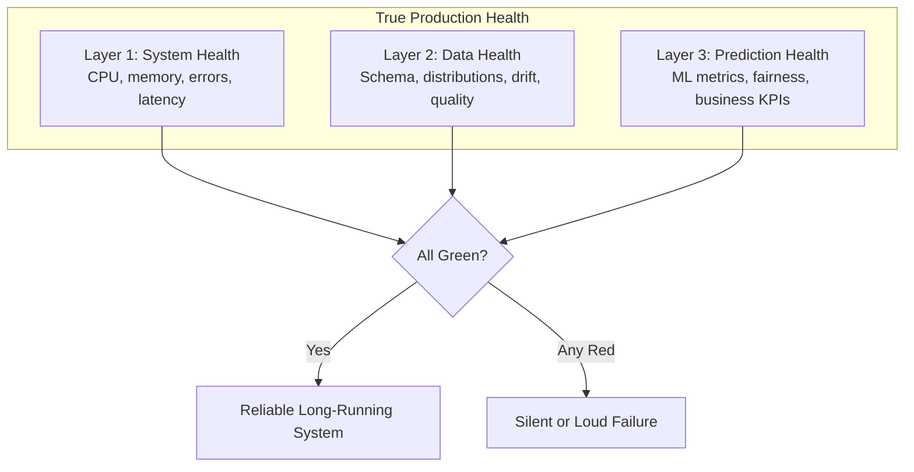
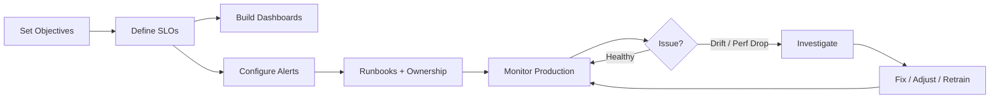

# Module Summary: ML Model Monitoring and Observability

## The Central Thesis

Monitoring is **not optional** for production machine learning. A mature ML system requires observability across three layers — and only when all three are healthy can we confidently say the service is up, inputs are sane, and predictions are still good and fair.



---

## Three-Layer Monitoring Framework

| Layer | What It Monitors | Key Metrics | Catches |
|-------|------------------|-------------|---------|
| **System health** | Is the service running? | P95/P99 latency, 4xx/5xx errors, CPU/memory, RPS | Crashes, overload, timeouts |
| **Data health** | Are inputs sane and stable? | Schema checks, missing rates, PSI, mean/std drift, cardinality | Covariate drift, pipeline bugs |
| **Prediction health** | Are outputs useful and fair? | AUC, precision, recall, RMSE, segment metrics, business KPIs | Concept drift, unfairness, silent degradation |

**All three are mandatory.** Monitoring only one layer leaves critical blind spots.

---

## Why ML Monitoring Differs from Traditional Monitoring

| Traditional | ML-Specific |
|-------------|-------------|
| "Is the service up?" | "Are predictions still correct?" |
| HTTP errors reveal problems | Silent accuracy drop — no errors |
| Monitor infrastructure | Also monitor data distributions and prediction quality |
| No ground truth needed | Delayed labels required for performance metrics |

The defining risk: **fast, error-free, wrong answers**.

---

## Drift: The Primary Production Failure Mode

| Type | What Shifts | Detection | Response |
|------|-------------|-----------|----------|
| Covariate | $P(X)$ — features | PSI, KS, histograms | Investigate; may retrain |
| Label | $P(Y)$ — targets | Class ratio monitoring | Adjust thresholds |
| Concept | $P(Y|X)$ — relationship | Performance on fresh labels | Retrain on updated data |

Drift is a **signal for investigation**, not an automatic retrain command.

---

## Observability Stack

| Pillar | Purpose | ML Extension |
|--------|---------|--------------|
| **Logs** | Per-event forensics | Feature values, scores, model version, segments |
| **Metrics** | Time-series alerting | PSI gauges, rolling AUC, latency histograms |
| **Traces** | Cross-service latency | Feature store vs. inference bottlenecks |

Typical stack: Prometheus + Grafana + ELK + Alertmanager (+ OpenTelemetry).

---

## Operational Workflow



1. **Objectives** — What bad outcomes to avoid
2. **SLOs** — 3–5 measurable thresholds per model
3. **Dashboards** — One per model; 30-second health scan
4. **Alerts** — Sustained SLO breaches with severity tiers
5. **Runbooks** — Business meaning, checks, next actions
6. **Ownership** — Data eng, ML eng, platform
7. **Closed loop** — Monitoring signals feed retraining pipelines

---

## Key Lab Lessons

| Scenario | Lesson |
|----------|--------|
| Silent degradation | Green infra + collapsing accuracy |
| Covariate drift | Feature means shift; model unchanged |
| Feedback loop | Model output biases future training data |
| Label drift | Base rate change breaks precision at fixed threshold |
| Perfect AUC paradox | Check PSI, error rate, sample size, leakage |

**Core lesson**: ML metrics alone are insufficient and dangerous. Monitor system health, data quality, and evaluation integrity together.

---

## Production Onboarding Checklist

- [ ] System metrics: P95/P99 latency, error rates, CPU/memory
- [ ] Data metrics: schema checks, missing rates, drift (PSI) on critical features
- [ ] Prediction metrics: ML metrics on recent labelled data vs. baseline
- [ ] Segment breakdowns for fairness and localised failures
- [ ] 1–2 business KPIs tied to real impact
- [ ] Structured per-prediction logging
- [ ] Alert config (YAML) separated from code
- [ ] Dashboards with exception highlighting
- [ ] Runbooks and ownership per alert type
- [ ] Retraining pipeline connected to monitoring signals

---

## From Deployment to Reliable System

Earlier modules covered getting models into production (APIs, containers, CI/CD). This module completes the picture:

```
Train → Deploy → Monitor → Detect Drift → Investigate → Retrain → Deploy → ...
```

Without monitoring, deployment is a one-time event. With monitoring, it becomes a **reliable, long-running system** that detects problems before users and stakeholders notice.

---

## Common Pitfalls / Exam Traps

- **"Service is up = model is good"** — The most common and dangerous misconception.
- **Single-layer monitoring** — Each layer catches different failures; all three required.
- **PSI > 0.2 = immediate retrain** — Investigate root cause first.
- **Perfect AUC without context** — Always check drift, error rate, and sample size.
- **Monitoring without closed loop** — Detection without remediation is incomplete MLOps.
- **Alert fatigue** — Sustained thresholds, grouped incidents, severity tiers.

---

## Quick Revision Summary

- Production ML requires three monitoring layers: system, data, prediction/business.
- ML monitoring differs because failures can be silent — no HTTP errors, wrong predictions.
- Three drift types: covariate ($P(X)$), label ($P(Y)$), concept ($P(Y|X)$).
- Observability pillars: logs, metrics, traces — extended with ML-specific signals.
- Workflow: objectives → SLOs → dashboards + alerts → runbooks → ownership → closed loop.
- PSI thresholds: <0.1 stable, 0.1–0.2 minor, >0.2 major.
- Perfect metrics on drifted data with errors = evaluation integrity failure.
- Monitoring transforms one-off deployment into a reliable, self-correcting ML system.
