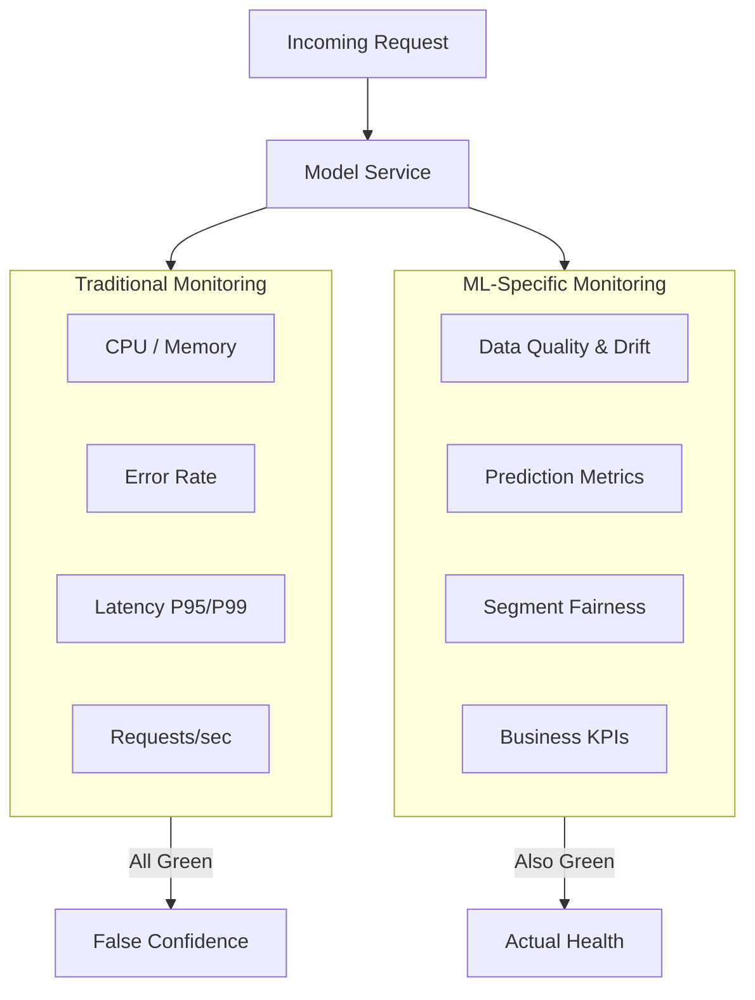
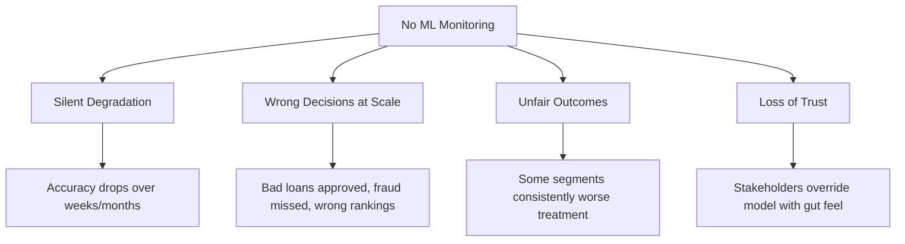

# Why Monitoring ML Models Is Different

## The Core Insight: "Service Is Up" ≠ "Model Is Good"

Traditional software monitoring asks: *Is the system healthy enough to serve requests?* Machine learning monitoring must additionally ask: *Are the predictions still correct, fair, and useful?*

A model service can be **perfectly healthy from an infrastructure perspective** — HTTP 200 responses, low latency, near-zero error rates — while being **actively wrong from an ML perspective** because input data drifted, labels changed, or the feature–label relationship shifted.

---

## Traditional Application Monitoring

For any web service or API, standard observability covers:

| Category | Typical Metrics | Alert Trigger Examples |
|----------|-----------------|------------------------|
| Infrastructure | CPU, memory, disk, network | CPU > 85% for 10 min |
| Service health | HTTP 4xx/5xx rates, timeouts | Error rate > 1% |
| Performance | Latency (avg, P95, P99) | P99 > 500 ms |
| Traffic | Requests per second, per endpoint | Traffic drop > 50% |

Dashboards and paging integrations (PagerDuty, Opsgenie) ensure on-call engineers respond when infrastructure fails.

**This is essential — and insufficient for ML.**

---

## ML Dimension 1: Data Quality and Drift

Models learn patterns from a **fixed training snapshot**. Production data is a live stream that changes continuously.

### Data quality signals

- **Missing values** — Sudden spike in nulls breaks imputation assumptions.
- **Schema drift** — Numeric fields become strings; new columns appear; expected columns vanish.
- **Out-of-range values** — Negative wages, transaction amounts orders of magnitude above training max.
- **Cardinality explosions** — Categorical feature goes from 50 to 50,000 distinct values.

### Distribution drift

- Feature distributions in production shift away from training baselines.
- Entirely new user segments appear that the model never saw.
- Upstream pipeline changes alter encoding or aggregation logic.

**Key property**: None of these cause HTTP errors. The API happily accepts bad data and returns confident wrong predictions.

**Example**: A credit scoring model trained on urban Indian borrowers is deployed nationally. Rural income distributions differ substantially. System metrics stay green; default prediction accuracy collapses for the new segment.

---

## ML Dimension 2: Prediction Quality and Fairness

### Model performance over time

Track task-appropriate metrics on **recent labelled data** (labels may arrive with delay):

| Task Type | Metrics to Track |
|-----------|------------------|
| Classification | Accuracy, precision, recall, F1, AUC |
| Regression | RMSE, MAE, $R^2$ |
| Ranking | NDCG, MAP, precision@K |

### Business metrics

Models exist to move business KPIs:

- Click-through rate (recommendation)
- Fraud caught vs. fraud missed (fraud detection)
- Revenue impact (dynamic pricing)
- Churn reduction (retention models)
- Manual review volume (automated decisioning)

### Fairness and segment stability

Monitor performance across **critical segments**: region, product line, device, age group, or other sensitive attributes.

A model can maintain stable global AUC while one segment silently receives worse predictions — a fairness failure invisible in aggregate metrics.

---

## Consequences of Not Monitoring ML Models

1. **Silent degradation** — World changes, model does not adapt; accuracy erodes unnoticed.
2. **Wrong decisions at scale** — Automated systems amplify errors across millions of requests.
3. **Unfair outcomes** — Differential drift across segments creates discriminatory treatment.
4. **Loss of trust** — Weird behaviour leads to manual overrides, undermining the entire ML investment.

Without monitoring, models do not merely get "a bit worse" — they can become **actively harmful** to users and business.

---

## Comparison: Traditional vs. ML Monitoring

| Aspect | Traditional App Monitoring | ML Model Monitoring |
|--------|---------------------------|---------------------|
| Primary question | Is the service running? | Are predictions still correct? |
| Failure visibility | HTTP errors, crashes | Silent accuracy drop |
| Input monitoring | Request size, auth | Feature distributions, schema |
| Output monitoring | Response codes | Scores, decisions, business KPIs |
| Ground truth | Not applicable | Delayed labels for evaluation |
| Fairness | Not typically tracked | Segment-level performance required |

**Both are needed.** ML systems require the full traditional stack **plus** data and prediction layers.

---

## Common Pitfalls / Exam Traps

- **"Green dashboards = healthy model"** — The most dangerous ML failure mode produces no HTTP errors.
- **Monitoring only latency and errors** — Misses drift, calibration shift, and segment unfairness.
- **Ignoring delayed labels** — Model metrics require ground truth that arrives hours or days later; plan for it.
- **Global metrics only** — Aggregate AUC can hide segment-level collapse.
- **Assuming training distribution is permanent** — Production is non-stationary; drift is expected, not exceptional.

---

## Quick Revision Summary

- ML services need traditional monitoring **and** data/prediction monitoring.
- "Service is up" does not mean "model is good" — silent degradation is the defining ML risk.
- Data layer: quality (missing, schema, range) + drift (distribution shift, new segments).
- Prediction layer: ML metrics over time, business KPIs, fairness across segments.
- Unmonitored models cause silent degradation, scaled wrong decisions, unfair outcomes, and stakeholder distrust.
- Both infrastructure health and ML-specific signals must be green for true production health.
