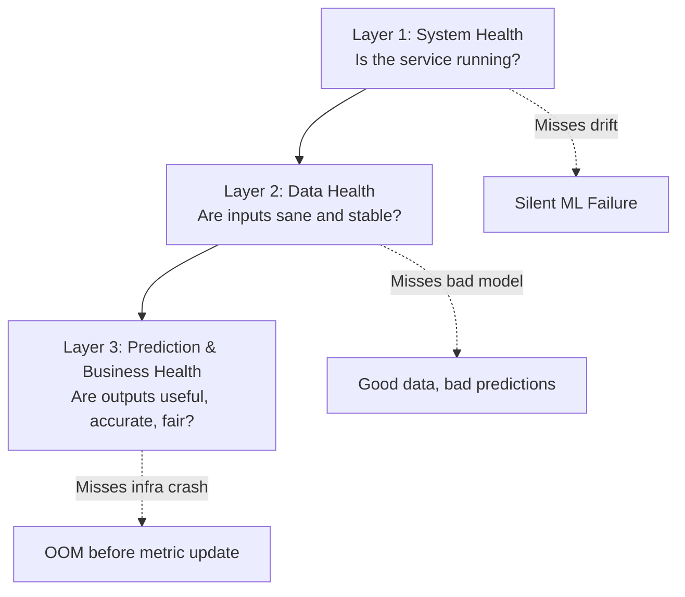
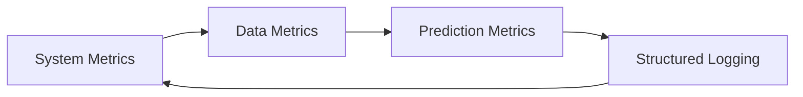

# What to Monitor: The Three-Layer Framework

## The Practical Question

Once we accept that ML monitoring differs from traditional app monitoring, the next question is concrete: **what exactly should we measure and log?**

The answer is organised into **three layers**. Each layer catches failure modes the others miss. Monitoring only one layer creates blind spots that lead to production incidents.

---

## Layer 1: System and API Health

These are the **classic metrics** for any web service. ML inference endpoints need them just as much as a payment API or search service.

### What to measure

| Metric | Why It Matters | Example Threshold |
|--------|----------------|-------------------|
| Latency (P95, P99) | Average hides tail latency; P99 reveals worst user experience | P95 < 100 ms |
| Error rates (4xx, 5xx) | Client bugs vs. server failures | 5xx < 0.5% |
| Connection timeouts | Network or overload issues | < 0.1% of requests |
| Traffic (RPS per endpoint) | Load spikes, upstream outages | Alert on >50% drop |
| CPU / memory usage | Resource exhaustion under load | CPU < 80% sustained |
| Container restart count | Crash loops, OOM kills | > 3 restarts/hour |

### Questions Layer 1 answers

- Is the prediction function still responding quickly?
- Are we hitting resource limits under current load?
- Did a deployment break the serving stack?

**Example**: A SageMaker endpoint shows 45 ms mean latency but 800 ms P99 — 1% of fraud-check requests time out, causing payment failures. Mean latency alone would miss this.

---

## Layer 2: Data Health

This layer monitors **the world as the model sees it** — the input features before inference.

### Schema and type checks

- Are all expected columns present?
- Are data types correct (numeric vs. string vs. categorical)?
- Has encoding or feature engineering output changed?

### Basic quality metrics

- **Missing value rate** per feature
- **Min / max** for numeric features
- **Out-of-range values** that should not exist
- **Cardinality** for categoricals — sudden explosion or collapse signals pipeline bugs or business shifts

### Drift indicators

- Compare **mean and standard deviation** in production vs. training.
- For mission-critical features, compute **PSI** (Population Stability Index) over a rolling window.
- Watch **prediction volume** — a sudden collapse or doubling indicates upstream change.

### Questions Layer 2 answers

- Has the input distribution shifted?
- Is upstream data quality degrading?
- Are we serving a population the model was not trained on?

**Example**: An e-commerce ranking model sees `product_category` cardinality jump from 200 to 15,000 after a catalog merge. No HTTP errors occur, but recommendation quality plummets for new categories.

---

## Layer 3: Prediction and Business Health

This layer evaluates **outputs and their real-world impact**.

### Model performance metrics

When ground truth labels are available (often with delay):

| Task | Metrics |
|------|---------|
| Classification | Accuracy, precision, recall, F1, AUC |
| Regression | RMSE, MAE, $R^2$ |
| Ranking | NDCG, MAP, precision@K |

Also monitor:

- **Calibration** — Do predicted probabilities match observed frequencies?
- **Threshold stability** — Has the decision threshold that maximises business value shifted?

### Segment-level breakdowns

Compute all performance metrics **by segment**: country, product, device, customer tier. Local failures are invisible in global averages.

### Business and fairness signals

- Business KPIs: revenue, conversion, fraud catch rate, churn, manual review volume.
- Fairness: error rates and acceptance rates across key demographic or geographic groups.
- Watch **gaps between segments** over time — stable global AUC can mask shifting decision distributions.

### Questions Layer 3 answers

- Is the model still accurate on fresh labelled data?
- Is one segment receiving systematically worse treatment?
- Are model-driven decisions helping or hurting business KPIs?

---

## Why All Three Layers Matter

| If you monitor only... | You miss... |
|------------------------|-------------|
| Layer 1 (system) | Drift, accuracy drop, unfair segments |
| Layer 2 (data) | Model logic bugs, threshold miscalibration |
| Layer 3 (predictions) | OOM crashes, latency spikes, API outages |

A mature ML monitoring setup treats all three as **mandatory**, not optional add-ons.

---

## Reusable Production Checklist

**System**: latency distribution, error rates, CPU/memory for serving stack.

**Data**: schema/type checks, missing rates, basic stats, at least one drift measure per critical feature.

**Predictions**: model metrics on recent labelled data vs. baseline, segment breakdowns, 1–2 business KPIs.

**Foundation**: structured logging per prediction with enough context to compute all metrics retrospectively.

---

## Common Pitfalls / Exam Traps

- **Single-layer monitoring** — Each layer catches different failure modes; all three are required.
- **Using mean latency only** — P95/P99 reveal tail experiences that averages hide.
- **Skipping segment breakdowns** — Global metrics mask local fairness and accuracy failures.
- **Ignoring prediction volume** — Sudden traffic changes often precede data or business shifts.
- **No baseline for comparison** — Metrics without a training-time or stable-period reference cannot detect drift.

---

## Quick Revision Summary

- ML monitoring uses three layers: system health, data health, prediction/business health.
- Layer 1 (system): latency P95/P99, errors, traffic, CPU/memory — same as any API.
- Layer 2 (data): schema, quality, cardinality, drift (mean/std, PSI), volume anomalies.
- Layer 3 (predictions): ML metrics on delayed labels, calibration, segments, business KPIs, fairness.
- Monitoring only one layer leaves critical blind spots.
- Structured per-prediction logging underpins all metric computation.
- Use the three-layer checklist when onboarding any new production model.
