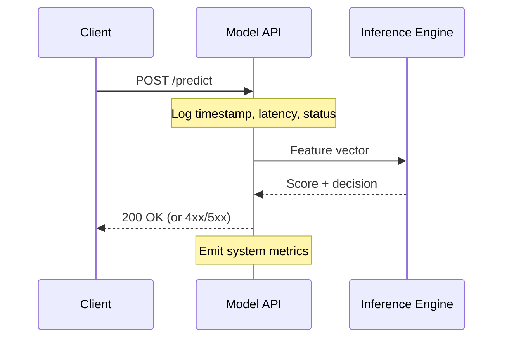
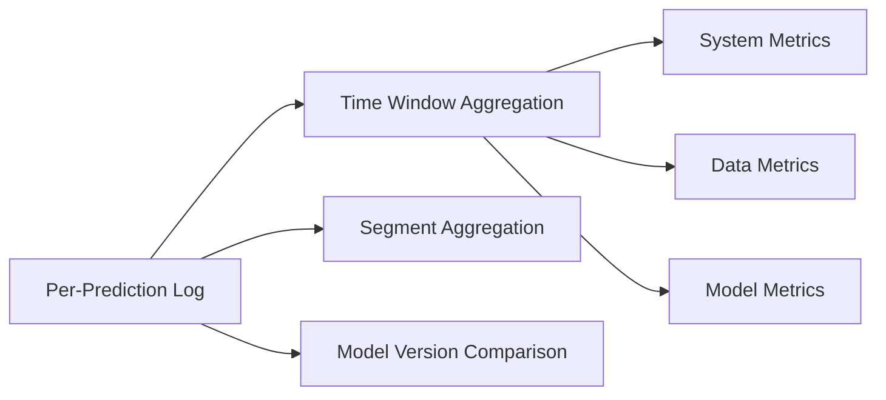

# System, Data, and Feature Metrics in Depth

## Intuition: Three Lenses on the Same Request

Every inference request passes through three observability lenses. System metrics ask whether the **plumbing** works. Data metrics ask whether the **input** makes sense. Prediction metrics ask whether the **output** still delivers value. This note details the concrete metrics at each layer and how they interconnect.

---

## Layer 1: System and API Health Metrics

### Latency

Do not rely on mean latency alone. Use percentile distributions:

- **P95** — 95% of requests complete faster than this value; represents typical worst-case experience.
- **P99** — Catches the slowest 1% that often correlates with timeouts and user churn.

A mean of 50 ms with P99 of 500 ms means 1% of users have a terrible experience — invisible to averages.

### Error rates

| Code Class | Meaning | Action |
|------------|---------|--------|
| 4xx | Bad client requests (malformed features, auth) | Fix client or API contract |
| 5xx | Server failures (model crash, OOM) | Page on-call immediately |
| Timeouts | Overload or dependency failure | Scale or optimise |

### Traffic and infrastructure

- **Requests per second** per endpoint — detect load spikes or upstream outages.
- **CPU and memory** for containers/VMs — predict resource exhaustion.
- **Restart count** — detect crash loops.



---

## Layer 2: Data and Feature Health Metrics

### Schema and type validation

For each important feature, verify:

- Column presence (no dropped fields from upstream ETL)
- Expected data types (numeric, categorical, datetime)
- Value constraints (non-negative amounts, valid enum values)

### Basic quality statistics

| Metric | Purpose | Alert Example |
|--------|---------|---------------|
| Missing value rate | Pipeline breakage, source outage | > 5% nulls on `income` |
| Min / max | Out-of-range detection | `age` > 150 or < 0 |
| Cardinality | Category explosion/collapse | `city` goes from 500 to 50,000 |
| Volume | Business or pipeline change | Daily predictions drop 60% |

### Drift detection

Compare production distributions to training baselines:

1. **Simple stats** — Mean and standard deviation side-by-side.
2. **PSI** — Single stability score for mission-critical features (detailed in later notes).
3. **Histogram comparison** — Visual overlay of training vs. recent production window.

**Example**: A loan model trained when average applicant age was 35 now sees mean age 24 after expanding to a younger market segment. System metrics are green; PSI on `age` fires critical.

---

## Layer 3: Prediction, Business, and Fairness Metrics

### Model performance (with delayed labels)

| Task | Primary Metrics |
|------|-----------------|
| Binary classification | AUC, precision, recall, F1 |
| Multi-class | Macro/micro F1, per-class recall |
| Regression | RMSE, MAE |
| Ranking | NDCG@K, MAP |

### Calibration and thresholds

- **Calibration**: If the model predicts 30% fraud probability, roughly 30% of those cases should be fraud.
- **Threshold drift**: The operating point that maximised F1 at launch may no longer maximise business value after label distribution shifts.

### Segment-level performance

Break down every metric by critical groups:

```
Global AUC: 0.91  (stable)
├── Region A AUC: 0.93
├── Region B AUC: 0.72  ← hidden failure
└── Region C AUC: 0.89
```

### Business KPIs

| Model Type | Example KPIs |
|------------|--------------|
| Fraud detection | Fraud caught, false positive rate, manual review cost |
| Recommendation | CTR, revenue per session, catalog coverage |
| Churn prediction | Retention rate, intervention success |
| Credit scoring | Default rate, approval volume, portfolio risk |

### Fairness signals

Track acceptance rates and error rates across protected or business-critical segments. A stable AUC can coexist with a shifting distribution of who receives favourable vs. unfavourable decisions.

---

## Structured Logging: The Foundation

All metrics depend on **good per-prediction logging** (full sampling or representative subset):

| Field | Content |
|-------|---------|
| Request metadata | Timestamp, model version, endpoint, request ID |
| Input | Feature values (privacy-safe representation), segment tags |
| Output | Raw score, final decision after thresholds/rules |
| Ground truth | Actual outcome when available (may arrive later) |
| System | Per-request latency |

With this log schema, compute any metric by time window, segment, or model version retrospectively.



---

## Production Onboarding Checklist

| Layer | Required Signals |
|-------|------------------|
| System | Latency distribution (P95/P99), error rates, CPU/memory |
| Data | Schema checks, missing rates, basic stats, ≥1 drift measure per critical feature |
| Predictions | ML metrics on recent labelled data vs. baseline, segment breakdowns |
| Business | ≥1–2 KPIs tied to real business impact |
| Logging | Sufficient per-prediction context for retrospective metric computation |

---

## Common Pitfalls / Exam Traps

- **Mean latency as sole SLA** — Always pair with P95/P99 for user-experience accuracy.
- **No training baseline stored** — Drift detection requires a reference distribution from training or a stable period.
- **Logging without segment tags** — Cannot compute fairness or localised failures later.
- **Evaluating only on easy examples** — Selection bias inflates metrics while hard cases fail silently.
- **Treating business KPIs as optional** — Technical metrics without business linkage cannot justify model operation.

---

## Quick Revision Summary

- System metrics: P95/P99 latency, 4xx/5xx errors, RPS, CPU/memory, restarts.
- Data metrics: schema, missing rates, min/max, cardinality, drift (mean/std, PSI), volume.
- Prediction metrics: task-appropriate ML metrics on delayed labels, calibration, thresholds.
- Always compute segment-level breakdowns — global averages hide local failures.
- Business KPIs and fairness gaps connect model behaviour to real impact.
- Structured per-prediction logging enables all retrospective metric computation.
- Use the five-row checklist when putting any new model into production.
